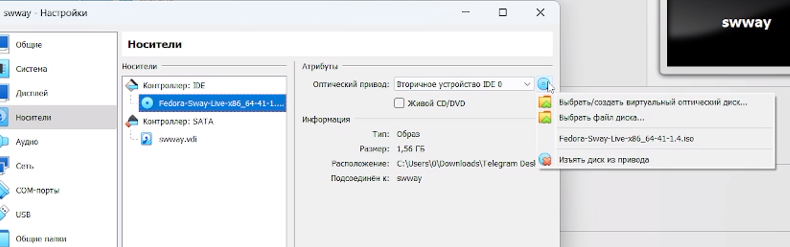
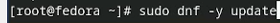
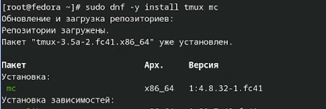
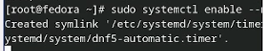
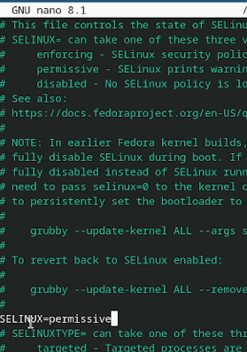
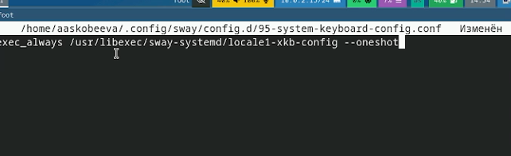
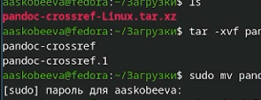

---
## Front matter
lang: ru-RU
title: Лабораторная работа № 1
subtitle: Установка и конфигурация операционной системы на виртуальную машину
author:
  - Скобеева А.А.
institute:
  - Российский университет дружбы народов, Москва, Россия
date: 6 марта 2025

## i18n babel
babel-lang: russian
babel-otherlangs: english

## Formatting pdf
toc: false
toc-title: Содержание
slide_level: 2
aspectratio: 169
section-titles: true
theme: metropolis
header-includes:
 - \metroset{progressbar=frametitle,sectionpage=progressbar,numbering=fraction}
---

# Информация

## Докладчик

:::::::::::::: {.columns align=center}
::: {.column width="70%"}

  * Скобеева Алиса Алексеевна
  * студентка 1-го курса направления "Прикладная информатика"
  * Российский университет дружбы народов
  * [1132246836@pfur.ru](mailto:1132246836@pfur.ru)
  * <https://github.com/skalisaaa>

:::
::: {.column width="30%"}

:::
::::::::::::::

# Вводная часть

## Актуальность

Данная презентация актуальна для студентов, обучающихся на технических специальностях и изучающих предмет "Архитектура компьютеров: операционные системы". 

## Объект и предмет исследования

- Linux Fedora Sway
- VirtualBox
- Программы для повышения комфорта работы в Linux Fedora Sway

## Цели и задачи

- Установить Fedora Sway на VirtualBox
- Настроить Fedora Sway, загрузив необходимые дополнения и расширения для нее

## Материалы и методы

- Материалы: ТУИС
- Установочные команды

# Создание презентации

## Установка Fedora Sway на VirtualBox

- Создаем новую ВМ в VirtualBox
- Настраиваем ее, опираясь на требования указанные на ТУИС
- Открываем ВМ, загружаем ОС, выходим и изымаем диск

## Обновления

- Устанавливаем средства разработки
- Обновляем все пакеты

## Повышение комфорта работы

- Устанавливаем программу для удобства работы в консоли

## Автоматическое обновление

- Устанавливаем программное обеспечение
- Запускаем таймер

## Отключение SELinux

- Открываем необходимый файл и заменяем в нем значение
- Меняем enforcing на permissive

- После перезагружаем виртуальную машину

## Настройка раскладки клавиатуры

- Создаем конфигурационный файл
- Редактируем его, внося в него следующую строку:

## Установка программного обеспечения для создания документации

- Запускаем tmux, переключаемся на роль супер-пользователя 
- Устанавливаем pandoc
- Далее, вручную ищем на github необходимую версию pandoc-crossref
- Устанавливаем нужную нам версию и распаковываем файл
- После, устанавливаем texlive

## Результаты

- В ходе выполнения Лабораторной работы № 1 мы установили Fedora Sway на виртуальную машину и установили необходимые дополнения и расширения для повышения комфорта работы. 

## Итоговый слайд

- Fedora Sway - удобная многофункциональная операционная система, которая подходит для изучения Архитектуры компьютеров студентам технических направлений. 

