---
## Front matter
title: "Лабораторная работа № 1"
subtitle: "Установка и конфигурация операционной системы на виртуальную машину"
author: "Алиса Алексеевна Скобеева"

## Generic otions
lang: ru-RU
toc-title: "Содержание"

## Bibliography
bibliography: bib/cite.bib
csl: pandoc/csl/gost-r-7-0-5-2008-numeric.csl

## Pdf output format
toc: true # Table of contents
toc-depth: 2
lof: true # List of figures
lot: true # List of tables
fontsize: 12pt
linestretch: 1.5
papersize: a4
documentclass: scrreprt
## I18n polyglossia
polyglossia-lang:
  name: russian
  options:
	- spelling=modern
	- babelshorthands=true
polyglossia-otherlangs:
  name: english
## I18n babel
babel-lang: russian
babel-otherlangs: english
## Fonts
mainfont: IBM Plex Serif
romanfont: IBM Plex Serif
sansfont: IBM Plex Sans
monofont: IBM Plex Mono
mathfont: STIX Two Math
mainfontoptions: Ligatures=Common,Ligatures=TeX,Scale=0.94
romanfontoptions: Ligatures=Common,Ligatures=TeX,Scale=0.94
sansfontoptions: Ligatures=Common,Ligatures=TeX,Scale=MatchLowercase,Scale=0.94
monofontoptions: Scale=MatchLowercase,Scale=0.94,FakeStretch=0.9
mathfontoptions:
## Biblatex
biblatex: true
biblio-style: "gost-numeric"
biblatexoptions:
  - parentracker=true
  - backend=biber
  - hyperref=auto
  - language=auto
  - autolang=other*
  - citestyle=gost-numeric
## Pandoc-crossref LaTeX customization
figureTitle: "Рис."
tableTitle: "Таблица"
listingTitle: "Листинг"
lofTitle: "Список иллюстраций"
lotTitle: "Список таблиц"
lolTitle: "Листинги"
## Misc options
indent: true
header-includes:
  - \usepackage{indentfirst}
  - \usepackage{float} # keep figures where there are in the text
  - \floatplacement{figure}{H} # keep figures where there are in the text
---

# Цель работы

Установить на VirtualBox операционную систему Fedora Sway, настроить ее, установить все необходимые дополнения и расширения к ней для комфортной работы.

# Задание

Установить и настроить Fedora Sway на виртуальный компьютер. 

# Выполнение лабораторной работы

Создаем виртуальную машину. Настраиваем все необходимые характеристики Fedora Sway в соответствии с тем, что указано в требованиях:

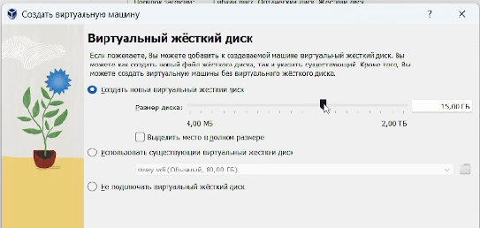{#fig:001 width=70%}

После того как мы настроили виртуальную машину, запускаем ее, нажимаем на сочетание клавиш Win+d, вбиваем liveinst и устанавливаем загрузчик. Открываем загрузчик, и продолжаем настройку Fedora Sway:

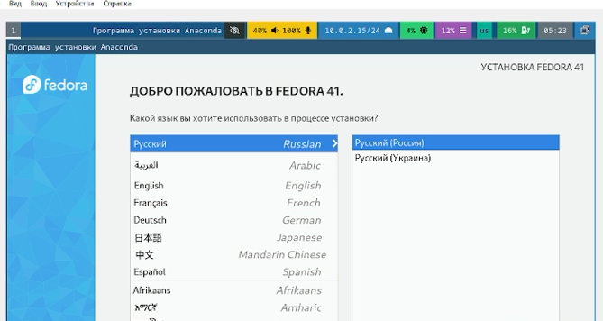{#fig:002 width=70%}

Далее, после того как мы полностью настроили Fedora Sway и загрузили ее, мы выключаем виртуальную машину, заходим в меню, далее в настройки ВМ и вынимаем диск из образа операционной системы:

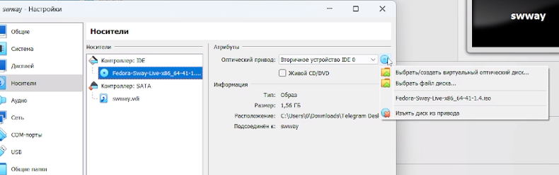{#fig:003 width=70%}

После, снова заходим в ВМ. Открываем терминал, и переключаемся на роль супер-пользователя:

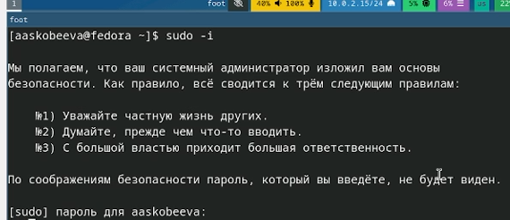{#fig:004 width=70%}

Далее, устанавливаем необходимые средства разработки:

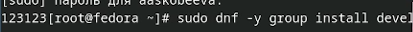{#fig:005 width=70%}

Устанавливаем обновления:

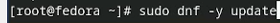{#fig:006 width=70%}

Повышаем комфорт работы, установив программу для удобства работы в консоли:

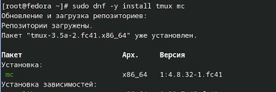{#fig:007 width=70%}

Далее устанавливаем автоматическое обновление:

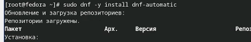{#fig:008 width=70%}

Запускаем таймер:

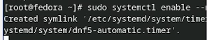{#fig:009 width=70%}

Открываем файл /etc/selinux/config с помощью команды nano:

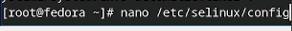{#fig:010 width=70%}

Открываем файл и редактируем его. Заменяем значение SELINUX с enforcing на permissive:

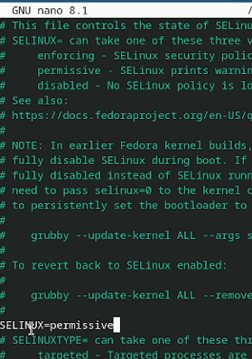{#fig:011 width=70%}

Настройка раскладки клавиатуры. 

Открываем терминальный мультиплексор tmux. Создаем конфигурационный файл и открываем его с помощью команды nano:

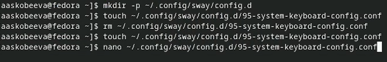{#fig:012 width=70%}

После того, как мы открыли файл, вбиваем в него необходимую строку:

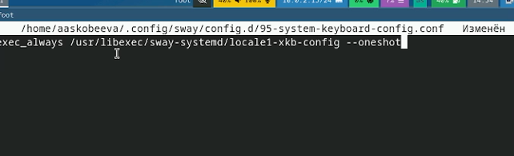{#fig:013 width=70%}

Установка программного обеспечения для создания документации. Работа с языком разметки Markdown.

Запускаем tmux, далее переключаемся на роль супер-пользователя. Устанавливаем pandoc:

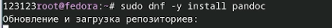{#fig:014 width=70%}

После, вручную устанавливаем pandoc-crossref. Ищем необходимую версию на github.
Распаковываем установившийся pandoc:

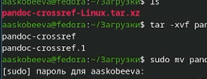{#fig:015 width=70%}

Далее, устанавливаем texlive:

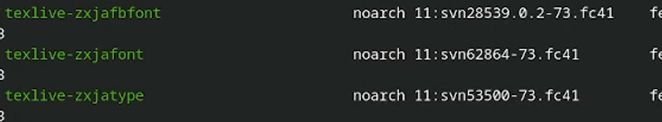{#fig:016 width=70%}

# Домашнее задание

С помощью команды dmesg | grep -i "то, что ищем" получаем следующую информацию:

1. Версия ядра Linux:

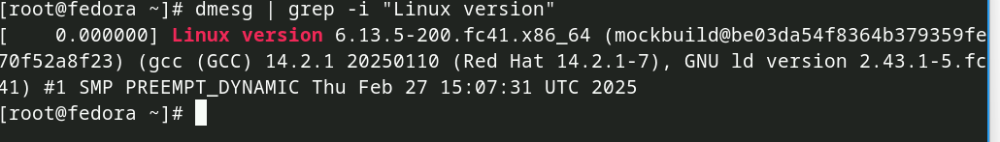{#fig:017 width=70%}

2. Частота процессора:

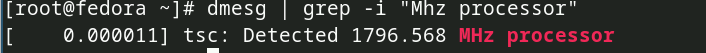{#fig:018 width=70%}

3. Модель процессора:

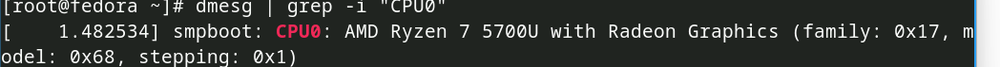{#fig:019 width=70%}

4. Объем доступной оперативной памяти:

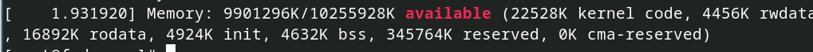{#fig:020 width=70%}

5. Тип файловой системы корневого раздела:

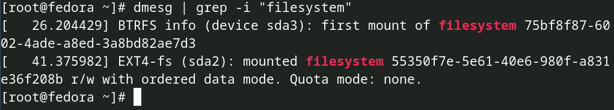{#fig:021 width=70%}

6. Последовательность монтирования файловых систем:

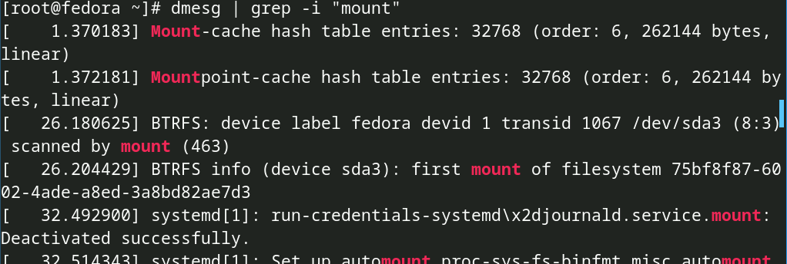{#fig:022 width=70%}

# Контрольные вопросы

1. Какую информацию содержит учётная запись пользователя?

- Имя пользователя (username): Уникальный логин.
- Пароль (password): Зашифрованный пароль.
- UID (User ID): Уникальный числовой ID пользователя.
- GID (Group ID): Числовой ID основной группы.
- Домашний каталог (home directory):  /home/<username>.  Именно здесь обычно хранятся конфигурационные файлы Sway, Waybar, Alacritty и прочих программ.
- Принадлежность к группам:  Определяет доступ к системным ресурсам.
- Оболочка (shell): По умолчанию, вероятно, Bash или Zsh.
- Файлы конфигурации: В домашнем каталоге хранятся конфигурационные файлы для Sway (~/.config/sway/config), терминала, Waybar, и других приложений, определяющие внешний вид и поведение системы.

2. Укажите команды терминала и приведите примеры:

- Для получения справки по команде:
    *   man <имя_команды> (manual page)
    *   Пример: man sway - покажет руководство по Sway.
    *   <имя_команды> --help или <имя_команды> -h
    *   Пример: swaymsg --help - покажет справку по swaymsg.

- Для перемещения по файловой системе:

    *   cd <путь> (change directory)
    *   Примеры: cd /home/<username>, cd .., cd ~

- Для просмотра содержимого каталога:

    *   ls <путь> (list)
    *   Примеры: ls /etc, ls -l, ls -a, ls -lh

- Для определения объёма каталога:

    *   du <путь> (disk usage)
    *   Примеры: du -sh /home/<username>, du -sh *

- Для создания / удаления каталогов / файлов:

    *   Создание каталога: mkdir <имя_каталога>
    *   Пример: mkdir новый_каталог
    *   Удаление каталога (пустого): rmdir <имя_каталога>
    *   Пример: rmdir новый_каталог
    *   Удаление каталога (с содержимым): rm -r <имя_каталога>
    *   Пример: rm -r старый_каталог
    *   Создание файла (пустого): touch <имя_файла>
    *   Пример: touch мой_файл.txt
    *   Удаление файла: rm <имя_файла>
    *   Пример: rm мой_файл.txt

- Для задания определённых прав на файл / каталог:

    *   chmod <права> <файл_или_каталог> (change mode)
    *   Пример: chmod 755 мой_файл.txt

- Для просмотра истории команд:

    *   history - покажет историю команд. Можно настроить количество сохраняемых команд в файле .bash_history или .zsh_history в домашнем каталоге.

3. Что такое файловая система? Приведите примеры с краткой характеристикой.

Файловая система организует данные на носителе в иерархической структуре.

- ext4: Наиболее вероятная файловая система для корневого раздела (/). Поддерживает журналирование, большие диски, и хорошо работает с SSD.
- btrfs:  Возможна, если выбрали её при установке Fedora.  Поддерживает моментальные снимки (snapshots) и копирование при записи.
- vfat:  Часто используется для /boot/efi раздела (ESP - EFI System Partition), необходимого для загрузки.

4. Как посмотреть, какие файловые системы подмонтированы в ОС?

- mount:  Показывает список смонтированных файловых систем.
- df -h: Показывает информацию об использовании дискового пространства и смонтированные файловые системы.
- findmnt: Дает расширенную информацию о точках монтирования.

5. Как удалить зависший процесс?

Найти PID процесса: ps aux | grep <часть_имени_процесса>.
Попробовать сначала kill <PID>.
Если процесс не завершается, использовать (очень осторожно!) kill -9 <PID>.  Пример: kill -9 1234.

# Выводы

В ходе выполнения лабораторной работы № 1 мы установили и настроили Fedora Sway на виртуальной машине, а также установили необходимые программы и дополнения для комфортной работы.

