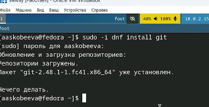
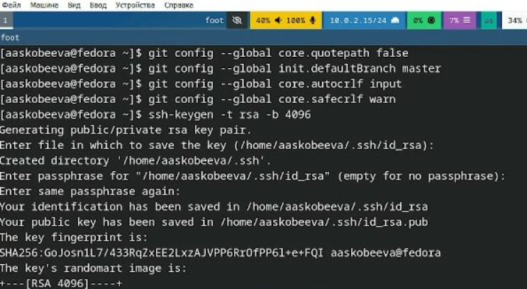
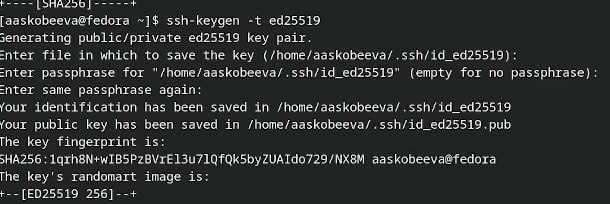
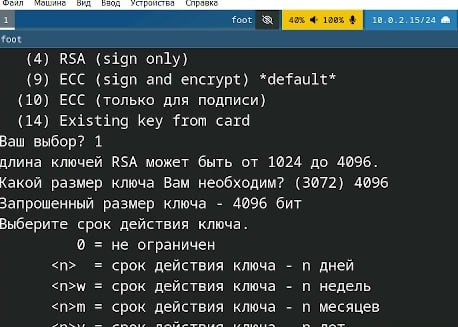
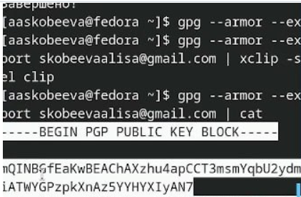
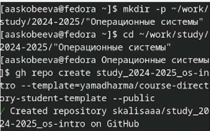

---
## Front matter
lang: ru-RU
title: Лабораторная работа № 2
subtitle: Первоначальная настройка git
author:
  - Скобеева А.А.
institute:
  - Российский университет дружбы народов, Москва, Россия
date: 07 марта 2025

## i18n babel
babel-lang: russian
babel-otherlangs: english

## Formatting pdf
toc: false
toc-title: Содержание
slide_level: 2
aspectratio: 169
section-titles: true
theme: metropolis
header-includes:
 - \metroset{progressbar=frametitle,sectionpage=progressbar,numbering=fraction}
---

# Информация

## Докладчик

:::::::::::::: {.columns align=center}
::: {.column width="70%"}

  * Скобеева Алиса Алексеевна
  * студентка 1-го курса направления "Прикладная информатика"
  * Российский университет дружбы народов
  * [1132246836@pfur.ru](mailto:1132246836@pfur.ru)

:::
::: {.column width="30%"}

:::
::::::::::::::

# Вводная часть

## Актуальность

- Данная презентация актуальна для студентов технических направлений, изучающих предмет "Архитектура компьютеров: операционные системы", а также для людей, интересующихся им.

## Объект и предмет исследования

- Репозиторий git
- Fedora Sway

## Цели и задачи

- Подключить git к Fedora Sway
- Настроить все для комфортной работы с репозиториями

## Материалы и методы

- Github
- Материалы ТУИС

# Основная часть

## Установка программного обеспечения

- Устанавливаем git и gh 
- Используем команды dnf install git и dnf install gh соответственно
- 

## Базовая настройка git

- Задаем имя и email владельца репозитория
- Далее, настраиваем utf-8, задаем имя начальной ветки(master), параметр autocrlf, параметр safecrlf
- 

## Создаем ключи ssh

- Создаем ключи ssh по алгоритму rsa и по алгоритму ed25519

## Создаем ключи pgp

- Генерируем ключ с помощью gpg --full-generate-key
- Выбираем из предложенных опций все согласно требованиям, указанным на ТУИС

## Настройка github

- Создаем учетную запись в github и заполняем ее

## Добавляем PGP ключ в GitHub

- Выводим список ключей, копируем отпечаток приватного ключа
- Если скопировать ключ с помощью команды не вышло, делаем это вручную с помощью команды cat
- После, вставляем в необходимое окно ключ на GitHub

## Настройка автоматических подписей коммитов git

- Используя введенный email, указываем Git применять его при подписи коммитов

## Создание репозитория курса

- Вводим необходимые команды для создания каталогов и подключения рабочего пространства

## Настройка каталога курса

- Переходим в каталог курса, удаляем лишние файлы и создаем необходимые каталоги
- После, отправляем файлы на сервер с помощью необходимых команд

## Результаты

- Мы настроили GitHub и подключили репозиторий к Fedora Sway

## Итоговый слайд

- Репозитории в GitHub - простой и удобный инструмент для хранения и публикации отчетов по техническим работам.

