---
## Front matter
title: "Отчёт по лабораторной работе № 2"
subtitle: "Первоначальная настройка git"
author: "Скобеева Алиса Алексеевна"

## Generic otions
lang: ru-RU
toc-title: "Содержание"

## Bibliography
bibliography: bib/cite.bib
csl: pandoc/csl/gost-r-7-0-5-2008-numeric.csl

## Pdf output format
toc: true # Table of contents
toc-depth: 2
lof: true # List of figures
lot: true # List of tables
fontsize: 12pt
linestretch: 1.5
papersize: a4
documentclass: scrreprt
## I18n polyglossia
polyglossia-lang:
  name: russian
  options:
	- spelling=modern
	- babelshorthands=true
polyglossia-otherlangs:
  name: english
## I18n babel
babel-lang: russian
babel-otherlangs: english
## Fonts
mainfont: IBM Plex Serif
romanfont: IBM Plex Serif
sansfont: IBM Plex Sans
monofont: IBM Plex Mono
mathfont: STIX Two Math
mainfontoptions: Ligatures=Common,Ligatures=TeX,Scale=0.94
romanfontoptions: Ligatures=Common,Ligatures=TeX,Scale=0.94
sansfontoptions: Ligatures=Common,Ligatures=TeX,Scale=MatchLowercase,Scale=0.94
monofontoptions: Scale=MatchLowercase,Scale=0.94,FakeStretch=0.9
mathfontoptions:
## Biblatex
biblatex: true
biblio-style: "gost-numeric"
biblatexoptions:
  - parentracker=true
  - backend=biber
  - hyperref=auto
  - language=auto
  - autolang=other*
  - citestyle=gost-numeric
## Pandoc-crossref LaTeX customization
figureTitle: "Рис."
tableTitle: "Таблица"
listingTitle: "Листинг"
lofTitle: "Список иллюстраций"
lotTitle: "Список таблиц"
lolTitle: "Листинги"
## Misc options
indent: true
header-includes:
  - \usepackage{indentfirst}
  - \usepackage{float} # keep figures where there are in the text
  - \floatplacement{figure}{H} # keep figures where there are in the text
---

# Цель работы

Подключить github, произвести настройку и подключение необходимого репозитория.

# Задание

Подключить git к нашему аккаунту на Fedora Sway.

# Выполнение лабораторной работы

1. Установка программного обеспечения

Устанавливаем git.

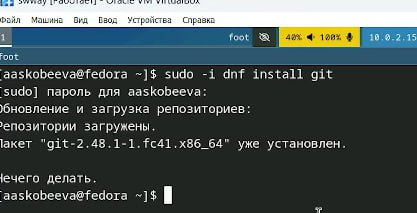{#fig:001 width=70%}

Устанавливаем gh.

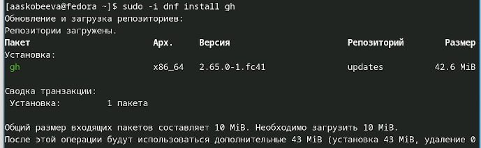{#fig:002 width=70%}

2. Базовая настройка git.
Задаем имя и email владельца репозитория, настраиваем utf-8 в выводе сообщений git, настраиваем верификацию и подписание коммитов, задаем имя начальной ветки, устанавливаем параметр autocrlf, а также параметр safecrlf. 

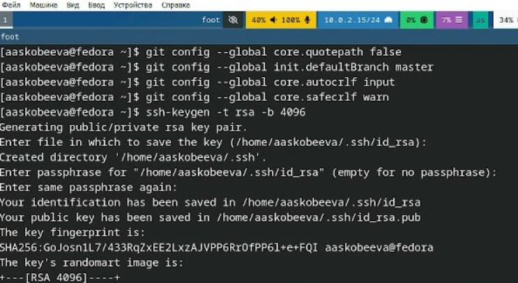{#fig:003 width=70%}

3. Создаем ключи ssh

По алгоритму rsa с ключем размером 4096 бит(см. изображение 3 выше)

По алгоритму ed25519:

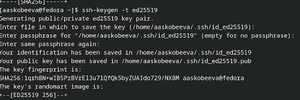{#fig:004 width=70%}

4. Создание ключей pgp

Генерируем ключ с помощью команды gpg --full-generate-key

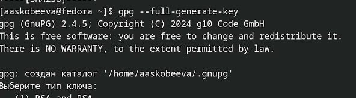{#fig:005 width=70%}

Иллюстрация выбора из предложенных опций:

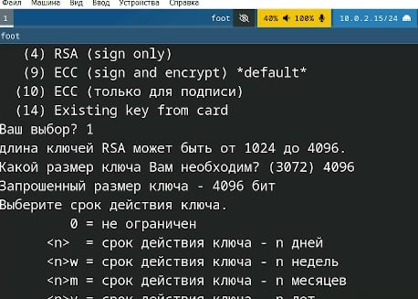{#fig:006 width=70%}

5. Настройка github

Поскольку учетная запись у меня была создана и заполнена ранее, данный пункт пропускаем.

6. Добавление PGP ключа в GitHub

Выводим список ключей, копируем отпечаток приватного ключа - в нашем случае это адрес электронной почты.

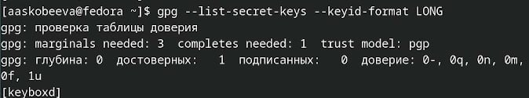{#fig:007 width=70%}

Копируем сгенерированный PGP ключ в буфер обмена.

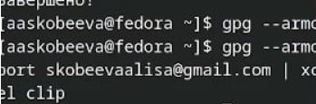{#fig:008 width=70%}

Поскольку с помощью команды скопировать ключ не вышло, скопируем его вручную, воспользовавшись командой cat:

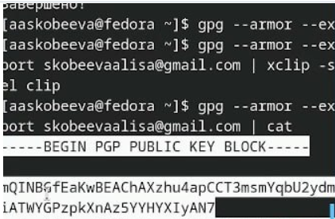{#fig:009 width=70%}

Вставляем ключ в настройках GitHub:

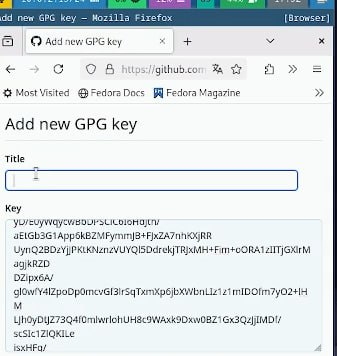{#fig:010 width=70%}

7. Настройка автоматических подписей коммитов git

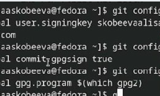{#fig:011 width=70%}

8. Создание репозитория курса

Вводим необходимые команды для создания каталогов и подключения рабочего пространства:

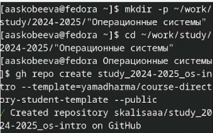{#fig:012 width=70%}

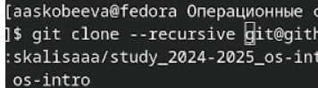{#fig:013 width=70%}

9. Настройка каталога курса

Переходим в каталог курса, удаляем лишние файлы и создаем необходимые каталоги

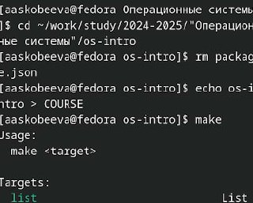{#fig:014 width=70%}

В конце отправляем файлы на сервер с помощью команд:

git add .
git commit -am 'feat(main): make course structure'
git push

# Контрольные вопросы

1. Что такое системы контроля версий (VCS) и для решения каких задач они предназначаются?

   Системы контроля версий (VCS) - это системы для отслеживания изменений файлов проекта. Предназначаются для следующих задач: совместная разработка, версионность, откат к предыдущим версиям, управление ветвями.

2. Объясните следующие понятия VCS и их отношения: хранилище, commit, история, рабочая копия.

   *   Хранилище: База данных со всеми версиями проекта.
   *   Commit: Запись изменений с комментарием.
   *   История: Последовательность коммитов.
   *   Рабочая копия: Локальная копия файлов для работы.
      (Отношения: Рабочая копия -> Commit -> История в Хранилище).

3. Что представляют собой и чем отличаются централизованные и децентрализованные VCS? Приведите примеры VCS каждого вида.

   *   Централизованные VCS: Одно центральное хранилище. Пример: SVN.
   *   Децентрализованные VCS: Полная локальная копия хранилища у каждого. Пример: Git.

4. Опишите действия с VCS при единоличной работе с хранилищем.

   Единоличная работа: git init, git add, git commit, git log, git checkout.

5. Опишите порядок работы с общим хранилищем VCS.

   Общее хранилище: git clone, git branch, git checkout, git add, git commit, git push, pull request, code review, merge.

6. Каковы основные задачи, решаемые инструментальным средством git?

   Git: Версионность, совместная разработка, управление ветвями, удаленное хранение, разрешение конфликтов.

7. Назовите и дайте краткую характеристику командам git.

   git init (создание), git clone (копирование), git add (добавление), git commit (фиксация), git push (отправка), git pull (получение), git branch (ветки), git merge (слияние).

8. Приведите примеры использования при работе с локальным и удалённым репозиториями.

   *   Локальный: git init, git add ., git commit -m "Initial commit".
   *   Удаленный: git clone <url>, git push origin <branch>.

9. Что такое и зачем могут быть нужны ветви (branches)?

   Ветви: Параллельные линии разработки. Зачем: разработка новых функций, эксперименты, управление релизами.

10. Как и зачем можно игнорировать некоторые файлы при commit?

    Игнорирование файлов: Файл .gitignore. Зачем: избегать захламления хранилища, безопасность, производительность.

# Выводы

Мы научились создавать и подключать репозитории.

