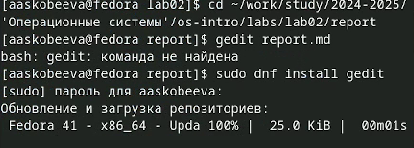
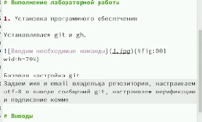
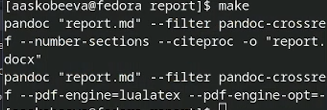
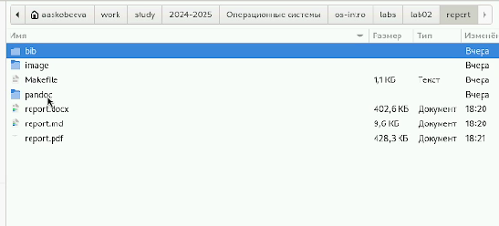
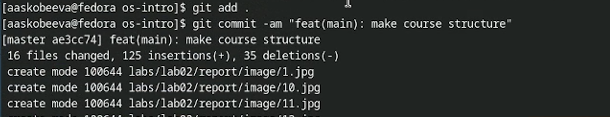

---
## Front matter
lang: ru-RU
title: Лабораторная работа № 3
subtitle: Выполнение отчета по ЛБ2 в Markdown.
author:
  - Скобеева А.А.
institute:
  - Российский университет дружбы народов, Москва, Россия
date: 06 марта 2025

## i18n babel
babel-lang: russian
babel-otherlangs: english

## Formatting pdf
toc: false
toc-title: Содержание
slide_level: 2
aspectratio: 169
section-titles: true
theme: metropolis
header-includes:
 - \metroset{progressbar=frametitle,sectionpage=progressbar,numbering=fraction}
---

# Информация

## Докладчик

:::::::::::::: {.columns align=center}
::: {.column width="70%"}

  * Скобеева Алиса Алексеевна
  * студентка 1-го курса направления "Прикладная информатика"
  * Российский университет дружбы народов
  * [1132246836@pfur.ru](mailto:1132246836@pfur.ru)
  * <https://github.com/skalisaaa>

:::
::: {.column width="30%"}

:::
::::::::::::::

# Вводная часть

## Актуальность

Данная презентация актуальна для научных сотрудников в технических сферах. Она содержит в себе информацию по работе с текстовым редактором Markdown.

## Объект и предмет исследования

- Лабораторная работа № 2
- Программное обеспечение для создания отчетов

## Цели и задачи

- Создать отчет ко 2 лабораторной работе в Markdown
- Описать алгоритм создания отчетов в Markdown

## Материалы и методы

- Процессор `pandoc` для входного формата Markdown
- Результирующие форматы
	- `pdf`
	- `html`
- Автоматизация процесса создания: `Makefile`

# Работа с Markdown

## Загрузка gedit

- Gedit: то, с помощью чего мы можем открывать файлы в формате md
- Устанавливаем, предварительно включив суперпользователя
- Открываем файл

## Редактирование файла

- Открываем файл и вносим данные о названии презентации и ФИО автора
- Выписываем цели и задания работы
- Прописываем все действия, которые мы выполнили в ходе ЛБ2.

## Создание файлов формата docx, pdf

- Для создания нужных нам файлов используем команду make

## Проверяем наличие файлов

- Заходим в проводник, находим нужную нам папку и проверяем наличие нужных нам файлов
- Открываем их и проверяем на наличие ошибок

## Отправление файлов на github

- В конце мы должны отправить все файлы в наш репозиторий на github
- Для этого последовательно выполняем команды, указанные на скриншоте:

## Результаты

- Мы научились работать в текстовом редакторе Markdown и выполнили с помощью него отчет по лабораторной работе № 2.

## Выводы

- Markdown - удобный инструмент, который позволяет в краткие сроки создавать качественные отчеты и презентации в трех разных форматах.

