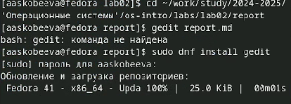
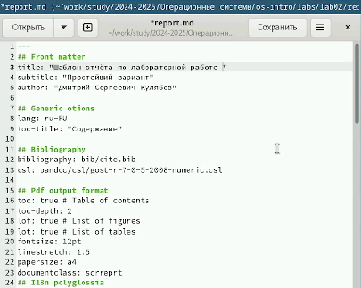
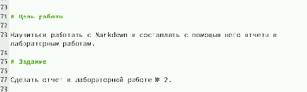
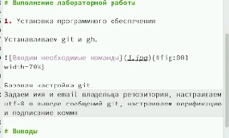
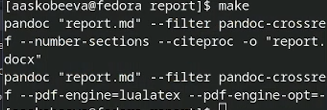
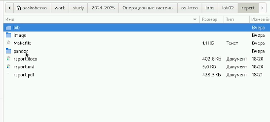
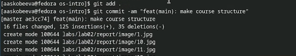

---
## Front matter
title: "Отчет по лабораторной работе № 3"
subtitle: "Работа с Markdown"
author: "Алиса Алексеевна Скобеева"

## Generic otions
lang: ru-RU
toc-title: "Содержание"

## Bibliography
bibliography: bib/cite.bib
csl: pandoc/csl/gost-r-7-0-5-2008-numeric.csl

## Pdf output format
toc: true # Table of contents
toc-depth: 2
lof: true # List of figures
lot: true # List of tables
fontsize: 12pt
linestretch: 1.5
papersize: a4
documentclass: scrreprt
## I18n polyglossia
polyglossia-lang:
  name: russian
  options:
	- spelling=modern
	- babelshorthands=true
polyglossia-otherlangs:
  name: english
## I18n babel
babel-lang: russian
babel-otherlangs: english
## Fonts
mainfont: IBM Plex Serif
romanfont: IBM Plex Serif
sansfont: IBM Plex Sans
monofont: IBM Plex Mono
mathfont: STIX Two Math
mainfontoptions: Ligatures=Common,Ligatures=TeX,Scale=0.94
romanfontoptions: Ligatures=Common,Ligatures=TeX,Scale=0.94
sansfontoptions: Ligatures=Common,Ligatures=TeX,Scale=MatchLowercase,Scale=0.94
monofontoptions: Scale=MatchLowercase,Scale=0.94,FakeStretch=0.9
mathfontoptions:
## Biblatex
biblatex: true
biblio-style: "gost-numeric"
biblatexoptions:
  - parentracker=true
  - backend=biber
  - hyperref=auto
  - language=auto
  - autolang=other*
  - citestyle=gost-numeric
## Pandoc-crossref LaTeX customization
figureTitle: "Рис."
tableTitle: "Таблица"
listingTitle: "Листинг"
lofTitle: "Список иллюстраций"
lotTitle: "Список таблиц"
lolTitle: "Листинги"
## Misc options
indent: true
header-includes:
  - \usepackage{indentfirst}
  - \usepackage{float} # keep figures where there are in the text
  - \floatplacement{figure}{H} # keep figures where there are in the text
---

# Цель работы

Научиться работать с Markdown и выполнять с его помощью отчеты к лабораторным работам.

# Задание

Сделать отчет к лабораторной работе № 2.

# Выполнение лабораторной работы

Переходим в необходимый каталог, устанавливаем gedit и далее заходим в файл:

{#fig:001 width=70%}

После того как мы перешли в нужный нам файл, начинаем его редактировать и писать в нем отчет:

{#fig:002 width=70%}

Записываем цели работы, задания и т.д.:

{#fig:003 width=70%}

Прописываем все действия, подписываем все изображения. Чтобы изображения корректно прикреплялись, следим за тем, чтобы были верно прописаны названия изображений, а также номер в кавычках:

{#fig:004 width=70%}

После того, как мы прописали все действия и завершили отчет, выполняем следующую команду:

{#fig:005 width=70%}

Проверяем, чтобы все наши файлы создались, открываем их, и проверяем на наличие ошибок.

{#fig:006 width=70%}

После того как мы убедились, что отчет выполнен и в нем нет никаких ошибок, отправляем файлы на github с помощью следующих команд:

{#fig:007 width=70%}

# Выводы

Мы научились работать с текстовым редактором Markdown, выполнять с помощью него отчеты к лабораторным работам и отправлять их на github. 

