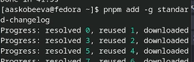

---
## Front matter
lang: ru-RU
title: Лабораторная работа № 4
subtitle: Продвинутое использование git
author:
  - Скобеева А.А.
institute:
  - Российский университет дружбы народов, Москва, Россия
date: 07 марта 2025

## i18n babel
babel-lang: russian
babel-otherlangs: english

## Formatting pdf
toc: false
toc-title: Содержание
slide_level: 2
aspectratio: 169
section-titles: true
theme: metropolis
header-includes:
 - \metroset{progressbar=frametitle,sectionpage=progressbar,numbering=fraction}
---

# Информация

## Докладчик

:::::::::::::: {.columns align=center}
::: {.column width="70%"}

  * Скобеева Алиса Алексеевна
  * студентка 1-го курса направления "Прикладная информатика"
  * Российский университет дружбы народов
  * [1132246836@pfur.ru](mailto:1132246836@pfur.ru)

:::
::: {.column width="30%"}

:::
::::::::::::::

# Вводная часть

## Актуальность

- Данная презентация актуальна для студентов технических направлений, изучающих предмет "Архитектура компьютеров: операционные системы", а также для людей, интересующихся этим предметом, а также, интересующихся продвинутым использованием git. 

## Объект и предмет исследования

- Репозитории GitHub
- Fedora Sway

## Цели и задачи

- Получить навыки правильной работы с репозиториями git. 

## Материалы и методы

- Материалы, опубликованные на ТУИС.

# Выполнение работы

# Установка программного обеспечения

## Установка программного обеспечения

- Устанавливаем git-flow, подключив права супер-пользователя
- Устанавливаем Node.js
- Настраиваем Node.js

## Добавление общепринятых коммитов 

- Добавляем коммит commitizen
- Добавляем коммит standart-changelog

# Практический сценарий использования git

## Создание репозитория git

- Создаем репозиторий. Называем его git-extended
- Делаем первый коммит и выкладываем его на github

## Конфигурация общепринятых коммитов

- Делаем конфигурацию для пакетов Node.js
- Редактируем файл package.json в соответствии с требованиями

- Добавляем новые файлы с помощью git add ., выполняем коммит с помощью git cz и отправляем на github.

## Конфигурация git-flow 1

- Инициализируем git-flow. Выбираем нужные параметры
- Проверяем, что мы находимся на ветке develop и загружаем весь репозиторий в хранилище.

## Конфигурация git-flow 2

- Устанавливаем внешнюю ветку как вышестоящую для этой ветки, создаем релиз с версией 1.0.0
- Создаем журнал изменений и добавляем его в индекс
- Заливаем релизную ветку в основную ветку, отправляем данные на github и создаем релиз.

## Работа с репозиторием git

- Разрабатываем новую функциональность
- Создаем релиз с версией 1.2.3, обнавляем номер релиза в файле, создаем журнал изменений
- Добавляем журнал в индекс, отпарвляем данные на github

## Результаты

- В ходе выполнения лабораторной работы мы приобрели навыки продвинутого использования git.

## Итоговый слайд

- Репозитории GitHub - удобный инструмент для хранения отчетов по работам.

