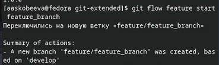

---
## Front matter
title: "Отчет по лабораторной работе № 4"
subtitle: "Продвинутое использование git"
author: "Алиса Алексеевна Скобеева"

## Generic otions
lang: ru-RU
toc-title: "Содержание"

## Bibliography
bibliography: bib/cite.bib
csl: pandoc/csl/gost-r-7-0-5-2008-numeric.csl

## Pdf output format
toc: true # Table of contents
toc-depth: 2
lof: true # List of figures
lot: true # List of tables
fontsize: 12pt
linestretch: 1.5
papersize: a4
documentclass: scrreprt
## I18n polyglossia
polyglossia-lang:
  name: russian
  options:
	- spelling=modern
	- babelshorthands=true
polyglossia-otherlangs:
  name: english
## I18n babel
babel-lang: russian
babel-otherlangs: english
## Fonts
mainfont: IBM Plex Serif
romanfont: IBM Plex Serif
sansfont: IBM Plex Sans
monofont: IBM Plex Mono
mathfont: STIX Two Math
mainfontoptions: Ligatures=Common,Ligatures=TeX,Scale=0.94
romanfontoptions: Ligatures=Common,Ligatures=TeX,Scale=0.94
sansfontoptions: Ligatures=Common,Ligatures=TeX,Scale=MatchLowercase,Scale=0.94
monofontoptions: Scale=MatchLowercase,Scale=0.94,FakeStretch=0.9
mathfontoptions:
## Biblatex
biblatex: true
biblio-style: "gost-numeric"
biblatexoptions:
  - parentracker=true
  - backend=biber
  - hyperref=auto
  - language=auto
  - autolang=other*
  - citestyle=gost-numeric
## Pandoc-crossref LaTeX customization
figureTitle: "Рис."
tableTitle: "Таблица"
listingTitle: "Листинг"
lofTitle: "Список иллюстраций"
lotTitle: "Список таблиц"
lolTitle: "Листинги"
## Misc options
indent: true
header-includes:
  - \usepackage{indentfirst}
  - \usepackage{float} # keep figures where there are in the text
  - \floatplacement{figure}{H} # keep figures where there are in the text
---

# Цель работы

Получение навыков правильной работы с репозиториями git.

# Задание

Создать репозиторий и выполнить с ним команды, которые указаны на платформе.

# Выполнение лабораторной работы

Установка git-flow
Устанавливаем git-flow из коллекции репозиториев Copr:

{#fig:001 width=70%}

{#fig:002 width=70%}

Установка Node.js
Последовательно выполняем команды:

{#fig:003 width=70%}

Запускаем:

{#fig:004 width=70%}

Общепринятые коммиты
Добавляем коммиты commitizen и standart-changelog

{#fig:005 width=70%}

{#fig:006 width=70%}

Создание репозитория git

Создаем репозиторий git. Называем его git-extended.

{#fig:007 width=70%}

Добавляем какой-нибудь файл, чтобы репозиторий корректно работал. Назовем его TOUCHME. Откроем его, и напишем произвольный текст. После, можем создавать первый коммит.

{#fig:008 width=70%}

Добавляем коммит:

{#fig:009 width=70%}

{#fig:010 width=70%}

Конфигурация общепринятых коммитов
Выполняем команду pnpm init:

{#fig:011 width=70%}

Последовательно заполняем файл так, как от нас требуется:

{#fig:012 width=70%}

Добавляем новые файлы с помощью git add .
Далее выполняем коммит git cz и отправляем все на GitHub:

{#fig:013 width=70%}

{#fig:014 width=70%}

Конфигурация git-flow
Инициализируем git-flow с помощью git flow init и выбираем нужные нам параметры:

{#fig:015 width=70%}

Проверяем, находимся ли мы на ветке develop и далее загружаем весь репозиторий в хранилище:

{#fig:016 width=70%}

Устанавливаем внешнюю ветку как вышестоящую для этой ветки:

{#fig:017 width=70%}

Далее, создаем релиз с версией 1.0.0, создаем журнал изменений и добавляем его в индекс:

{#fig:018 width=70%}

Заливаем релизную ветку в основную фетку и отправляем данные на github. Далее создаем релиз на github. Для этого используем утилиты работы с github:

{#fig:019 width=70%}

{#fig:020 width=70%}

{#fig:021 width=70%}

{#fig:022 width=70%}

{#fig:023 width=70%}

Работа с репозиторием git.
Разработка новой функциональности
Создаем ветку для новой функциональности, далее, продолжаем работу с git как обычно, и по окончании объединяем ветку feature_branch с develop:

{#fig:024 width=70%}

{#fig:025 width=70%}

Создание релиза git-flow
Создаем релиз с версией 1.2.3. Обновляем номер версии в файле package.json. Далее, создаем журнал изменений и добавляем его в индекс. Далее, заливаем релизную ветку в основную ветку и отправляем данные на GitHub. Создаем релиз на github c комментарием из журнала изменений: 

{#fig:026 width=70%}

{#fig:027 width=70%}

{#fig:028 width=70%}

{#fig:029 width=70%}

{#fig:030 width=70%}

{#fig:031 width=70%}

{#fig:032 width=70%}

# Выводы

В ходе выполнения лабораторной работы мы приобрели навыки продвинутого использования git.

