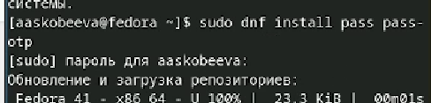
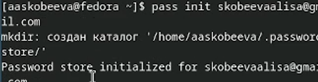
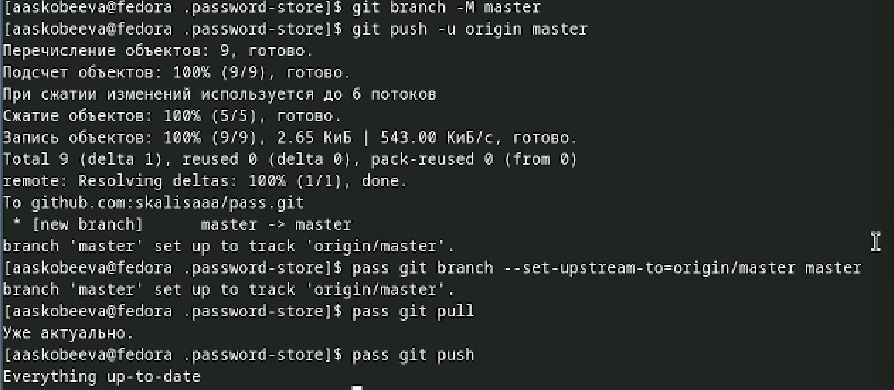
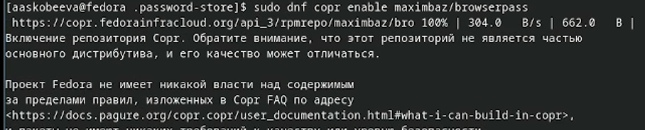
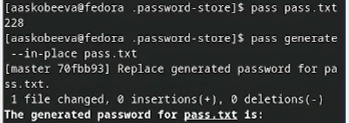
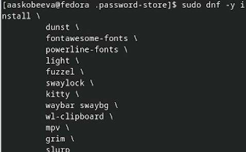
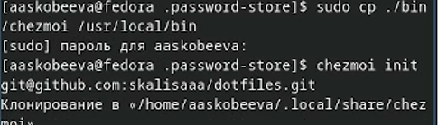
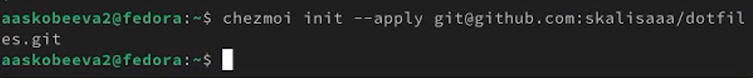

---
## Front matter
lang: ru-RU
title: Отчет по лабораторной работе № 5
subtitle: Настройка рабочей среды
author:
  - Скобеева А. А.
institute:
  - Российский университет дружбы народов, Москва, Россия

## i18n babel
babel-lang: russian
babel-otherlangs: english

## Formatting pdf
toc: false
toc-title: Содержание
slide_level: 2
aspectratio: 169
section-titles: true
theme: metropolis
header-includes:
 - \metroset{progressbar=frametitle,sectionpage=progressbar,numbering=fraction}
---

# Информация

## Докладчик

:::::::::::::: {.columns align=center}
::: {.column width="70%"}

  * Скобеева Алиса Алексеевна
  * студентка 1-го курса
  * направление "Прикладная информатика"
  * Российский университет дружбы народов
  * [1132246836pfur.ru](mailto:1132246836@pfur.ru)

:::
::: {.column width="30%"}

:::
::::::::::::::

# Вводная часть

## Актуальность

- Данная презентация актуальна для всех, кто работает с Github и на Linux. 

## Объект и предмет исследования

- Chezmoi
- Репозитории github

## Цели и задачи

- Настроить рабочую среду на своей основной ВМ и на второй.

## Материалы и методы

- Материалы ТУИС

# Создание презентации

## Менеджер паролей pass

- Установка pass и gopass

## Инициализация хранилища

- Последовательно выполняем команды для инициализации и синхронизации с git

## Создание нового репозитория

- Создаем новый репозиторий и инициализируем его

## Настройка интерфейса с браузером
- Выполняем команды для настройки

## Сохранение пароля

- Создаем файл и к нему добавляем пароль сначала сами, а потом с помощью pass generate

## Дополнительное ПО

- Устанавливаем с помощью команд

## Создание собственного репозитория

- Создаем репозиторий и инициализируем его с chezmoi

## Использование chezmoi на нескольких машинах

- Инициализируем и выполняем команды

## Результаты

- Мы успешно выполнили все задания лабораторной работы.

