---
## Front matter
title: "Отчет по лабораторной работе № 5"
subtitle: "Настройка рабочей среды"
author: "Скобеева Алиса Алексеевна"

## Generic otions
lang: ru-RU
toc-title: "Содержание"

## Bibliography
bibliography: bib/cite.bib
csl: pandoc/csl/gost-r-7-0-5-2008-numeric.csl

## Pdf output format
toc: true # Table of contents
toc-depth: 2
lof: true # List of figures
lot: true # List of tables
fontsize: 12pt
linestretch: 1.5
papersize: a4
documentclass: scrreprt
## I18n polyglossia
polyglossia-lang:
  name: russian
  options:
	- spelling=modern
	- babelshorthands=true
polyglossia-otherlangs:
  name: english
## I18n babel
babel-lang: russian
babel-otherlangs: english
## Fonts
mainfont: IBM Plex Serif
romanfont: IBM Plex Serif
sansfont: IBM Plex Sans
monofont: IBM Plex Mono
mathfont: STIX Two Math
mainfontoptions: Ligatures=Common,Ligatures=TeX,Scale=0.94
romanfontoptions: Ligatures=Common,Ligatures=TeX,Scale=0.94
sansfontoptions: Ligatures=Common,Ligatures=TeX,Scale=MatchLowercase,Scale=0.94
monofontoptions: Scale=MatchLowercase,Scale=0.94,FakeStretch=0.9
mathfontoptions:
## Biblatex
biblatex: true
biblio-style: "gost-numeric"
biblatexoptions:
  - parentracker=true
  - backend=biber
  - hyperref=auto
  - language=auto
  - autolang=other*
  - citestyle=gost-numeric
## Pandoc-crossref LaTeX customization
figureTitle: "Рис."
tableTitle: "Таблица"
listingTitle: "Листинг"
lofTitle: "Список иллюстраций"
lotTitle: "Список таблиц"
lolTitle: "Листинги"
## Misc options
indent: true
header-includes:
  - \usepackage{indentfirst}
  - \usepackage{float} # keep figures where there are in the text
  - \floatplacement{figure}{H} # keep figures where there are in the text
---

# Цель работы

Здесь приводится формулировка цели лабораторной работы. Формулировки
цели для каждой лабораторной работы приведены в методических
указаниях.

Цель данного шаблона --- максимально упростить подготовку отчётов по
лабораторным работам.  Модифицируя данный шаблон, студенты смогут без
труда подготовить отчёт по лабораторным работам, а также познакомиться
с основными возможностями разметки Markdown.

# Задание

Настроить рабочую среду в виртуальной машине Fedora Sway, а также на второй виртуальной машине.

# Выполнение лабораторной работы

Установка менеджера паролей pass и gopass:

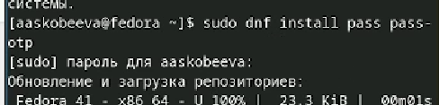{#fig:001 width=70%}

Далее просматриваем список ключей:

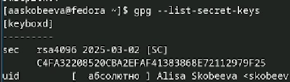{#fig:002 width=70%}

Инициализируем хранилище:

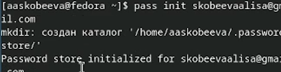{#fig:003 width=70%}

Проводим синхронизацию с хранилищем:

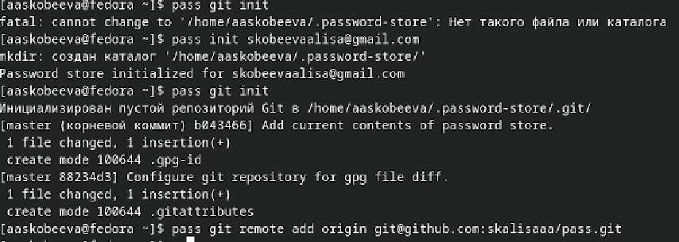{#fig:004 width=70%}

Выполняем оставшиеся команды для синхронизации:

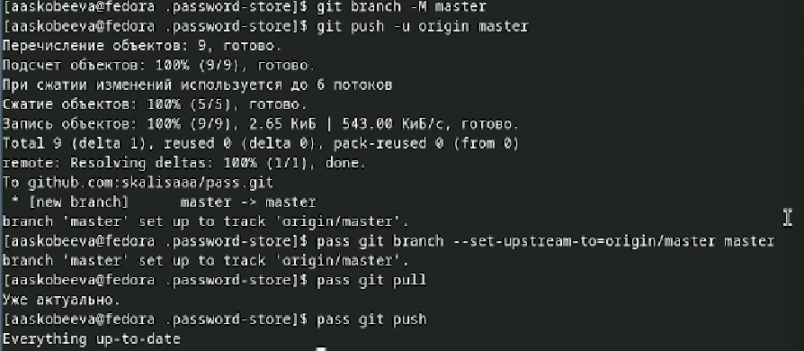{#fig:005 width=70%}

Настройка интерфейса с броузером

Устанавливаем программу, обеспечивающую интерфейс native messaging:

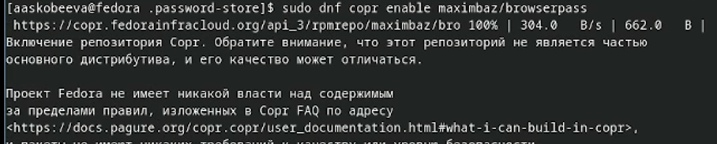{#fig:006 width=70%}

Сохранение пароля

Создаем новый файл, к которому будет добавлен пароль, добавляем пароль:

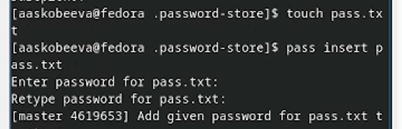{#fig:007 width=70%}

Генерируем новый пароль к файлу:

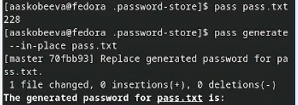{#fig:008 width=70%}

Управление файлами конфигурации

Устанавливаем дополнительное ПО:

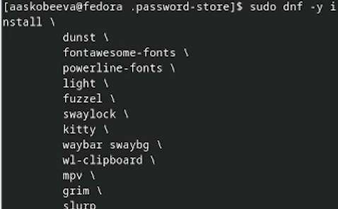{#fig:009 width=70%}

Устанавливаем три шрифта:

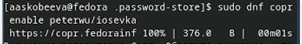{#fig:010 width=70%}

Устанавливаем бинарный файл:

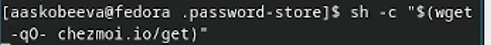{#fig:011 width=70%}

Создаем собственный репозиторий с помощью утилит:

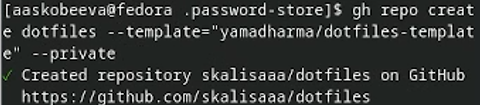{#fig:012 width=70%}

Инициализация chezmoi с репозиторием:

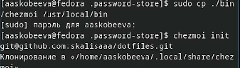{#fig:014 width=70%}

Использование chezmoi на нескольких машинах
Запускаем вторую виртуальную машину.

Инициализируем chezmoi с dotfiles на 2-ой машине:

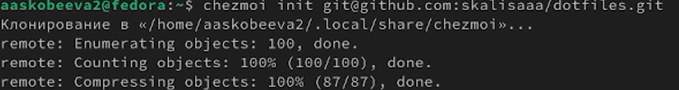{#fig:015 width=70%}

Проверяем, какие внесения внесет chezmoi. Соглашаемся с ними:

{#fig:016 width=70%}

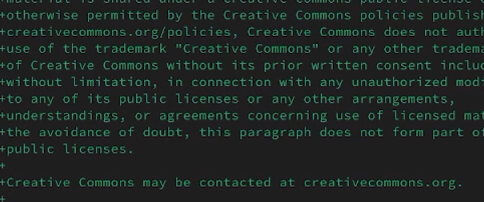{#fig:017 width=70%}

Настройка новой машины с помощью одной команды:

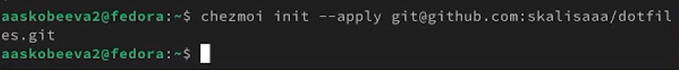{#fig:018 width=70%}

Ежедневные операции
Выполняем команды, но т.к. выдает "Все актуально" загружать нет ничего нового.

{#fig:019 width=70%}

# Выводы

В данной лабораторной работе мы настроили нашу основную виртуальную машину и вторую.

