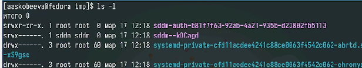
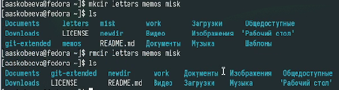
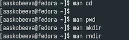
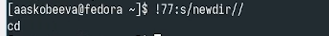

---
## Front matter
lang: ru-RU
title: Отчет по лабораторной работе № 6
subtitle: Основы интерфейса взаимодействия пользователя с системой Unix на уровень командной строки
author:
  - Скобеева А.А.
institute:
  - Российский университет дружбы народов, Москва, Россия
date: 18 марта 2025

## i18n babel
babel-lang: russian
babel-otherlangs: english

## Formatting pdf
toc: false
toc-title: Содержание
slide_level: 2
aspectratio: 169
section-titles: true
theme: metropolis
header-includes:
 - \metroset{progressbar=frametitle,sectionpage=progressbar,numbering=fraction}
---

# Информация

## Докладчик

:::::::::::::: {.columns align=center}
::: {.column width="70%"}

  * Скобеева Алиса Алексеевна
  * студентка 1-го курса
  * направление "Прикладная информатика"
  * Российский университет дружбы народов
  * [1132246836@pfur.ru](mailto:1132246836@pfur.ru)

:::
::: {.column width="30%"}

:::
::::::::::::::

# Вводная часть

## Актуальность

- Данная презентация актуальна для всех, кто интересуется работой с командной строкой на ОС Linux Fedora Sway

## Объект и предмет исследования

- Командная строка

## Цели и задачи

- Приобретение практических навыков взаимодействия пользователя с системой посредством командной строки

## Материалы и методы

- Материалы с платформы ТУИС

# Основная часть

## Выполнение команд

- Выводим содержимое каталога
- Используем команду ls с различными опциями
- 

## Выполнение команд

- Создаем различные каталоги
- Выполняем команды, требуемые по заданию. Например, удаляем каталоги одной командой
- 

## Использование команды man

- С помощью команды man находим нужные нам команды
- Также, просматриваем разные команды с помощью man
- 

## Модификация команд

- Просматриваем историю команд
- Модифицируем некоторые из них
- 

## Результаты

- Мы успешно выполнили задания лабораторной работы, проведя необходимые операции с каталогами.

