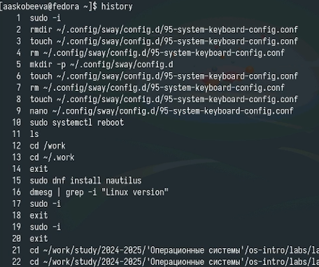

---
## Front matter
title: "Отчет по лабораторной работе № 6"
subtitle: "Основы интерфейса взаимодействия пользователя с системой Unix на уровень командной строки"
author: "Алиса Алексеевна Скобеева"

## Generic otions
lang: ru-RU
toc-title: "Содержание"

## Bibliography
bibliography: bib/cite.bib
csl: pandoc/csl/gost-r-7-0-5-2008-numeric.csl

## Pdf output format
toc: true # Table of contents
toc-depth: 2
lof: true # List of figures
lot: true # List of tables
fontsize: 12pt
linestretch: 1.5
papersize: a4
documentclass: scrreprt
## I18n polyglossia
polyglossia-lang:
  name: russian
  options:
	- spelling=modern
	- babelshorthands=true
polyglossia-otherlangs:
  name: english
## I18n babel
babel-lang: russian
babel-otherlangs: english
## Fonts
mainfont: IBM Plex Serif
romanfont: IBM Plex Serif
sansfont: IBM Plex Sans
monofont: IBM Plex Mono
mathfont: STIX Two Math
mainfontoptions: Ligatures=Common,Ligatures=TeX,Scale=0.94
romanfontoptions: Ligatures=Common,Ligatures=TeX,Scale=0.94
sansfontoptions: Ligatures=Common,Ligatures=TeX,Scale=MatchLowercase,Scale=0.94
monofontoptions: Scale=MatchLowercase,Scale=0.94,FakeStretch=0.9
mathfontoptions:
## Biblatex
biblatex: true
biblio-style: "gost-numeric"
biblatexoptions:
  - parentracker=true
  - backend=biber
  - hyperref=auto
  - language=auto
  - autolang=other*
  - citestyle=gost-numeric
## Pandoc-crossref LaTeX customization
figureTitle: "Рис."
tableTitle: "Таблица"
listingTitle: "Листинг"
lofTitle: "Список иллюстраций"
lotTitle: "Список таблиц"
lolTitle: "Листинги"
## Misc options
indent: true
header-includes:
  - \usepackage{indentfirst}
  - \usepackage{float} # keep figures where there are in the text
  - \floatplacement{figure}{H} # keep figures where there are in the text
---

# Цель работы

Приобретение практических навыков взаимодействия пользователя с системой посредством командной строки. 

# Задание

Здесь приводится описание задания в соответствии с рекомендациями
методического пособия и выданным вариантом.

# Выполнение лабораторной работы

Определяем полное имя вашего домашнего каталога:

{#fig:001 width=70%}

Переходим в каталог tmp. Выводим на экран содержимое каталога:

{#fig:002 width=70%}

Используем команду ls с разными опциями:

{#fig:003 width=70%}

Разница между командами: 
ls - выводит список файлов и каталогов в текущем каталоге;
ls -l - выводит подрбный список файлов и каталогов(с правами доступа, размером, датой изменения и т.д.);
ls -a - выводит список всех файлов и каталогов, включая скрытые (начинающиеся с точки);
ls -al - выводит подробный список всех файлов и каталогов, включая скрытые

Определяем, есть ли в каталоге подкаталог с именем cron:

{#fig:004 width=70%}

Переходим в домашний каталог и выводим на экран его содержимое: 

{#fig:005 width=70%}

Создаем каталог с именем newdir. В нем создаем каталог с именем morefun:

{#fig:006 width=70%}

Создаем три каталога одной командой. Удаляем их также одной командой:

{#fig:007 width=70%}

Пробуем удалить каталог newdir командой rm:

{#fig:008 width=70%}

Удаляем каталог ~/newdir/morefun:

{#fig:009 width=70%}

С помощью команды man определяем, какую опцию команды ls нужно использовать для просмотра подкаталогов:

{#fig:010 width=70%}

С помощью команды lt мы можем отсотрировать по времени последнего изменения выводимый список содержимого каталога с развернутым описанием файлов.

Просматриваем следующие команды с помощью man:

{#fig:011 width=70%}

Просмотрим историю команд:

{#fig:012 width=70%}

Выполняем модификацию команды:

{#fig:013 width=70%}

# Ответы на вопросы

1. Что такое командная строка?
Командная строка - это текстовый интерфейс пользователя для взаимодействия с операционной системой, команды вводятся текстом, а не выбираются кнопками. 

2. При помощи какой команды можно определить абсолютный путь текущего каталога? Приведите пример.
Абсолютный путь текущего каталога определяется командой pwd, пример: pwd -> /home/user/Documents. 

3. При помощи какой команды и каких опций можно определить только тип файлов и их имена в текущем каталоге? Приведите примеры.
Тип файлов и их имена в текущем каталоге можно определить командой ls -F, например, ls -F выведет file.txt dir/ script.sh* link@, или командой stat -c "%F %n" *, например, stat -c "%F %n" * выведет обычный файл file.txt каталог dir исполняемый файл script.sh символическая ссылка link. 

4. Каким образом отобразить информацию о скрытых файлах? Приведите примеры.
Скрытые файлы отображаются командой ls -a (включая . и ..) или ls -A (кроме . и ..), пример: ls -a -> . .. .hidden_file file.txt dir. 

5. При помощи каких команд можно удалить файл и каталог? Можно ли это сделать одной и той же командой? Приведите примеры.
Файлы удаляются командой rm file.txt, а пустые каталоги командой rmdir empty_dir, непустые каталоги удаляются командой rm -rf dir, rm с опцией -r или -rf может удалять и файлы, и каталоги.

6. Каким образом отобразить информацию о последних выполненных пользователем командах?
Последние выполненные команды отображаются командой history, например, history 20 для последних 20 команд.

7. Как воспользоваться историей команд для их модифицированного выполнения? Приведите примеры.
Для модифицированного выполнения команд можно использовать стрелки вверх/вниз, !n (номер команды), !! (последняя команда), !string (последняя команда, начинающаяся с string), ^string1^string2^ (замена). 

8. Приведите примеры запуска нескольких команд в одной строке.
Несколько команд в одной строке запускаются через ; (последовательно), && (если предыдущая успешна), || (если предыдущая неудачна), пример: pwd; ls -l. 

9. Дайте определение и приведите примера символов экранирования.
Символы экранирования отменяют специальное значение символов, часто используется \, пример: ls file\ with\ spaces.txt. 

10. Охарактеризуйте вывод информации на экран после выполнения команды ls с опцией l.
Вывод ls -l показывает права доступа, количество ссылок, владельца, группу, размер, дату изменения и имя файла/каталога. 

11. Что такое относительный путь к файлу? Приведите примеры использования относительного и абсолютного пути при выполнении какой-либо команды.
Относительный путь - это путь относительно текущего каталога, абсолютный путь - от корня, пример, в /home/user/Documents: cat file.txt (относительный), cat /home/user/Documents/file.txt (абсолютный). 

12. Как получить информацию об интересующей вас команде?
Информацию о команде можно получить через man command_name, command_name --help или info command_name. 

13. Какая клавиша или комбинация клавиш служит для автоматического дополнения вводимых команд?
Клавиша Tab служит для автоматического дополнения команд.

# Выводы

Мы выполнили лабораторную работу и приобрели практические навыки взаимодействия пользователя с системой посредством командной строки.

