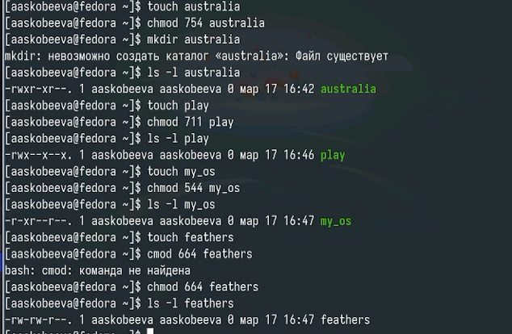

---
## Front matter
lang: ru-RU
title: Отчет по лабораторной работе № 7
subtitle: Анализ файловой структуры UNIX. Команды для работы с файлами и каталогами
author:
  - Скобеева А.А.
institute:
  - Российский университет дружбы народов, Москва, Россия
date: 18 марта 2025

## i18n babel
babel-lang: russian
babel-otherlangs: english

## Formatting pdf
toc: false
toc-title: Содержание
slide_level: 2
aspectratio: 169
section-titles: true
theme: metropolis
header-includes:
 - \metroset{progressbar=frametitle,sectionpage=progressbar,numbering=fraction}
---

# Информация

## Докладчик

:::::::::::::: {.columns align=center}
::: {.column width="70%"}

  * Скобеева Алиса Алексеевна
  * студентка 1-го курса
  * направление "Прикладная информатика"
  * Российский университет дружбы народов
  * [1132246836@pfur.ru](mailto:1132246836@pfur.ru)

:::
::: {.column width="30%"}

:::
::::::::::::::

# Вводная часть

## Актуальность

- Данная презентация актуальна для всех, кто интересуется работой в терминале Linux.

## Объект и предмет исследования

- Каталоги и файлы 

## Цели и задачи

- Ознакомление с файловой системой Linux, ee структурой, именами и содержанием каталогов. Приобретение практических навыков по применению команд для работы с файлами и каталогами, по управлению процессами (и работами), по проверке использования диска и обслуживанию файловой системы.

## Материалы и методы

- Материалы ТУИС

# Основная часть

## Выполнение примеров

- Выполняем все примеры, представленные в первой части лабораторной работы
- 

## Создание каталогов и файлов

- Создаем различные каталоги и подкаталоги
- Создаем файлы, переименовываем их и перемещаем
- 

## Определение опций команды chmod

- Выделяем файлам права доступа
- 

## Просмотр содержимого файла

- С помощью cat просматриваем содержимое /etc/passwd
- 

## Копирование и перемещение

- Копируем и перемещаем файлы и каталоги
- 

## Права доступа

- Эксперементируем с правами доступа файлов
- 

## Изучение команд с помощью man

- C помощью команды man изучаем различные команды
- 

## Результаты

- Мы успешно выполнили задания лабораторной работы и научились работать с правами доступа, а также приобрели навыки работы с файлами и каталогами.

