---
## Front matter
title: "Отчет по лабораторной работе № 7"
subtitle: "Анализ файловой структуры UNIX. Команды для работы с файлами и каталогами"
author: "Алиса Алексеевна Скобеева"

## Generic otions
lang: ru-RU
toc-title: "Содержание"

## Bibliography
bibliography: bib/cite.bib
csl: pandoc/csl/gost-r-7-0-5-2008-numeric.csl

## Pdf output format
toc: true # Table of contents
toc-depth: 2
lof: true # List of figures
lot: true # List of tables
fontsize: 12pt
linestretch: 1.5
papersize: a4
documentclass: scrreprt
## I18n polyglossia
polyglossia-lang:
  name: russian
  options:
	- spelling=modern
	- babelshorthands=true
polyglossia-otherlangs:
  name: english
## I18n babel
babel-lang: russian
babel-otherlangs: english
## Fonts
mainfont: IBM Plex Serif
romanfont: IBM Plex Serif
sansfont: IBM Plex Sans
monofont: IBM Plex Mono
mathfont: STIX Two Math
mainfontoptions: Ligatures=Common,Ligatures=TeX,Scale=0.94
romanfontoptions: Ligatures=Common,Ligatures=TeX,Scale=0.94
sansfontoptions: Ligatures=Common,Ligatures=TeX,Scale=MatchLowercase,Scale=0.94
monofontoptions: Scale=MatchLowercase,Scale=0.94,FakeStretch=0.9
mathfontoptions:
## Biblatex
biblatex: true
biblio-style: "gost-numeric"
biblatexoptions:
  - parentracker=true
  - backend=biber
  - hyperref=auto
  - language=auto
  - autolang=other*
  - citestyle=gost-numeric
## Pandoc-crossref LaTeX customization
figureTitle: "Рис."
tableTitle: "Таблица"
listingTitle: "Листинг"
lofTitle: "Список иллюстраций"
lotTitle: "Список таблиц"
lolTitle: "Листинги"
## Misc options
indent: true
header-includes:
  - \usepackage{indentfirst}
  - \usepackage{float} # keep figures where there are in the text
  - \floatplacement{figure}{H} # keep figures where there are in the text
---

# Цель работы

Ознакомление с файловой системой Linux, её структурой, именами и содержанием каталогов. Приобретение практических навыков по применению команд для работы с файлами и каталогами, по управлению процессами (и работами), по проверке использования диска и обслуживанию файловой системы.

# Задание

Последовательно выполнить команды, указанные в заданиях к лабораторной работе.

# Выполнение лабораторной работы

Выполняем примеры, приведенные в первой части описания лабораторной работы.

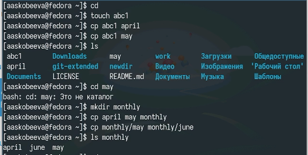{#fig:001 width=70%}

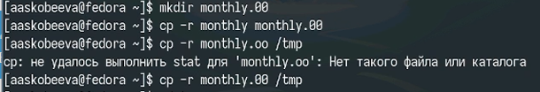{#fig:002 width=70%}

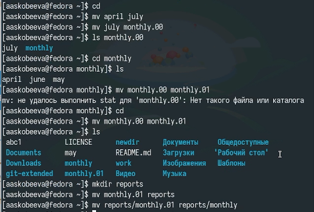{#fig:003 width=70%}

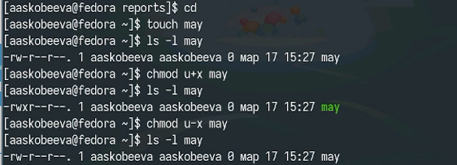{#fig:004 width=70%}

{#fig:005 width=70%}

Создаем директории, файлы, переименовываем их, копируем и перемещаем между каталогами:

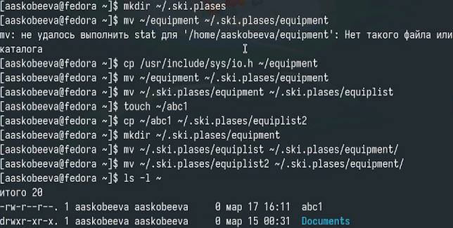{#fig:006 width=70%}

Создаем каталоги и перемещаем туда файлы:

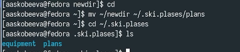{#fig:007 width=70%}

Определяем опции команды chmod:

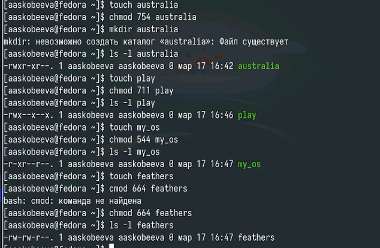{#fig:008 width=70%}

Просматриваем содержимое файла /etc/passwd:

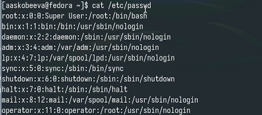{#fig:009 width=70%}

Копируем и перемещаем файлы между каталогами:

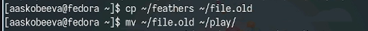{#fig:010 width=70%}

Копирование каталога:

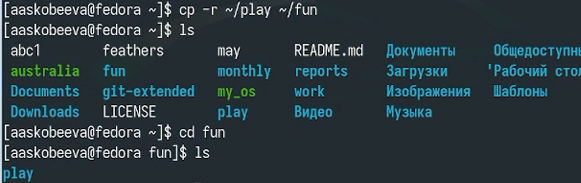{#fig:011 width=70%}

Копирование и перемещение:

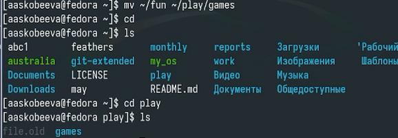{#fig:012 width=70%}

Экспериментируем с правами доступа, и смотрим результат выполнения команд:

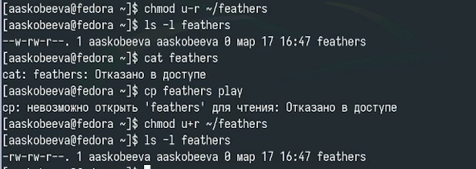{#fig:013 width=70%}

Продолжаем давать и забирать права доступа:

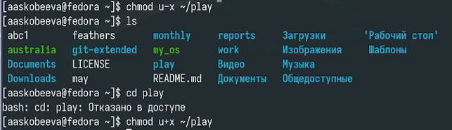{#fig:014 width=70%}

Изучаем команды с помощью man:

{#fig:015 width=70%}

# Контрольные вопросы

1.  Дайте характеристику каждой файловой системе, существующей на жёстком диске компьютера, на котором вы выполняли лабораторную работу.

    *   Btrfs: Современная файловая система, которая включает в себя многие продвинутые функции, такие как копирование при записи (copy-on-write), снапшоты, динамическое изменение размера разделов и встроенную поддержку RAID.

2.  Приведите общую структуру файловой системы и дайте характеристику каждой директории первого уровня этой структуры.

    Общая структура файловой системы Linux представляет собой иерархическое дерево, начинающееся с корневого каталога (/). Вот основные директории первого уровня и их характеристики:

    *   /: Корневой каталог. Все файлы и каталоги находятся внутри этой структуры.

    *   /bin: Содержит основные исполняемые файлы, необходимые для работы системы в однопользовательском режиме и доступные всем пользователям. (например, ls, cp, mv).

    *   /boot: Содержит файлы, необходимые для загрузки операционной системы (ядро, загрузчик).

    *   /dev: Содержит файлы устройств, представляющие собой интерфейсы к аппаратным устройствам (например, /dev/sda - жесткий диск, /dev/tty - терминал).

    *   /etc: Содержит конфигурационные файлы системы и приложений.

    *   /home: Содержит домашние каталоги пользователей. Каждый пользователь имеет свой собственный каталог внутри /home, где он может хранить свои файлы.

    *   /lib и /lib64: Содержат общие библиотеки, необходимые для работы программ, расположенных в /bin и /sbin. /lib64 используется на 64-битных системах.

    *   /media: Используется для автоматического монтирования съемных носителей (USB-накопители, CD-ROM).

    *   /mnt: Используется для временного монтирования файловых систем.

    *   /opt: Содержит дополнительные пакеты программного обеспечения.

    *   /proc: Виртуальная файловая система, содержащая информацию о процессах и системе. Файлы в /proc создаются динамически ядром.

    *   /root: Домашний каталог пользователя root.

    *   /run: Временная файловая система, используемая для хранения данных времени выполнения, таких как PID-файлы и сокеты.

    *   /sbin: Содержит системные исполняемые файлы, необходимые для администрирования системы (например, fdisk, ifconfig). Доступны только пользователю root.

    *   /srv: Содержит данные для служб, предоставляемых системой.

    *   /sys: Виртуальная файловая система, предоставляющая интерфейс к яд
ру и драйверам устройств.

    *   /tmp: Временный каталог, используемый для хранения временных файлов. Содержимое /tmp обычно очищается при перезагрузке системы.

    *   /usr: Содержит большинство пользовательских программ и данных.

    *   /var: Содержит переменные данные, такие как журналы, очереди печати, временные файлы и базы данных.

3.  Какая операция должна быть выполнена, чтобы содержимое некоторой файловой системы было доступно операционной системе?

    Чтобы содержимое файловой системы стало доступно операционной системе, необходимо выполнить операцию монтирования (mounting). Монтирование связывает файловую систему на физическом устройстве (например, разделе жесткого диска, USB-накопителе) с определенной точкой монтирования (каталогом) в общей структуре файловой системы.

4.  Назовите основные причины нарушения целостности файловой системы. Как устранить повреждения файловой системы?

    Основные причины нарушения целостности файловой системы:

    *   Сбои питания: Внезапное отключение питания во время записи данных на диск.
    *   Аппаратные сбои: Повреждение жесткого диска или другого устройства хранения.
    *   Программные ошибки: Ошибки в драйверах файловой системы или в других программах, работающих с файловой системой.
    *   Некорректное выключение системы: Выключение компьютера без завершения работы операционной системы.
    *   Вирусы и вредоносное ПО: Некоторые вирусы могут повредить файловую систему.

    Для устранения повреждений файловой системы используются утилиты проверки и восстановления файловой системы, такие как fsck (file system check).  Для файловой системы ext4 обычно используется команда e2fsck. Команда запускается с указанием устройства, которое нужно проверить.

    Пример: sudo e2fsck -f /dev/sda1

    Опция -f заставляет fsck выполнять проверку даже если файловая система помечена как "чистая".

5.  Как создаётся файловая система?

    Файловая система создаётся с помощью утилиты форматирования. В Linux для этого часто используют команду mkfs (make file system). Необходимо указать тип файловой системы и устройство, на котором её нужно создать.

    Примеры:

    *   sudo mkfs.ext4 /dev/sda1 (создать файловую систему ext4 на разделе /dev/sda1)
    *   sudo mkfs.xfs /dev/sdb1 (создать файловую систему XFS на разделе /dev/sdb1)

6.  Дайте характеристику командам для просмотра текстовых файлов.

    Основные команды для просмотра текстовых файлов в Linux:

    *   cat: Выводит содержимое файла на экран.
        *   Пример: cat file.txt
    *   less: Позволяет просматривать файл постранично. Поддерживает навигацию по файлу (вверх, вниз, поиск).
        *   Пример: less file.txt
    *   more: Аналогична less, но имеет меньше возможностей для навигации.
        *   Пример: more file.txt
    *   head: Выводит первые несколько строк файла (по умолчанию 10).
        *   Пример: head file.txt (первые 10 строк)
        *   Пример: head -n 20 file.txt (первые 20 строк)
    *   tail: Выводит последние несколько строк файла (по умолчанию 10). Часто используется для просмотра лог-файлов.
        *   Пример: tail file.txt (последние 10 строк)
        *   Пример: tail -f file.txt (выводить последние строки и следить за добавлением новых строк в файл)
        *   Пример: tail -n 50 file.txt (последние 50 строк)
    *   nl: Выводит содержимое файла, добавляя нумерацию строк.
        *   Пример: nl file.txt

7.  Приведите основные возможности команды cp в Linux.

    Команда cp (copy) используется для копирования файлов и каталогов. Основные возможности:

    *   cp source_file destination_file: Копирование файла source_file в файл destination_file.
    *   cp source_file directory: Копирование файла source_file в каталог directory.
    *   cp -r source_directory destination_directory: Рекурсивное копирование кат
алога source_directory в каталог destination_directory. Опция -r необходима для копирования каталогов.
    *   cp -i source_file destination_file: Копирование файла с запросом подтверждения, если destination_file уже существует.
    *   cp -u source_file destination_file: Копирование файла, только если source_file новее, чем destination_file.
    *   cp -p source_file destination_file: Копирование файла с сохранением прав доступа, владельца, времени изменения.
    *   cp -a source_directory destination_directory: Копирование каталога рекурсивно с сохранением всех атрибутов (прав доступа, владельца, времени изменения, символических ссылок и т.д.). Эквивалентно -dr --preserve=all
    *   cp -s source_file link_name: Создание символической ссылки (link_name) на source_file вместо копирования файла.

8.  Приведите основные возможности команды mv в Linux.

    Команда mv (move) используется для перемещения или переименования файлов и каталогов. Основные возможности:

    *   mv source_file destination_file: Переименование файла source_file в destination_file. Если destination_file существует, то он будет перезаписан.
    *   mv source_file directory: Перемещение файла source_file в каталог directory.
    *   mv source_directory destination_directory: Перемещение каталога source_directory в каталог destination_directory.
    *   mv -i source_file destination_file: Переименование или перемещение файла с запросом подтверждения, если destination_file уже существует.
    *   mv -u source_file destination_file: Перемещение файла, только если source_file новее, чем destination_file.

9.  Что такое права доступа? Как они могут быть изменены?

    Права доступа в Linux определяют, какие действия могут выполнять пользователи и группы с файлами и каталогами. Существует три типа прав доступа:

    *   Чтение (read, r): Позволяет просматривать содержимое файла или просматривать список файлов в каталоге.
    *   Запись (write, w): Позволяет изменять содержимое файла или создавать/удалять файлы в каталоге.
    *   Выполнение (execute, x): Позволяет запускать файл как программу или входить в каталог.

    Права доступа назначаются трем категориям пользователей:

    *   Владелец файла (user): Пользователь, которому принадлежит файл.
    *   Группа владельца файла (group): Группа, которой принадлежит файл.
    *   Остальные (others): Все остальные пользователи системы.

    Права доступа отображаются в виде строки из 10 символов, например, -rwxr-xr--. Первый символ указывает на тип файла (- - обычный файл, d - каталог, l - символическая ссылка и т.д.). Остальные 9 символов разбиты на три группы по 3 символа, представляющие права доступа для владельца, группы и остальных соответственно.

    Для изменения прав доступа используется команда chmod (change mode). Существует два способа указания прав доступа:

    *   Символьный: Используются символы u (user), g (group), o (others), a (all), + (добавить), - (удалить), = (установить).
        *   Примеры:
            *   chmod u+x file.txt: Добавить право выполнения владельцу файла file.txt.
            *   chmod g-w file.txt: Забрать право записи у группы для файла file.txt.
            *   chmod o=r file.txt: Установить право чтения для остальных пользователей для файла file.txt.
            *   chmod a+r file.txt: Дать всем пользователям право на чтение файла file.txt.
    *   Числовой: Используются три цифры, представляющие права доступа для владельца, группы и остальных соответственно. Каждая цифра является суммой следующих значений:
        *   4 - чтение (r)
        *   2 - запись (w)
        *   1 - выполнение (x)
        *   Примеры:
            *   chmod 755 file.txt: Установить права rwxr-xr-x (владелец - чтение, запись, выполнение; группа - чтение, выполнение; остальные - чтение
, выполнение).
            *   chmod 644 file.txt: Установить права rw-r--r-- (владелец - чтение, запись; группа - чтение; остальные - чтение).
        *   chmod 777 file.txt: Дать всем пользователям все права.

        Для изменения владельца файла используются команды chown (change owner) и chgrp (change group).
        * Пример:
            * chown user file.txt: Сменить владельца файла на user.
            * chgrp group file.txt: Сменить группу файла на group.

# Выводы

Мы успешно выполнили все задания лабораторной работы и приобрели навыки работы с каталогами, подкаталогами и файлами.

