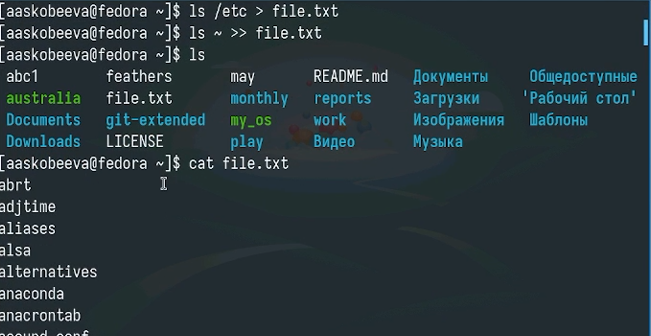
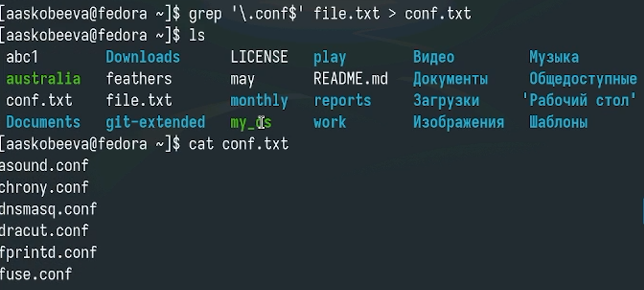
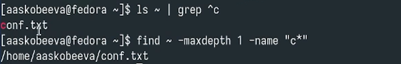
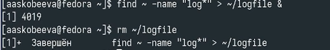
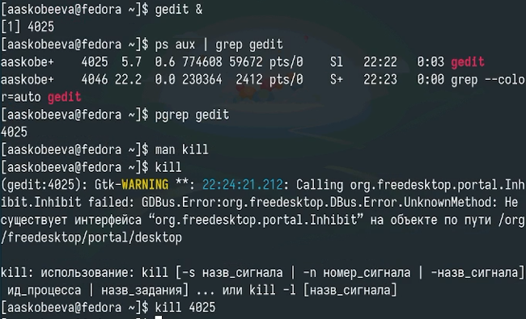
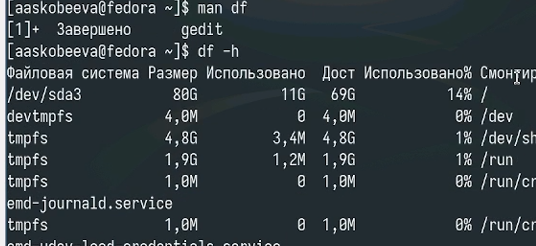
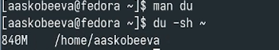
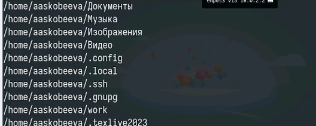

---
## Front matter
lang: ru-RU
title: Отчет по лабораторной работе № 8
subtitle: Поиск файлов. Перенаправление ввода-вывода. Просмотр запущенных процессов
author:
  - Скобеева А.А.
institute:
  - Российский университет дружбы народов, Москва, Россия
date: 18 марта 2025

## i18n babel
babel-lang: russian
babel-otherlangs: english

## Formatting pdf
toc: false
toc-title: Содержание
slide_level: 2
aspectratio: 169
section-titles: true
theme: metropolis
header-includes:
 - \metroset{progressbar=frametitle,sectionpage=progressbar,numbering=fraction}
---

# Информация

## Докладчик

:::::::::::::: {.columns align=center}
::: {.column width="70%"}

  * Скобеева Алиса Алексеевна
  * студентка 1-го курса
  * направление "Прикладная информатика"
  * Российский университет дружбы народов
  * [1132246836@pfur.ru](mailto:1132246836@pfur.ru)

:::
::: {.column width="30%"}

:::
::::::::::::::

# Вводная часть

## Актуальность

- Данная презентация актуальна для тех, кто интересуется работой с файлами в терминале Linux

## Объект и предмет исследования

- Файлы и каталоги
- Терминал Linux

## Цели и задачи

- Ознакомление с инструментами поиска файлов и фильтрации текстовых данных. Приобретение практических навыков: по управлению процессами(и заданиями), по проверке использования диска и обслуживанию файловых систем.

## Материалы и методы

- Материалы ТУИС

# Основная часть

## Запись названия файлов

- Осуществляем запись названия файлов из каталогов
- 

## Запись названия определенных файлов

- 

## Просмотр файлов

- Выполним команду для просмотра файлов, начинающихся с определенного символа
- 

## Вывод названий файлов на экран

- 

## Запуск процесса

- Запускаем и завершаем процесс записи названий в файл
- 

## Запуск gedit

- Запускаем gedit в фоновом режиме
- Завершаем с помощью kill
- 

## Выполнение команд df и du

- 
- 

## Вывод директорий

- Используем команду find
- 

## Результаты

- Мы успешно выполнили все задания лабораторной работы и достигли поставленных в ней целей.

