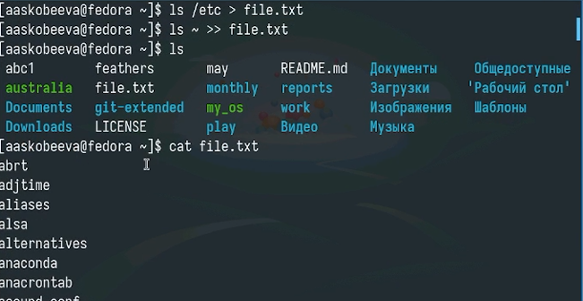
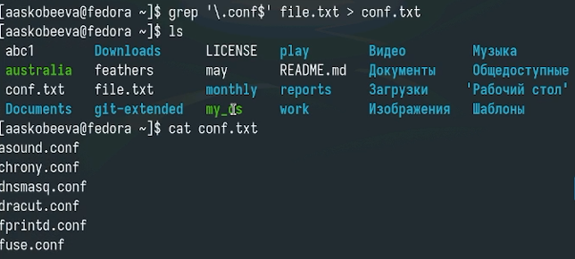
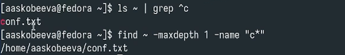
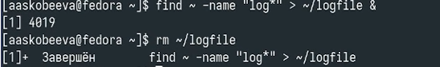
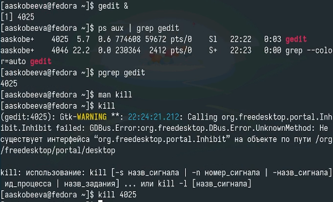
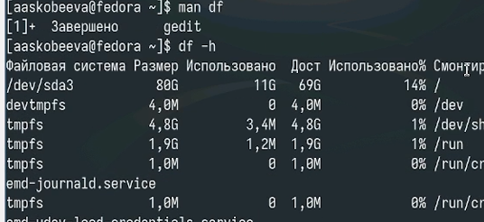
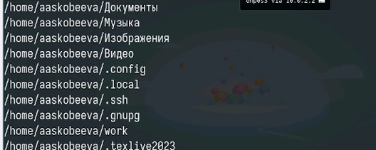

---
## Front matter
title: "Отчет по лабораторной работе № 8"
subtitle: "Поиск файлов. Перенаправление ввода-вывода. Просмотр запущенных процессов"
author: "Алиса Алексеевна Скобеева"

## Generic otions
lang: ru-RU
toc-title: "Содержание"

## Bibliography
bibliography: bib/cite.bib
csl: pandoc/csl/gost-r-7-0-5-2008-numeric.csl

## Pdf output format
toc: true # Table of contents
toc-depth: 2
lof: true # List of figures
lot: true # List of tables
fontsize: 12pt
linestretch: 1.5
papersize: a4
documentclass: scrreprt
## I18n polyglossia
polyglossia-lang:
  name: russian
  options:
	- spelling=modern
	- babelshorthands=true
polyglossia-otherlangs:
  name: english
## I18n babel
babel-lang: russian
babel-otherlangs: english
## Fonts
mainfont: IBM Plex Serif
romanfont: IBM Plex Serif
sansfont: IBM Plex Sans
monofont: IBM Plex Mono
mathfont: STIX Two Math
mainfontoptions: Ligatures=Common,Ligatures=TeX,Scale=0.94
romanfontoptions: Ligatures=Common,Ligatures=TeX,Scale=0.94
sansfontoptions: Ligatures=Common,Ligatures=TeX,Scale=MatchLowercase,Scale=0.94
monofontoptions: Scale=MatchLowercase,Scale=0.94,FakeStretch=0.9
mathfontoptions:
## Biblatex
biblatex: true
biblio-style: "gost-numeric"
biblatexoptions:
  - parentracker=true
  - backend=biber
  - hyperref=auto
  - language=auto
  - autolang=other*
  - citestyle=gost-numeric
## Pandoc-crossref LaTeX customization
figureTitle: "Рис."
tableTitle: "Таблица"
listingTitle: "Листинг"
lofTitle: "Список иллюстраций"
lotTitle: "Список таблиц"
lolTitle: "Листинги"
## Misc options
indent: true
header-includes:
  - \usepackage{indentfirst}
  - \usepackage{float} # keep figures where there are in the text
  - \floatplacement{figure}{H} # keep figures where there are in the text
---

# Цель работы

Ознакомление с инструментами поиска файлов и фильтрации текстовых данных. Приобретение практических навыков: по управлению процессами (и заданиями), по проверке использования диска и обслуживанию файловых систем.

# Задание

Последовательно выполнить упражнения, указанные на платформе ТУИС.

# Выполнение лабораторной работы

Записываем в file.txt названия файлов из /etc и из домашнего каталога:

{#fig:001 width=70%}

Выводим имена файлов, имеющих расширение .conf и записываем их в conf.txt:

{#fig:002 width=70%}

Определение файлов в домашнем каталоге, начинающихся с "с":

{#fig:003 width=70%}

Выводим на экран название файлов из /etc начинающихся с "h":

{#fig:004 width=70%}

Запускаем и завершаем процесс, который будет записывать определенные названия в файл:

{#fig:005 width=70%}

Запускаем в фоновом режиме gedit. Узнаем идентификатор процесса и завершаем его с помощью kill:

{#fig:006 width=70%}

Выполняем команду df:

{#fig:007 width=70%}

Выполняем команду du:

{#fig:008 width=70%}

С помощью find выводим имена всех директорий, имеющихся в домашнем каталоге:

{#fig:009 width=70%}

# Выводы

Мы успешно выполнили все задания лабораторной работы и приобрели навыки по управлению процессами, по проверке использования диска и обслуживанию файловых систем.

# Контрольные вопросы

1. Какие потоки ввода вывода вы знаете?

  В Linux существует три стандартных потока ввода-вывода:

  •  Стандартный ввод (stdin, file descriptor 0): Поток, из которого программа получает ввод. Обычно это клавиатура.
  •  Стандартный вывод (stdout, file descriptor 1): Поток, в который программа отправляет обычный вывод. Обычно это экран.
  •  Стандартный поток ошибок (stderr, file descriptor 2): Поток, в который программа отправляет сообщения об ошибках. Обычно это экран.
  
2. Объясните разницу между операцией > и >>.

  Обе операции используются для перенаправления стандартного вывода в файл, но они делают это по-разному:

  •  > (перезапись): Перенаправляет стандартный вывод в файл, перезаписывая его содержимое, если файл уже существует. Если файл не существует, он будет создан.

    Пример: ls -l > file.txt (результат команды ls -l будет записан в файл file.txt, перезаписав его, если он существовал).

  •  >> (добавление): Перенаправляет стандартный вывод в файл, добавляя его в конец файла, если он уже существует. Если файл не существует, он будет создан.

    Пример: ls -l >> file.txt (результат команды ls -l будет добавлен в конец файла file.txt).

3. Что такое конвейер?

  Конвейер (pipeline) - это последовательность команд, соединенных символом | (вертикальная черта). Вывод одной команды (stdout) становится вводом для следующей команды (stdin). Конвейеры позволяют создавать сложные операции, комбинируя простые команды.

  Пример: ls -l /etc | grep "conf" (вывести список файлов в каталоге /etc и найти строки, содержащие "conf").
  
4. Что такое процесс? Чем это понятие отличается от программы?

  •  Программа: Это набор инструкций, хранящихся на диске в виде исполняемого файла. Это пассивный объект.
  •  Процесс: Это экземпляр программы, выполняющийся в оперативной памяти. Это активный объект, имеющий свой PID, ресурсы (память, открытые файлы и т. д.) и состояние.

  Простыми словами, программа - это рецепт, а процесс - это приготовленное блюдо по этому рецепту. Одна и та же программа может быть запущена несколько раз, создавая несколько независимых процессов.
  
5. Что такое PID и GID?

  •  PID (Process ID): Уникальный числовой идентификатор, присваиваемый каждому процессу в системе. Он используется для управления процессами (например, для завершения процесса).
  •  GID (Group ID): Уникальный числовой идентификатор, присваиваемый каждой группе пользователей в системе. Он используется для определения прав доступа к файлам и каталогам для группы пользователей.
  
6. Что такое задачи и какая команда позволяет ими управлять?

  В контексте командной строки Linux, "задачи" обычно относятся к процессам, запущенным в фоновом режиме. Команда jobs позволяет просматривать список задач, выполняющихся в текущей оболочке. Другие полезные команды:

  •  &: Запустить команду в фоновом режиме.
    *  Пример: sleep 60 & (запустить команду sleep 60 в фоновом режиме).
  •  fg: Переместить задачу из фонового режима в foreground (передний план).
    *  Пример: fg %1 (переместить задачу с номером 1 в foreground).
  •  bg: Переместить остановленную задачу в фоновый режим.
    *  Пример: bg %1 (переместить задачу с номером 1 в background).
  •  kill: Отправить сигнал процессу (обычно для завершения процесса).
    *  Пример: kill %1 (завершить задачу с номером 1).
    
7. Найдите информацию об утилитах top и htop. Каковы их функции?

  top и htop - это интерактивные утилиты для мониторинга процессов в Linux. Они отображают список процессов, отсортированных по использованию ресурсов (например, CPU, памяти).

  •  top: Стандартная утилита мониторинга, доступная в большинстве дистрибутивов Linux. Она показывает список процессов, исп
ользование ресурсов, время работы системы и другую полезную информацию.
  •  htop: Более продвинутая версия top. Она имеет более удобный интерфейс, поддерживает подсветку синтаксиса, позволяет управлять процессами (например, завершать их) с помощью клавиш, и показывает информацию о процессах в виде дерева. htop обычно не установлен по умолчанию и требует установки.

  Обе утилиты полезны для выявления процессов, потребляющих много ресурсов, и для мониторинга общей производительности системы.
  
8. Назовите и дайте характеристику команде поиска файлов. Приведите примеры использования этой команды.

  Команда для поиска файлов в Linux - find. Она позволяет искать файлы по имени, типу, размеру, времени изменения, правам доступа и другим критериям.

  Примеры:

  •  find . -name "file.txt": Найти файл с именем "file.txt" в текущем каталоге и его подкаталогах.
  •  find / -name "file.txt": Найти файл с именем "file.txt" во всей файловой системе (начиная с корневого каталога).
  •  find . -type f -name "*.txt": Найти все файлы с расширением ".txt" в текущем каталоге и его подкаталогах.
  •  find . -type d -name "dir": Найти все каталоги с именем "dir" в текущем каталоге и его подкаталогах.
  •  find . -size +10M: Найти все файлы размером больше 10 МБ в текущем каталоге и его подкаталогах.
  •  find . -mtime -7: Найти все файлы, измененные за последние 7 дней.
  * find . -user username: Найти все файлы, принадлежащие пользователю username.
  * find / -perm 777: Найти все файлы с правами 777.
  
9. Можно ли по контексту (содержанию) найти файл? Если да, то как?

  Да, для поиска файлов по содержимому используется команда grep. Она ищет строки, соответствующие заданному шаблону, в указанных файлах.

  Пример:

  •  grep "keyword" file.txt: Найти все строки, содержащие "keyword", в файле file.txt.
  •  grep -r "keyword" .: Найти все файлы в текущем каталоге и его подкаталогах, содержащие "keyword". Опция -r означает рекурсивный поиск.
  •  grep -l "keyword" ./*: Найти только имена файлов, которые содержат "keyword".
  •  grep -i "keyword" file.txt: Искать "keyword" без учета регистра.

  Для более сложных поисков можно использовать регулярные выражения с grep -E или egrep.
  
10. Как определить объем свободной памяти на жёстком диске?

  Используйте команду df (disk free).

  •  df -h: Отображает информацию о свободном и занятом месте на дисках в удобочитаемом формате (например, КБ, МБ, ГБ).
  •  df -Th: То же самое, что и df -h, но добавляет информацию о типе файловой системы.
  
11. Как определить объем вашего домашнего каталога?

  Используйте команду du (disk usage).

  •  du -sh ~: Отображает общий размер домашнего каталога в удобочитаемом формате.
  •  du -sh /home/username: Отображает общий размер домашнего каталога пользователя username.

12. Как удалить зависший процесс?

  1. Найдите PID зависшего процесса с помощью команд top, htop или ps aux.
  2. Попробуйте отправить процессу сигнал SIGTERM (15), который просит процесс завершиться корректно: kill PID.
  3. Если процесс не завершается после SIGTERM, отправьте сигнал SIGKILL (9), который принудительно завершает процесс: kill -9 PID.

  Пример:
    top  # Найти PID зависшего процесса (например, 1234)
    kill 1234 # Попытка завершить процесс корректно
    kill -9 1234 # Принудительное завершение процесса, если предыдущая команда не сработала

