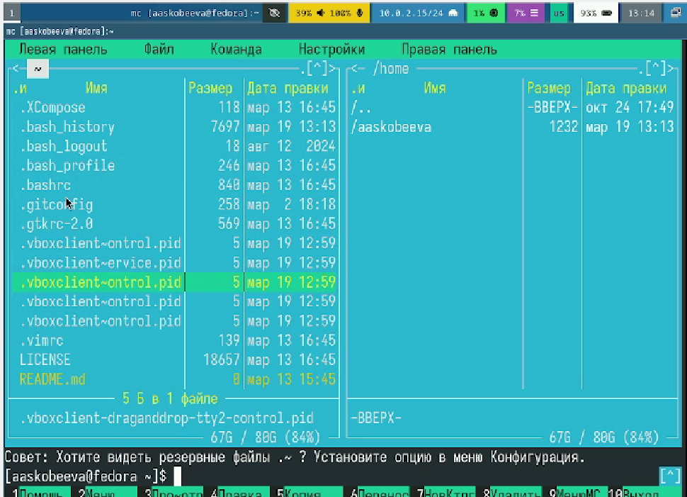
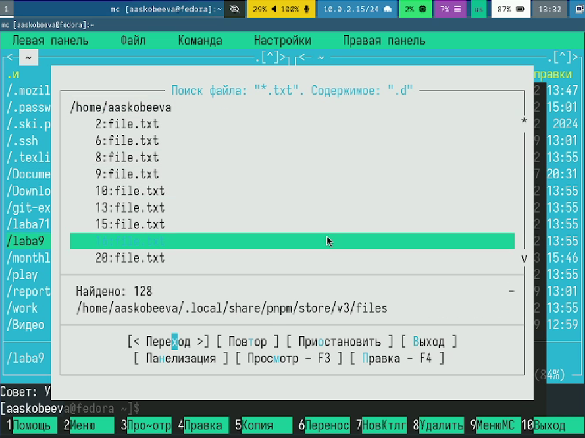
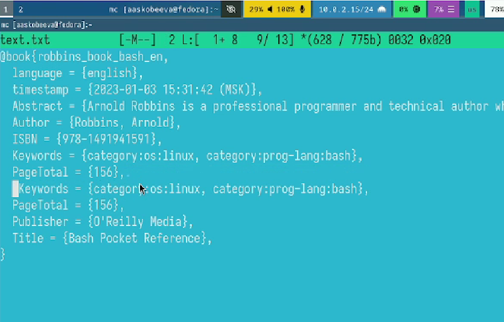
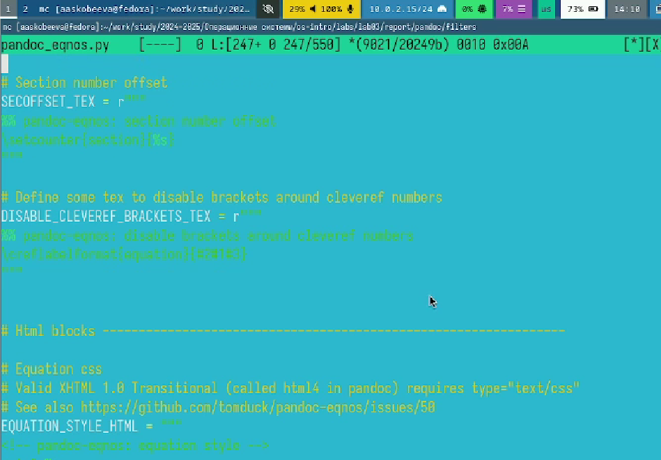

---
## Front matter
lang: ru-RU
title: Лабораторная работа № 9
subtitle: Командная оболочка MC
author:
  - Скобеева А.А.
institute:
  - Российский университет дружбы народов, Москва, Россия
date: 07 марта 2025

## i18n babel
babel-lang: russian
babel-otherlangs: english

## Formatting pdf
toc: false
toc-title: Содержание
slide_level: 2
aspectratio: 169
section-titles: true
theme: metropolis
header-includes:
 - \metroset{progressbar=frametitle,sectionpage=progressbar,numbering=fraction}
---

# Информация

## Докладчик

:::::::::::::: {.columns align=center}
::: {.column width="70%"}

  * Скобеева Алиса Алексеевна
  * студентка 1-го курса направления "Прикладная информатика"
  * Российский университет дружбы народов
  * [1132246836@pfur.ru](mailto:1132246836@pfur.ru)

:::
::: {.column width="30%"}

:::
::::::::::::::

# Вводная часть

## Актуальность

- Данная презентация актуальна для студентов технических направлений, изучающих предмет "Архитектура компьютеров: операционные системы", а также для людей, интересующихся работой с командной оболочкой mc. 

## Объект и предмет исследования

- Командная оболочка mc
- Linux Fedora Sway

## Цели и задачи

- Освоение основных возможностей командной оболочки Midnight Commander. Приобретение навыков практической работы по просмотру каталогов и файлов; манипуляций
с ними.

## Материалы и методы

- Github
- Материалы ТУИС

# Основная часть

## Изучение структуры mc

- Изучаем структуру mc
- Выполняем различные команды, используя специальные комбинации клавиш
- 

## Работа с подменю Файл и Команда

- Изучаем различные возможности подменю
- Ищем файл по заданным параметрам
- 

## Работа с текстовым файлом в mc

- Создаем файл и вставляем в него кусок текста
- Копируем и вставляем строки, добавляем текст в начало и конец файла
- 

## Подсветка синтаксиса

- Открываем файл с текстом написанном на языке программирования Python
- Включаем подсветку синтаксиса
- 

## Результаты

- Мы изучили командную оболочку mc и успешно выполнили все задания лабораторной работы № 9.

