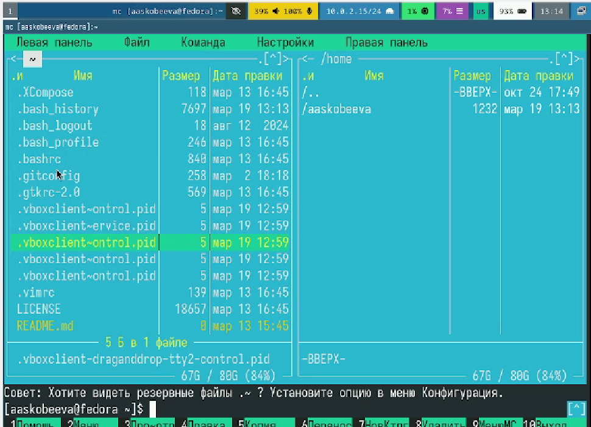
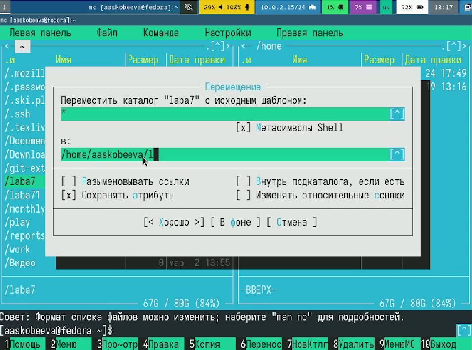
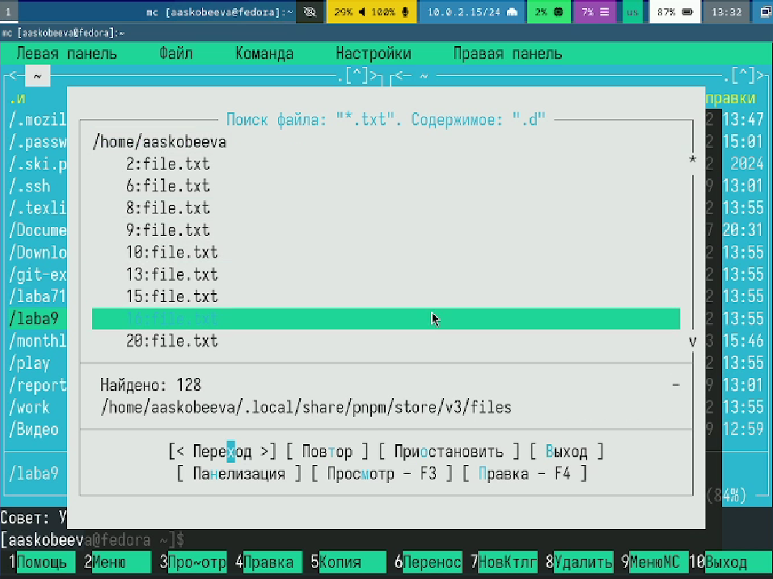
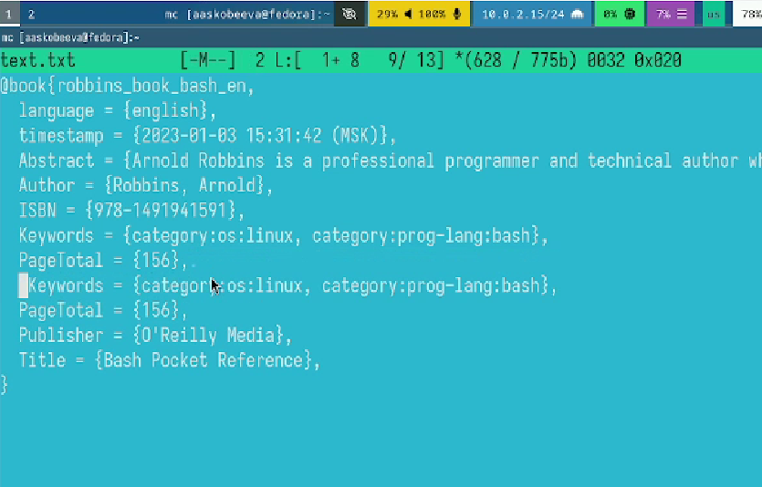
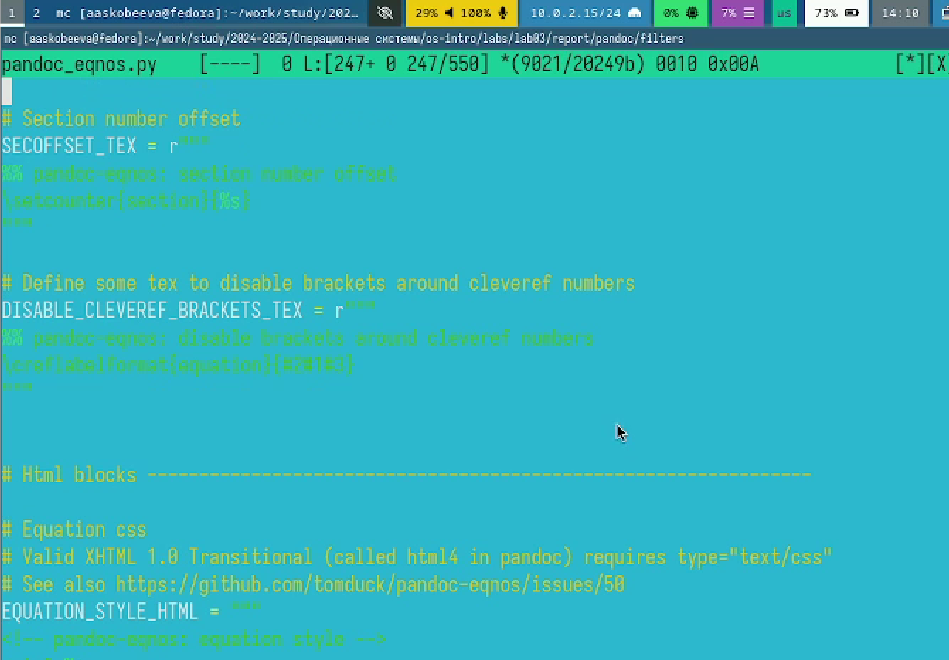

---
## Front matter
title: "Отчет по лабораторной работе № 9"
subtitle: "Командная оболочка MC"
author: "Скобеева Алиса Алексеевна"

## Generic otions
lang: ru-RU
toc-title: "Содержание"

## Bibliography
bibliography: bib/cite.bib
csl: pandoc/csl/gost-r-7-0-5-2008-numeric.csl

## Pdf output format
toc: true # Table of contents
toc-depth: 2
lof: true # List of figures
lot: true # List of tables
fontsize: 12pt
linestretch: 1.5
papersize: a4
documentclass: scrreprt
## I18n polyglossia
polyglossia-lang:
  name: russian
  options:
	- spelling=modern
	- babelshorthands=true
polyglossia-otherlangs:
  name: english
## I18n babel
babel-lang: russian
babel-otherlangs: english
## Fonts
mainfont: IBM Plex Serif
romanfont: IBM Plex Serif
sansfont: IBM Plex Sans
monofont: IBM Plex Mono
mathfont: STIX Two Math
mainfontoptions: Ligatures=Common,Ligatures=TeX,Scale=0.94
romanfontoptions: Ligatures=Common,Ligatures=TeX,Scale=0.94
sansfontoptions: Ligatures=Common,Ligatures=TeX,Scale=MatchLowercase,Scale=0.94
monofontoptions: Scale=MatchLowercase,Scale=0.94,FakeStretch=0.9
mathfontoptions:
## Biblatex
biblatex: true
biblio-style: "gost-numeric"
biblatexoptions:
  - parentracker=true
  - backend=biber
  - hyperref=auto
  - language=auto
  - autolang=other*
  - citestyle=gost-numeric
## Pandoc-crossref LaTeX customization
figureTitle: "Рис."
tableTitle: "Таблица"
listingTitle: "Листинг"
lofTitle: "Список иллюстраций"
lotTitle: "Список таблиц"
lolTitle: "Листинги"
## Misc options
indent: true
header-includes:
  - \usepackage{indentfirst}
  - \usepackage{float} # keep figures where there are in the text
  - \floatplacement{figure}{H} # keep figures where there are in the text
---

# Цель работы

Освоение основных возможностей командной оболочки Midnight Commander. Приобретение навыков практической работы по просмотру каталогов и файлов; манипуляций
с ними.

# Задание

Выполнить задания по MC и по встроенному редактору MC, указанные в ТУИСе.

# Выполнение лабораторной работы

Запускаем из командной строки mc, изучаем его структуру и меню. Выполняем несколько операций, используя управляющие клавиши. 

{#fig:001 width=70%}

Тестируем возможности подменю Файл. Создаем каталог, перемещаем в него файлы.

{#fig:002 width=70%}

Тестируем средства подменю Команда. Осуществляем поиск в файловой системе файла с заданными условиями.

{#fig:003 width=70%}

Вызываем подменю Настройки и осваиваем операции, определяющие структуру экрана mc

Выполняем задания по встроенному редактору mc.

Создаем файл text.txt и открываем его с помощью встроенного в mc редактора. Вставляем в него небольшой отрывок текста из другого файла, и выполняем над ним некоторые действия.

{#fig:004 width=70%}

Продолжаем выполнять действия над файлом. 

{#fig:005 width=70%}

Открываем файл с исходным текстом на языке программирования Python. С помощью редактора подключаем подсветку синтаксиса.

{#fig:006 width=70%}

# Выводы

Мы научились работать с командной оболочкой mc и выполнили все задания лабораторной работы № 9.

# Ответы на контрольные вопросы

1. Режимы работы mc и их характеристика:

•   Режим просмотра (View): Позволяет просматривать содержимое текстовых файлов без возможности редактирования. Активируется клавишей F3.
•   Режим редактирования (Edit): Позволяет редактировать текстовые файлы с помощью встроенного редактора. Активируется клавишей F4.
•   Режим командной строки (Command line): Обе панели работают как файловые менеджеры, но внизу есть командная строка для ввода команд shell. Активируется нажатием клавиш Ctrl+O (переключение между режимами).
•   Режим файлового менеджера (File manager): Основной режим работы, в котором отображаются файловые панели, позволяющие перемещаться по файловой системе, выполнять файловые операции и запускать программы.

2. Операции с файлами, выполняемые как через shell, так и через меню/клавиши mc:

•   Копирование файлов/директорий:
    *   Shell: cp <источник> <назначение>
    *   mc: F5 (Copy)
•   Перемещение/переименование файлов/директорий:
    *   Shell: mv <источник> <назначение>
    *   mc: F6 (Rename/Move)
•   Создание директорий:
    *   Shell: mkdir <имя_директории>
    *   mc: F7 (Make dir)
•   Удаление файлов/директорий:
    *   Shell: rm <имя_файла> (для файлов) или rm -r <имя_директории> (для директорий)
    *   mc: F8 (Delete)
•   Создание символических ссылок:
    * Shell: ln -s <оригинал> <ссылка>
    * mc: Alt+l

3. Структура меню левой/правой панели mc:

•   Меню содержит список команд для управления отображением файловой панели.
•   Список команд (характеристика):
    *   Имя: Переключает отображение файловой панели на имена файлов.
    *   Размер: Переключает отображение файловой панели на имена файлов и их размеры.
    *   Время: Переключает отображение файловой панели на имена файлов и время их последнего изменения.
    *   Изменить: Переключает отображение файловой панели на настраиваемый формат.
    *   Фильтр: Позволяет задать шаблон для отображения файлов.
    *   Сортировка: Позволяет задать вид сортировки файлов.

4. Структура меню "Файл" mc и характеристика команд:

•   Меню содержит команды для работы с выбранными файлами/директориями.
•   Список команд (характеристика):
    *   Просмотр (View): Просмотр содержимого файла (F3).
    *   Правка (Edit): Редактирование файла (F4).
    *   Копирование (Copy): Копирование файла/директории (F5).
    *   Переименование/Перемещение (Rename/Move): Переименование или перемещение файла/директории (F6).
    *   Создать каталог (Make dir): Создание новой директории (F7).
    *   Удалить (Delete): Удаление файла/директории (F8).
    *   Быстрый просмотр (Quick view): Отображает содержимое файла в другой панели (Ctrl+X, q).
    *   Информация (Info): Показывает информацию о файле/директории.

5. Структура меню "Команда" mc и характеристика команд:

•   Меню содержит команды для выполнения различных операций, не связанных напрямую с файлами, а скорее с системой или mc в целом.
•   Список команд (характеристика):
    *   Командная строка (Command line): Вывод командной строки оболочки (Ctrl+O).
    *   Консоль (Console): Открывает отдельное окно консоли.
    *   Дерево каталогов (Directory tree): Отображает дерево каталогов для навигации.
    *   Найти файл (Find file): Поиск файлов по имени, содержимому и другим критериям.
    *   Права доступа (Chmod): Изменение прав доступа к файлам/директориям.
    *   Владелец/Группа (Chown): Изменение владельца и группы файла/директории.
    *   Сравнить каталоги (Compare directories): Сравнение содержимого двух директорий.
    *   Внешние команды: Выполнение заданных пользователем внешних команд.

6. Структура меню "Настройки" mc и характеристика команд:

•   Меню позволяет настраивать внешний вид
и поведение mc.
•   Список команд (характеристика):
    *   Конфигурация (Configuration): Настройка параметров mc (цвета, шрифты, поведение).
    *   Вид (Layout): Настройка расположения панелей и элементов интерфейса.
    *   Параметры панели (Panel options): Настройка параметров отображения файловых панелей.
    *   Подтверждения (Confirmations): Настройка запросов подтверждения для опасных операций (удаление, перезапись).
    *   Виртуальные ФС (Virtual File System): Настройка параметров для виртуальных файловых систем (FTP, SSH и т.д.).
    *   Сохранить настройки (Save setup): Сохранение текущих настроек в конфигурационный файл.

7. Встроенные команды mc и их характеристика:

•   Встроенные команды выполняются непосредственно mc, а не через shell.
•   Примеры (характеристика):
    *   cd <путь>: Смена текущей директории (навигация по файловой системе).
    *   ! <команда>: Выполнение команды shell.
    *   pwd: Вывод текущей директории.
    *   help: Вывод справки по mc.
    *   Команды для управления панелями (переключение, изменение вида и т.д.).

8. Команды встроенного редактора mc и их характеристика:

•   Вызываются в режиме редактирования файла (F4).
•   Примеры (характеристика):
    *   Ctrl+S: Сохранить файл.
    *   Ctrl+Q: Выход из редактора.
    *   Ctrl+F: Поиск.
    *   Ctrl+R: Замена.
    *   Ctrl+Y: Удалить строку.
    *   Ctrl+K: Удалить до конца строки.
    *   Alt+G: Перейти к строке.
    *   F5: Копировать выделенный текст.
    *   F6: Переместить выделенный текст.
    *   F2: Сохранить и выйти

9. Средства mc для создания меню, определяемых пользователем:

•   Меню пользователя (User menu): mc позволяет создавать пользовательское меню, которое вызывается клавишей F2.
•   Редактирование меню: Меню настраивается редактированием файла ~/.mc/menu (или системного, если правите глобально).
•   Синтаксис: Файл содержит секции, определяющие пункты меню и команды, которые будут выполняться при их выборе. Можно использовать переменные и условия.

10. Средства mc для выполнения действий, определяемых пользователем, над текущим файлом:

•   Внешние команды (External commands): Можно задать команды, которые будут выполняться над выбранным файлом(ами) или директориями.
•   Редактирование: Внешние команды настраиваются через меню "Команда" -> "Внешние команды" или через редактирование файла ~/.mc/bindings.
•   Использование: Можно использовать переменные, чтобы передать имя файла, директорию и другие параметры в команду. Например, можно настроить команду для архивирования текущего файла.
•   Меню пользователя(User menu): Как вариант, команды для текущего файла можно добавить и через меню пользователя, указав там путь к файлу.
