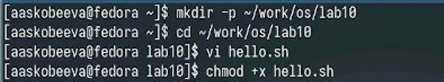
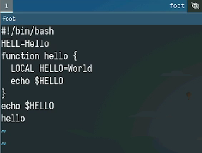
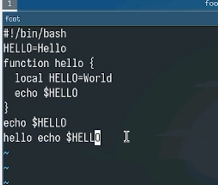
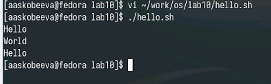

---
## Front matter
lang: ru-RU
title: Лабораторная работа № 10
subtitle: Текстовый редактор vi
author:
  - Скобеева А.А.
institute:
  - Российский университет дружбы народов, Москва, Россия
date: 07 марта 2025

## i18n babel
babel-lang: russian
babel-otherlangs: english

## Formatting pdf
toc: false
toc-title: Содержание
slide_level: 2
aspectratio: 169
section-titles: true
theme: metropolis
header-includes:
 - \metroset{progressbar=frametitle,sectionpage=progressbar,numbering=fraction}
---

# Информация

## Докладчик

:::::::::::::: {.columns align=center}
::: {.column width="70%"}

  * Скобеева Алиса Алексеевна
  * студентка 1-го курса направления "Прикладная информатика"
  * Российский университет дружбы народов
  * [1132246836@pfur.ru](mailto:1132246836@pfur.ru)

:::
::: {.column width="30%"}

:::
::::::::::::::

# Вводная часть

## Актуальность

- Данная презентация актуальна для студентов технических направлений, изучающих предмет "Архитектура компьютеров: операционные системы", а также для людей, интересующихся работой с текстовым редактором vi

## Объект и предмет исследования

- Текстовый редактор vi
- Fedora Sway

## Цели и задачи

- Ознакомиться с текстовым редактором vi
- Выполнить практические задания

## Материалы и методы

- Github
- Материалы ТУИС

# Основная часть

## Открываем vi

- Вызываем vi и создаем файл hello.sh
- 

## Работа с файлом

- Зажимаем клавишу i и вводим текст в файл
- 

## Редактирование файла

- Редактируем текст файла и сохраняем
- 

## Проверка работы

- Запускаем файл и проверяем как он работает
- 

## Результаты

- Мы научились работать с текстовым редактором vi и успешно выполнили задания лабораторной работы

