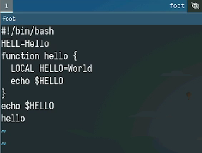
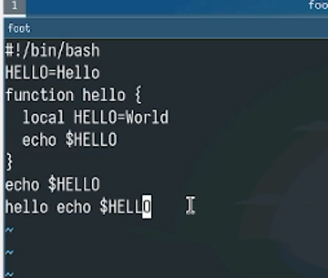
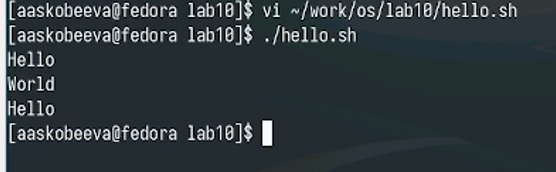

---
## Front matter
title: "Отчет по лабораторной работе № 10"
subtitle: "Текстовый редактор vi"
author: "Скобеева Алиса Алексеевна"

## Generic otions
lang: ru-RU
toc-title: "Содержание"

## Bibliography
bibliography: bib/cite.bib
csl: pandoc/csl/gost-r-7-0-5-2008-numeric.csl

## Pdf output format
toc: true # Table of contents
toc-depth: 2
lof: true # List of figures
lot: true # List of tables
fontsize: 12pt
linestretch: 1.5
papersize: a4
documentclass: scrreprt
## I18n polyglossia
polyglossia-lang:
  name: russian
  options:
	- spelling=modern
	- babelshorthands=true
polyglossia-otherlangs:
  name: english
## I18n babel
babel-lang: russian
babel-otherlangs: english
## Fonts
mainfont: IBM Plex Serif
romanfont: IBM Plex Serif
sansfont: IBM Plex Sans
monofont: IBM Plex Mono
mathfont: STIX Two Math
mainfontoptions: Ligatures=Common,Ligatures=TeX,Scale=0.94
romanfontoptions: Ligatures=Common,Ligatures=TeX,Scale=0.94
sansfontoptions: Ligatures=Common,Ligatures=TeX,Scale=MatchLowercase,Scale=0.94
monofontoptions: Scale=MatchLowercase,Scale=0.94,FakeStretch=0.9
mathfontoptions:
## Biblatex
biblatex: true
biblio-style: "gost-numeric"
biblatexoptions:
  - parentracker=true
  - backend=biber
  - hyperref=auto
  - language=auto
  - autolang=other*
  - citestyle=gost-numeric
## Pandoc-crossref LaTeX customization
figureTitle: "Рис."
tableTitle: "Таблица"
listingTitle: "Листинг"
lofTitle: "Список иллюстраций"
lotTitle: "Список таблиц"
lolTitle: "Листинги"
## Misc options
indent: true
header-includes:
  - \usepackage{indentfirst}
  - \usepackage{float} # keep figures where there are in the text
  - \floatplacement{figure}{H} # keep figures where there are in the text
---

# Цель работы

Получить практические навыки работы с текстовым редактором vi, установленным по умолчанию практически во всех дистрибутивах.

# Задание

Выполнить задания по созданию нового файла с использованием vi и редактированию существующего файла.

# Выполнение лабораторной работы

Создаем каталог, переходим в него, вызываем vi и создаем файл hello.sh. Делаем его исполняемым

{#fig:001 width=70%}

Нажимаем клавишу i и вводим текст.

{#fig:002 width=70%}

Нажимаем на клавиши w и q и на Enter для сохранения текста и завершения работы.

Вызываем vi на редактирование файла. Редактируем файл: добавляем текст, удаляем строки.

{#fig:003 width=70%}

Проверяем получившийся вывод

{#fig:004 width=70%}


# Выводы

Мы получили навыки работы с текстовым редактором vi и успешно выполнили задания лабораторной работы.

# Ответы на контрольные вопросы

1. Режимы работы vi:
  •  Командный режим (Command mode): Для ввода команд управления редактором (перемещение, удаление, копирование и т.д.).
  •  Режим вставки (Insert mode): Для ввода текста.
  •  Режим последней строки (Last line mode): Для выполнения команд, начинающихся с ":", например, сохранения, выхода, поиска.
2. Выход без сохранения: В командном режиме введите :q! и нажмите Enter.
3. Команды позиционирования:
  •  h - влево
  •  j - вниз
  •  k - вверх
  •  l - вправо
  •  w - следующее слово
  •  b - предыдущее слово
  •  0 - начало строки
  •  $ - конец строки
4. Слово в vi: Последовательность символов, ограниченная пробелами, знаками препинания или другими не-буквенно-цифровыми символами.
5. Переход в начало/конец файла:
  •  Начало: gg
  •  Конец: G
6. Группы команд редактирования:
  •  Вставка: i (перед курсором), a (после курсора), o (новая строка после), O (новая строка перед).
  •  Удаление: x (символ), dw (слово), dd (строка).
  •  Копирование и вставка: yy (копировать строку), p (вставить после курсора), P (вставить перед курсором).
  •  Замена: r (заменить символ), cw (заменить слово).
7. Заполнение строки символами $:
  •  Перейти в начало строки (0).
  •  Нажать R (перейти в режим замены).
  •  Удерживать символ $ до конца строки.
  •  Нажать Esc для выхода из режима замены.
8. Отмена действия: Нажать u (undo) в командном режиме.
9. Команды режима последней строки:
  •  :w - сохранить файл.
  •  :q - выйти (если файл не изменен).
  •  :q! - выйти без сохранения.
  •  :wq - сохранить и выйти.
  •  :/pattern - поиск строки, содержащей pattern.
  •  :set nu - показать номера строк
10. Определение позиции конца строки (без перемещения): Визуально, смотря на строку, или использовать команду поиска конца строки /$ (затем нажать Esc, чтобы отменить перемещение курсора).
11. Анализ опций vi:
  •  Просмотр опций: :set all
  •  Описание опций: man vi или man ex для просмотра документации, где описаны все опции. Количество опций может варьироваться в зависимости от реализации vi.
12. Определение режима работы vi: Визуально - если можно вводить текст, это режим вставки. Если текст не вводится, это командный режим. Можно также ориентироваться на информацию в статусной строке (если она отображается).
13. Граф взаимосвязи режимов vi:

  ```
  [Командный режим] -- (i, a, o, O) --> [Режим вставки]
  [Командный режим] -- (:) --> [Режим последней строки]
  [Режим вставки] -- (Esc) --> [Командный режим]
  [Режим последней строки] -- (Enter) --> [Командный режим]
  ```


