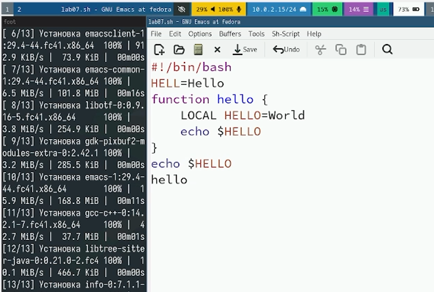
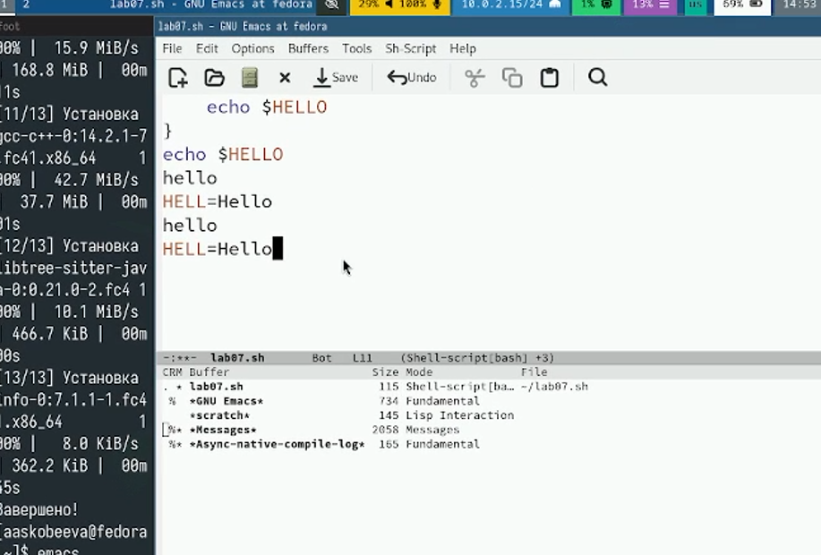
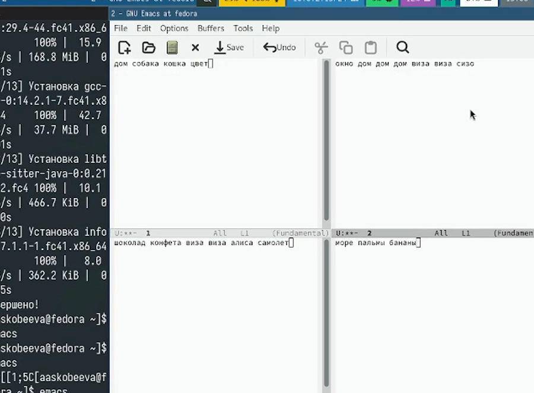
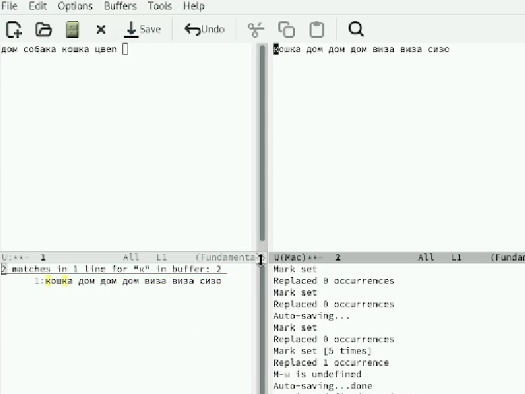

---
## Front matter
lang: ru-RU
title: Лабораторная работа № 11
subtitle: Текстовый редактор emacs
author:
  - Скобеева А.А.
institute:
  - Российский университет дружбы народов, Москва, Россия
date: 07 марта 2025

## i18n babel
babel-lang: russian
babel-otherlangs: english

## Formatting pdf
toc: false
toc-title: Содержание
slide_level: 2
aspectratio: 169
section-titles: true
theme: metropolis
header-includes:
 - \metroset{progressbar=frametitle,sectionpage=progressbar,numbering=fraction}
---

# Информация

## Докладчик

:::::::::::::: {.columns align=center}
::: {.column width="70%"}

  * Скобеева Алиса Алексеевна
  * студентка 1-го курса направления "Прикладная информатика"
  * Российский университет дружбы народов
  * [1132246836@pfur.ru](mailto:1132246836@pfur.ru)

:::
::: {.column width="30%"}

:::
::::::::::::::

# Вводная часть

## Актуальность

- Данная презентация актуальна для студентов технических направлений, изучающих предмет "Архитектура компьютеров: операционные системы", а также для людей, интересующихся работой в текстовом редакторе emacs

## Объект и предмет исследования

- Текстовый редактор emacs
- Fedora Sway

## Цели и задачи

- Ознакомиться с текстовым редактором emacs
- Выполнить практические задания

## Материалы и методы

- Github
- Материалы ТУИС

# Основная часть

## Создание файла

- Открываем редактор emacs и создаем файл
- В файл вписываем текст
- 

## Работа с комбинациями клавиш

- С написанным текстом в созданном файле проделываем некоторые действия
- Проделываем процедуры редактирования с помощью комбинаций клавиш
- Практикуем команды для перемещения курсора

## Управление буферами

- Открываем список буферов и перемещаемся между ними
- 

## Управление окнами

- Делим фрейм на 4 части
- В каждом из четырех окон открываем буфер и вводим несколько строк текста
- 

## Режим поиска

- Используем режимы поиска и замены, переключаемся между ними
- 

## Результаты

- Мы научились работать с текстовым редактором emacs и успешно выполнили все задания лабораторной работы.

