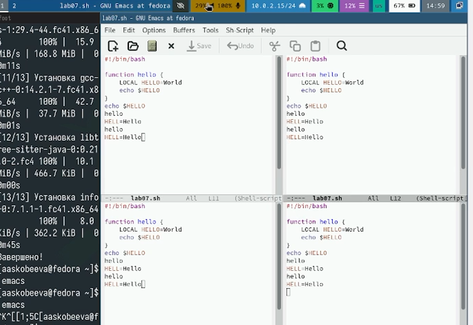

---
## Front matter
title: "Отчет по лабораторной работе № 11"
subtitle: "Текстовый редактор emacs"
author: "Скобеева Алиса Алексеевна"

## Generic otions
lang: ru-RU
toc-title: "Содержание"

## Bibliography
bibliography: bib/cite.bib
csl: pandoc/csl/gost-r-7-0-5-2008-numeric.csl

## Pdf output format
toc: true # Table of contents
toc-depth: 2
lof: true # List of figures
lot: true # List of tables
fontsize: 12pt
linestretch: 1.5
papersize: a4
documentclass: scrreprt
## I18n polyglossia
polyglossia-lang:
  name: russian
  options:
	- spelling=modern
	- babelshorthands=true
polyglossia-otherlangs:
  name: english
## I18n babel
babel-lang: russian
babel-otherlangs: english
## Fonts
mainfont: IBM Plex Serif
romanfont: IBM Plex Serif
sansfont: IBM Plex Sans
monofont: IBM Plex Mono
mathfont: STIX Two Math
mainfontoptions: Ligatures=Common,Ligatures=TeX,Scale=0.94
romanfontoptions: Ligatures=Common,Ligatures=TeX,Scale=0.94
sansfontoptions: Ligatures=Common,Ligatures=TeX,Scale=MatchLowercase,Scale=0.94
monofontoptions: Scale=MatchLowercase,Scale=0.94,FakeStretch=0.9
mathfontoptions:
## Biblatex
biblatex: true
biblio-style: "gost-numeric"
biblatexoptions:
  - parentracker=true
  - backend=biber
  - hyperref=auto
  - language=auto
  - autolang=other*
  - citestyle=gost-numeric
## Pandoc-crossref LaTeX customization
figureTitle: "Рис."
tableTitle: "Таблица"
listingTitle: "Листинг"
lofTitle: "Список иллюстраций"
lotTitle: "Список таблиц"
lolTitle: "Листинги"
## Misc options
indent: true
header-includes:
  - \usepackage{indentfirst}
  - \usepackage{float} # keep figures where there are in the text
  - \floatplacement{figure}{H} # keep figures where there are in the text
---

# Цель работы

Получить практические навыки работы с редактором Emacs.

# Задание

Ознакомиться с редактором Emacs и выполнить упражнения.

# Выполнение лабораторной работы

Открываем Emacs и создаем файл lab07.sh с помощью комбинации клавиш. Набираем в нем текст.

{#fig:001 width=70%}

Проделываем с текстом различные процедуры редактирования, используя комбинации клавиш. 

Выполняем команды для перемещения курсора по тексту.

Выводим список активных буферов на экран. Переключаемся между буферами.

{#fig:002 width=70%}

Управление окнами. Делим фрейм на 4 части. 

{#fig:003 width=70%}

В каждом из четырех окон открываем новый буфер и вводим несколько строк текста.

{#fig:004 width=70%}

Пробуем несколько режимов поиска, и ищем слова по запросу в каждом из окон.

{#fig:005 width=70%}

# Выводы

Мы научились работать с текстовым редактором Emacs и успешно выполнили все задания лабораторной работы.

# Ответы на контрольные вопросы

1. Краткая характеристика редактора Emacs: Emacs - это не просто текстовый редактор, а целая операционная среда внутри другой операционной системы. Это крайне мощный и гибкий инструмент, который позволяет редактировать текстовые файлы, писать код, управлять файлами, читать почту, просматривать веб-страницы и многое другое. Emacs славится своей расширяемостью: его можно настраивать и модифицировать практически бесконечно, используя язык Emacs Lisp. Это делает Emacs одним из самых настраиваемых редакторов, позволяя адаптировать его под конкретные нужды пользователя. Многие программисты считают Emacs своей "операционной системой".
2. Особенности, затрудняющие освоение:
  •  Кривая обучения: Emacs имеет довольно крутую кривую обучения. Огромное количество команд и комбинаций клавиш поначалу кажутся неподъемными.
  •  Сложные комбинации клавиш: Многие команды требуют удержания нескольких клавиш одновременно, что может быть неудобно. Например, использование клавиши Meta (обычно Alt) в сочетании с другими клавишами.
  •  "Все есть буфер": Концепция буферов, где даже команды, сообщения и вывод программ представляются в виде буферов, может быть неочевидной для новичков.
  •  Необходимость кастомизации: Чтобы Emacs стал действительно удобным, его нужно настраивать. Это требует знания Emacs Lisp, что является дополнительным барьером.
  •  Ориентация на текст: Emacs в большей степени ориентирован на работу с текстом, а не на графический интерфейс, что может быть непривычно для тех, кто привык к современным GUI-редакторам.
3. Буфер и окно в Emacs:
  •  Буфер: Представьте буфер как область памяти, содержащую текст, с которым вы работаете. Это может быть содержимое файла, вывод какой-то команды, список открытых файлов, черновик письма и т.д. Буфер существует независимо от того, отображается он на экране или нет. В Emacs практически все действия выполняются в буферах.
  •  Окно: Окно - это область на экране, которая отображает содержимое одного из буферов. Можно сказать, что окно - это "вид" на буфер. Вы можете иметь несколько окон, каждое из которых отображает свой буфер, или несколько окон, отображающих один и тот же буфер.
4. Более 10 буферов в одном окне? Нет, в каждый момент времени одно окно Emacs может отображать содержимое только одного буфера. Однако, вы можете быстро переключаться между разными буферами в одном окне, или создать несколько окон и в каждом открыть свой буфер. Таким образом, общее количество открытых буферов может быть сколь угодно большим.
5. Буферы, создаваемые по умолчанию:
  •  scratch: Буфер, предназначенный для экспериментов с Emacs Lisp. В нем можно выполнять небольшие фрагменты кода и сразу видеть результат.
  •  Messages: Буфер, в котором отображаются системные сообщения, ошибки, предупреждения и другая информация о работе Emacs.
6. Комбинации клавиш:
  •  C-c | (Control+c, Shift+): Нажимаете и удерживаете клавишу Control, затем нажимаете клавишу 'c', отпускаете Control, затем нажимаете клавишу Shift и клавишу, на которой изображен символ | (обычно находится над Enter).
  •  C-c C-| (Control+c, Control+Shift+): Нажимаете и удерживаете клавишу Control, затем нажимаете клавишу 'c', отпускаете Control, затем нажимаете и удерживаете клавишу Control и Shift, затем нажимаете клавишу, на которой изображен символ | (обычно находится над Enter).
7. Разделить текущее окно на две части:
  •  C-x 2 (Control+x, 2): Делит текущее окно по горизонтали на две части, в каждой из которых можно отобразить свой буфер.
  •  C-x 3 (Control+x, 3): Делит текущее окно по вертикали на две части.
8. Файл настроек: Emacs хранит свои настройки в файле, который обычно называется ~/.emacs или ~/.emacs.d/init.el. Это файл на языке Emacs Lisp, в котором можно указывать параметры настройки, определять новые команды и выполнять другие дейсию клавиша "стрелка влево" перемещает курсор на один символ влево. Да, её можно переназначить, используя Emacs Lisp. Например, можно назначить ей выполнение какой-либо другой команды или функции.
10. Удобство (субъективно): Личное мнение о удобстве работы с vi или Emacs сильно зависит от привычек, задач и предпочтений.
    *   Emacs: Мне лично Emacs кажется более удобным из-за его гибкости и расширяемости. Возможность настроить его под свои конкретные нужды и использовать для решения самых разных задач делает его незаменимым инструментом. Однако, я признаю, что освоение Emacs требует времени и усилий.
    *   vi: vi хорош своей лаконичностью и доступностью. Он практически всегда есть на любой Unix-подобной системе, и его базовые команды можно освоить за несколько минут. Это делает vi отличным выбором для быстрой правки файлов на удаленных серверах.
