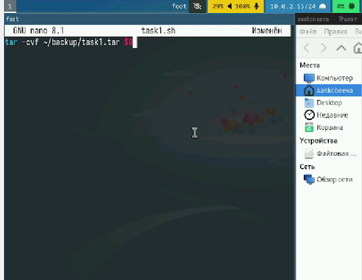
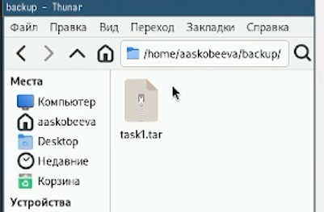
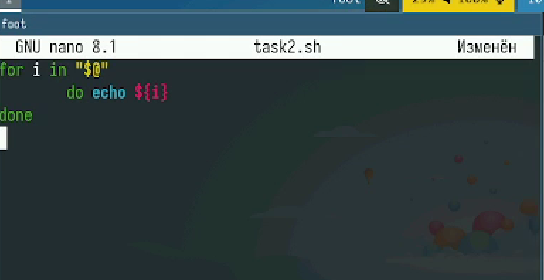
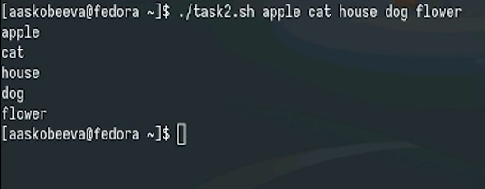
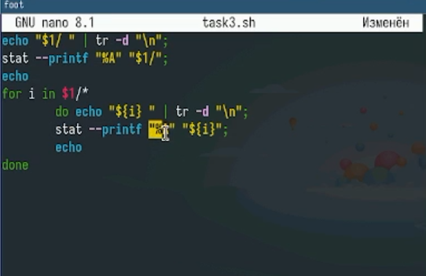
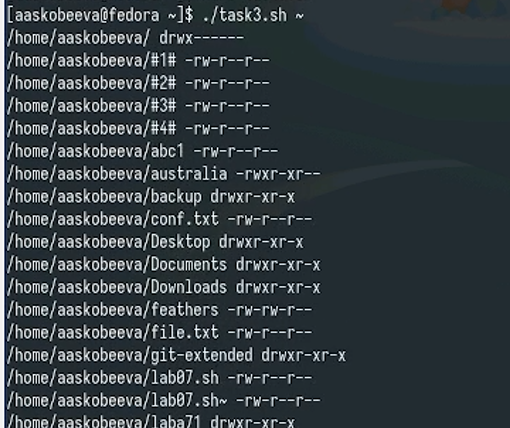
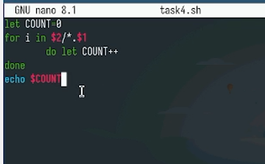
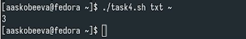

---
## Front matter
lang: ru-RU
title: Лабораторная работа № 12
subtitle: Программирование в командном процессоре ОС UNIX. Командные файлы
author:
  - Скобеева А.А.
institute:
  - Российский университет дружбы народов, Москва, Россия
date: 07 марта 2025

## i18n babel
babel-lang: russian
babel-otherlangs: english

## Formatting pdf
toc: false
toc-title: Содержание
slide_level: 2
aspectratio: 169
section-titles: true
theme: metropolis
header-includes:
 - \metroset{progressbar=frametitle,sectionpage=progressbar,numbering=fraction}
---

# Информация

## Докладчик

:::::::::::::: {.columns align=center}
::: {.column width="70%"}

  * Скобеева Алиса Алексеевна
  * студентка 1-го курса направления "Прикладная информатика"
  * Российский университет дружбы народов
  * [1132246836@pfur.ru](mailto:1132246836@pfur.ru)

:::
::: {.column width="30%"}

:::
::::::::::::::

# Вводная часть

## Актуальность

- Данная презентация актуальна для студентов технических направлений, изучающих предмет "Архитектура компьютеров: операционные системы", а также для всех, кто интересуется программированием в командном процессоре ОС UNIX.

## Объект и предмет исследования

- Программирование в командном процессоре ОС UNIX
- Командные файлы
- Fedora Sway

## Цели и задачи

- Подключить git к Fedora Sway
- Настроить все для комфортной работы с репозиториями

## Материалы и методы

- Github
- Материалы ТУИС

# Основная часть

## Первый командный файл

- Пишем скрипт, который при запуске будет делать резервную копию самого себя и архивироваться
- 

## Результат работы 1-го файла

- 

## Второй командный файл

- Пишем скрипт, который последовательно распечатывает значения аргументов
- 

## Результат работы 2-го файла

- 

## Третий командный файл

- Пишем скрипт - аналог команды ls
- 

## Результат работы 3-го файла

- 

## Четвертый командный файл 

- Пишем скрипт, который вычисляет кол-фо файлов указанного формата в указанной директории
- 

## Результат работы 4-го файла

- 

## Результаты

- Мы написали несколько простых комманд и успешно выполнили все задания лабораторной работы

