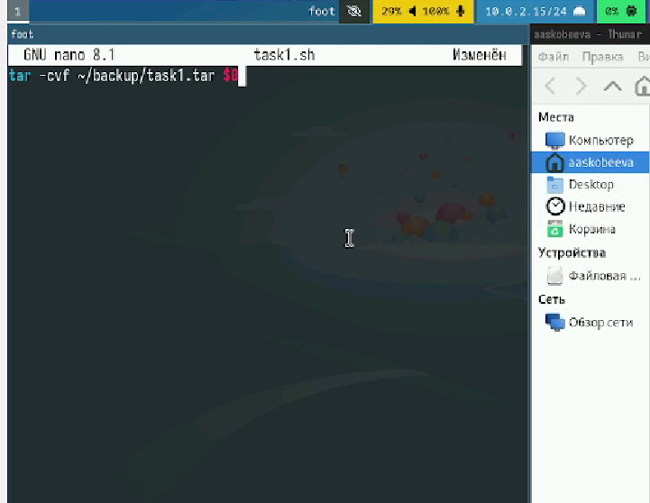
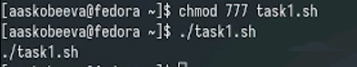
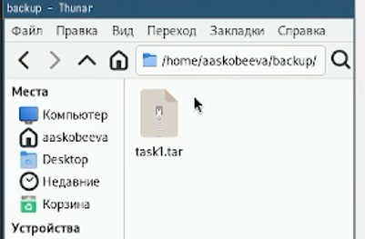
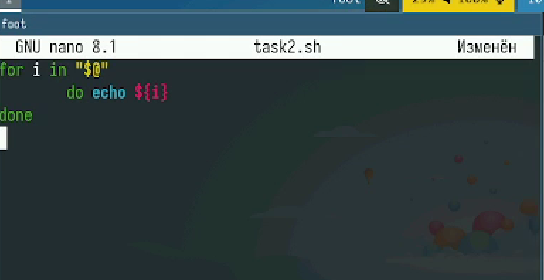
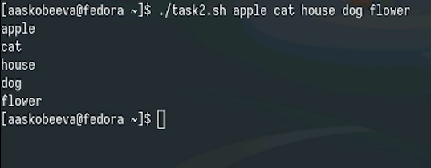
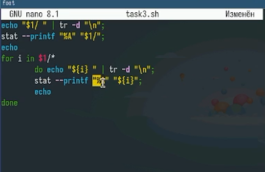
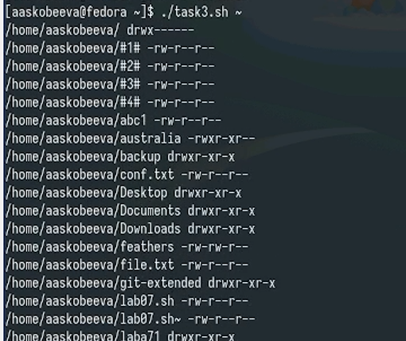
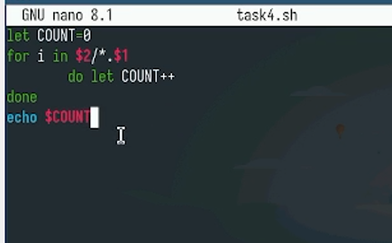
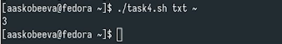

---
## Front matter
title: "Отчет по лабораторной работе № 12"
subtitle: "Программирование в командном процессоре ОС LINUX. Командные файлы"
author: "Скобеева Алиса Алексеевна"

## Generic otions
lang: ru-RU
toc-title: "Содержание"

## Bibliography
bibliography: bib/cite.bib
csl: pandoc/csl/gost-r-7-0-5-2008-numeric.csl

## Pdf output format
toc: true # Table of contents
toc-depth: 2
lof: true # List of figures
lot: true # List of tables
fontsize: 12pt
linestretch: 1.5
papersize: a4
documentclass: scrreprt
## I18n polyglossia
polyglossia-lang:
  name: russian
  options:
	- spelling=modern
	- babelshorthands=true
polyglossia-otherlangs:
  name: english
## I18n babel
babel-lang: russian
babel-otherlangs: english
## Fonts
mainfont: IBM Plex Serif
romanfont: IBM Plex Serif
sansfont: IBM Plex Sans
monofont: IBM Plex Mono
mathfont: STIX Two Math
mainfontoptions: Ligatures=Common,Ligatures=TeX,Scale=0.94
romanfontoptions: Ligatures=Common,Ligatures=TeX,Scale=0.94
sansfontoptions: Ligatures=Common,Ligatures=TeX,Scale=MatchLowercase,Scale=0.94
monofontoptions: Scale=MatchLowercase,Scale=0.94,FakeStretch=0.9
mathfontoptions:
## Biblatex
biblatex: true
biblio-style: "gost-numeric"
biblatexoptions:
  - parentracker=true
  - backend=biber
  - hyperref=auto
  - language=auto
  - autolang=other*
  - citestyle=gost-numeric
## Pandoc-crossref LaTeX customization
figureTitle: "Рис."
tableTitle: "Таблица"
listingTitle: "Листинг"
lofTitle: "Список иллюстраций"
lotTitle: "Список таблиц"
lolTitle: "Листинги"
## Misc options
indent: true
header-includes:
  - \usepackage{indentfirst}
  - \usepackage{float} # keep figures where there are in the text
  - \floatplacement{figure}{H} # keep figures where there are in the text
---

# Цель работы

Изучить основы программирования в оболочке ОС UNIX/Linux. Научиться писать небольшие командные файлы.

# Задание

Написать несколько командных файлов.

# Выполнение лабораторной работы

Создаем файл task1.sh. Пишем скрипт, который при запуске будет делать резервную копию самого себя в другую директорию backup. При этом файл архивируется.

{#fig:001 width=70%}

Запускаем файл

{#fig:002 width=70%}

Проверяем корректность работы файла

{#fig:003 width=70%}

Создаем файл task2.sh Пишем командный файл, обрабатывающий любое число аргументов командной строки. Скрипт последовательно распечатывает значения всех переданных аргументов

{#fig:004 width=70%}

Проверяем корректность работы файла

{#fig:005 width=70%}

Создаем файл task3.sh и пишем аналог команды ls

{#fig:006 width=70%}

Проверяем корректность работы файла

{#fig:007 width=70%}

Создаем файл task4.sh и пишем скрипт, который вычисляет кол-во файлов указанного формата в указанной директории

{#fig:008 width=70%}

Проверяем работу

{#fig:009 width=70%}

# Выводы

Мы научились писать небольшие команды и успешно выполнили все задания лабораторной работы.

# Ответы на контрольные вопросы

1.  Командная оболочка: Интерфейс между пользователем и ядром ОС. Примеры: bash, zsh, fish. Отличаются синтаксисом, функциональностью, и наличием дополнительных возможностей.
2.  POSIX: Семейство стандартов, определяющих интерфейсы операционных систем. Гарантирует переносимость программ.
3.  Переменные/Массивы в bash:
    *   Переменные: var="value"
    *   Массивы: array=(item1 item2 item3)
4.  let/read:
    *   let: Вычисление арифметических выражений.
    *   read: Чтение ввода пользователя.
5.  Арифметические операции в bash: +, -, *, /, %, * (возведение в степень).
6.  (( )): Обозначает арифметическое выражение.
7.  Стандартные переменные: HOME, PATH, USER, PWD, SHELL, PS1 (строка приглашения).
8.  Метасимволы: Символы, имеющие специальное значение для оболочки (например, *, ?, |, >, <).
9.  Экранирование: Обратный слеш \ перед метасимволом или заключение в кавычки.
10. Создание/Запуск командных файлов:
    *   Создание: touch script.sh, редактирование с помощью текстового редактора.
    *   Запуск: bash script.sh или ./script.sh (если файл исполняемый).
11. Функции в bash:

Bash
    function function_name() {
        # Команды
    }
    

12. Проверка типа файла: if [ -d "file" ] (каталог) или if [ -f "file" ] (обычный файл).
13. set/typeset/unset:
    *   set: Устанавливает или отображает переменные оболочки.
    *   typeset: Объявляет тип переменной (например, integer).
    *   unset: Удаляет переменную.
14. Передача параметров: ./script.sh arg1 arg2, параметры доступны как $1, $2 и т.д.
15. Специальные переменные:
    *   $0: Имя скрипта
    *   $#: Количество параметров
    *   $@: Все параметры
    *   $?: Код возврата последней команды
    *   $$: PID текущего процесса
    *   $!: PID последнего запущенного фонового процесса
