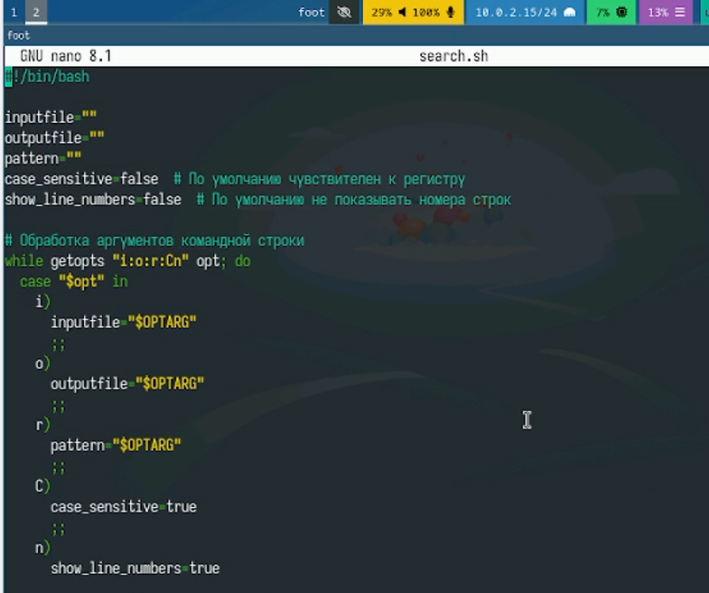
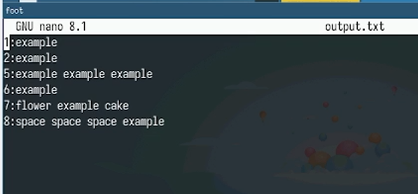
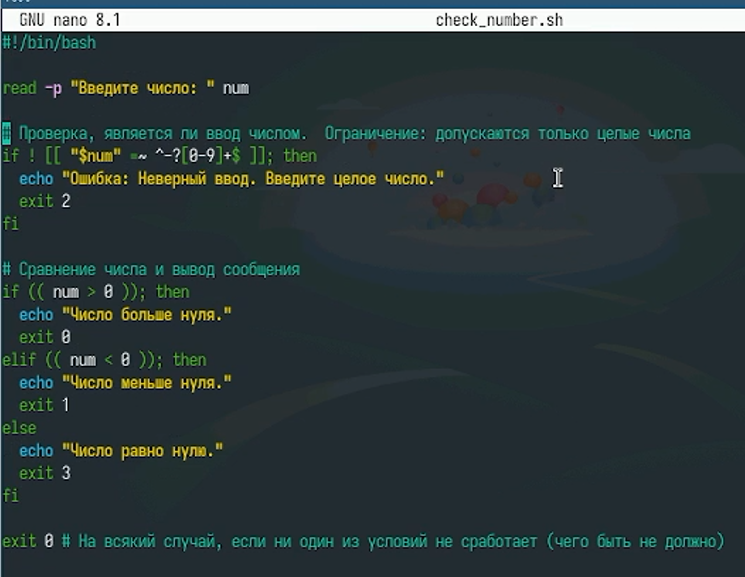
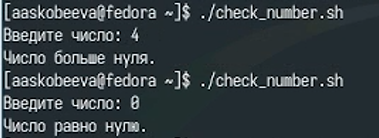
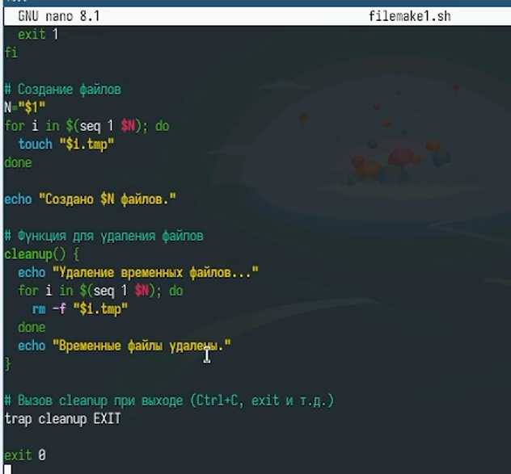
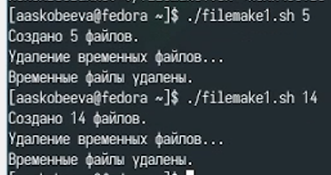
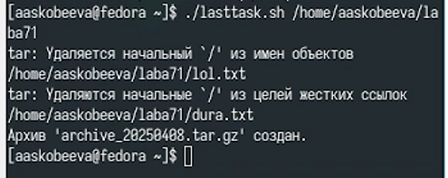

---
## Front matter
lang: ru-RU
title: Лабораторная работа № 13
subtitle: Программирование в командном процессоре ОС Unix. Ветвления и циклы
author:
  - Скобеева А.А.
institute:
  - Российский университет дружбы народов, Москва, Россия
date: 07 марта 2025

## i18n babel
babel-lang: russian
babel-otherlangs: english

## Formatting pdf
toc: false
toc-title: Содержание
slide_level: 2
aspectratio: 169
section-titles: true
theme: metropolis
header-includes:
 - \metroset{progressbar=frametitle,sectionpage=progressbar,numbering=fraction}
---

# Информация

## Докладчик

:::::::::::::: {.columns align=center}
::: {.column width="70%"}

  * Скобеева Алиса Алексеевна
  * студентка 1-го курса направления "Прикладная информатика"
  * Российский университет дружбы народов
  * [1132246836@pfur.ru](mailto:1132246836@pfur.ru)

:::
::: {.column width="30%"}

:::
::::::::::::::

# Вводная часть

## Актуальность

- Данная презентация актуальна для студентов технических направлений, изучающих предмет "Архитектура компьютеров: операционные системы", а также для всех, кто интересуется программированием в командном процессоре ОС UNIX.

## Объект и предмет исследования

- Командный процессор ОС UNIX
- Fedora Sway

## Цели и задачи

- Изучить ОП в оболочке ОС UNIX
- Научиться писать более сложные команды с использованием логических управляющих конструкций и циклов

## Материалы и методы

- Оболочка ОС UNIX
- Материалы ТУИС

# Основная часть

## 1-ый командный файл

- Пишем файл, который анализирует командную строку с ключами, а затем ищет в указанном файле строки, определяемые ключом -p.
- 

## Результат работы 1-го файла

- 

## 2-ой командный файл

- Пишем следующую программу, которая определяет, что число больше, меньше или равно нулю
- 

## Результат работы 2-го файла

- 

## 3-ий командный файл

- Пишем командный файл, создающий указанное число файлов, а также умеющий их удалять
- 

## Результат работы 3-го файла

- 

## 4-ый командный файл

- Пишем командный файл, который с помощью команды tar запаковывает в архив все файлы в указанной директории
- 

## Результат работы 4-го файла

- 

## Результаты

- Мы успешно написали 4 программы и проверили корректность их работы

