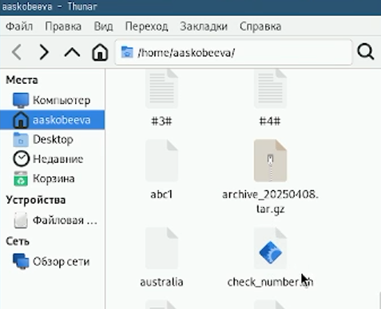
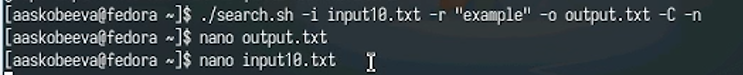
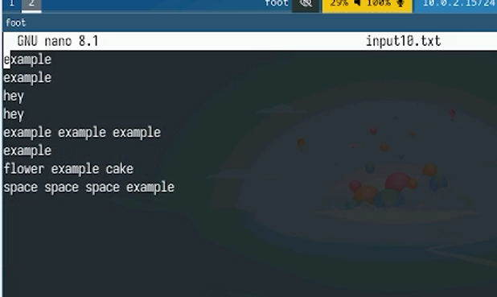
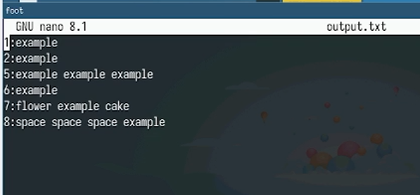
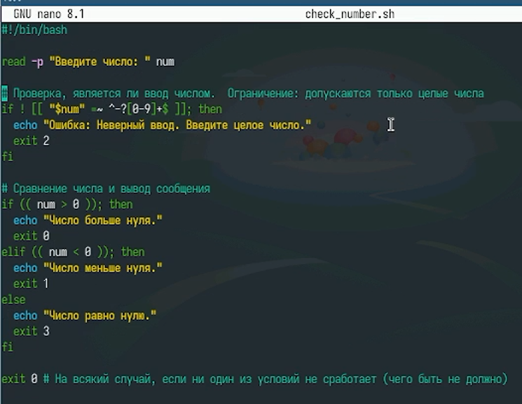
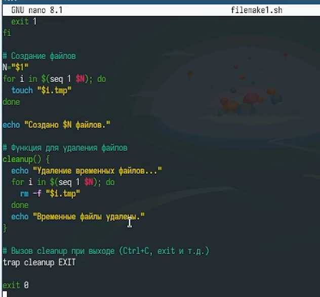
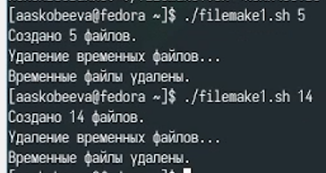
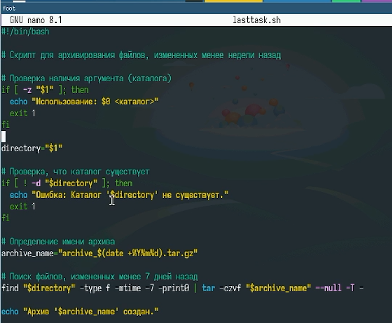
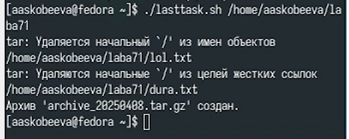

---
## Front matter
title: "Отчет по лабораторной работе № 13"
subtitle: "Программирование в командном процессоре ОС Unix. Ветвления и циклы"
author: "Скобеева Алиса Алексеевна"

## Generic otions
lang: ru-RU
toc-title: "Содержание"

## Bibliography
bibliography: bib/cite.bib
csl: pandoc/csl/gost-r-7-0-5-2008-numeric.csl

## Pdf output format
toc: true # Table of contents
toc-depth: 2
lof: true # List of figures
lot: true # List of tables
fontsize: 12pt
linestretch: 1.5
papersize: a4
documentclass: scrreprt
## I18n polyglossia
polyglossia-lang:
  name: russian
  options:
	- spelling=modern
	- babelshorthands=true
polyglossia-otherlangs:
  name: english
## I18n babel
babel-lang: russian
babel-otherlangs: english
## Fonts
mainfont: IBM Plex Serif
romanfont: IBM Plex Serif
sansfont: IBM Plex Sans
monofont: IBM Plex Mono
mathfont: STIX Two Math
mainfontoptions: Ligatures=Common,Ligatures=TeX,Scale=0.94
romanfontoptions: Ligatures=Common,Ligatures=TeX,Scale=0.94
sansfontoptions: Ligatures=Common,Ligatures=TeX,Scale=MatchLowercase,Scale=0.94
monofontoptions: Scale=MatchLowercase,Scale=0.94,FakeStretch=0.9
mathfontoptions:
## Biblatex
biblatex: true
biblio-style: "gost-numeric"
biblatexoptions:
  - parentracker=true
  - backend=biber
  - hyperref=auto
  - language=auto
  - autolang=other*
  - citestyle=gost-numeric
## Pandoc-crossref LaTeX customization
figureTitle: "Рис."
tableTitle: "Таблица"
listingTitle: "Листинг"
lofTitle: "Список иллюстраций"
lotTitle: "Список таблиц"
lolTitle: "Листинги"
## Misc options
indent: true
header-includes:
  - \usepackage{indentfirst}
  - \usepackage{float} # keep figures where there are in the text
  - \floatplacement{figure}{H} # keep figures where there are in the text
---

# Цель работы

Изучить основы программирования в оболочке ОС UNIX. Научится писать более сложные командные файлы с использованием логических управляющих конструкций и циклов.

# Задание

Написать несколько программ используя ветвления и циклы.

# Выполнение лабораторной работы

Пишем командный файл, который анализирует командную строку с ключами, а затем ищет в указанном файле строки, определяемые ключом -p.

{#fig:001 width=70%}

Создаем файл, в котором пишем некоторый текст

{#fig:003 width=70%}

Запускаем командный файл, и проверяем результат работы в файле output.txt

{#fig:004 width=70%}

Пишем следующую программу, которая определяет, что число больше, меньше или равно нулю

{#fig:005 width=70%}

Проверяем корректность работы программы

{#fig:006 width=70%}

Пишем командный файл, создающий указанное число файлов, а также умеющий их удалять

{#fig:007 width=70%}

Проверяем корректность работы программы

{#fig:008 width=70%}

Пишем командный файл, который с помощью команды tar запаковывает в архив все файлы в указанной директории

{#fig:009 width=70%}

Запускаем файл

{#fig:010 width=70%}

Проверяем корректность работы программы

{#fig:011 width=70%}

# Выводы

Мы успешно написали 4 командных файла и проверили корректность их работы.

# Ответы на контрольные вопросы

1. getopts: Разбор параметров командной строки с использованием стандартного синтаксиса (-a, -b value).
2. Метасимволы и имена файлов: Метасимволы (*, ?, []) расширяются в имена файлов, соответствующие шаблону (globbing).
3. Операторы управления действиями: && (и), || (или), ; (последовательное выполнение).
4. Прерывание цикла: break (выход из цикла), continue (переход к следующей итерации).
5. false/true: Команды, всегда возвращающие false (1) или true (0) соответственно. Удобны для упрощения логических выражений.
6. if test -f man$s/$i.$s: Проверка, существует ли обычный файл с именем man[значение переменной s]/[значение переменной i].[значение переменной s].
7. while/until:
  •  while condition: Цикл выполняется, пока condition истинно.
  •  until condition: Цикл выполняется, пока condition ложно
