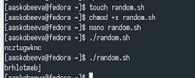

---
## Front matter
lang: ru-RU
title: Лабораторная работа № 14
subtitle: Программирование в командном процессоре ОС Unix. Расширенное программирование
author:
  - Скобеева А.А.
institute:
  - Российский университет дружбы народов, Москва, Россия
date: 07 марта 2025

## i18n babel
babel-lang: russian
babel-otherlangs: english

## Formatting pdf
toc: false
toc-title: Содержание
slide_level: 2
aspectratio: 169
section-titles: true
theme: metropolis
header-includes:
 - \metroset{progressbar=frametitle,sectionpage=progressbar,numbering=fraction}
---

# Информация

## Докладчик

:::::::::::::: {.columns align=center}
::: {.column width="70%"}

  * Скобеева Алиса Алексеевна
  * студентка 1-го курса направления "Прикладная информатика"
  * Российский университет дружбы народов
  * [1132246836@pfur.ru](mailto:1132246836@pfur.ru)

:::
::: {.column width="30%"}

:::
::::::::::::::

# Вводная часть

## Актуальность

- Данная презентация актуальна для студентов технических направлений, изучающих предмет "Архитектура компьютеров: операционные системы", а также для всех, кто интересуется программированием в командном процессоре ОС Unix

## Объект и предмет исследования

- Командный процессор ОС Unix
- Fedora Sway

## Цели и задачи

- Изучить ОП в оболочке ОС Unix
- Научиться писать более сложные командные файлы с использованием логических управляющих конструкций и циклов

## Материалы и методы

- Github
- Материалы ТУИС

# Основная часть

## 1-ый командный файл

- Пишем командный файл, реализующий упрощенный механизм семафоров. Также дорабатываем программу так, чтобы имелась возможность взаимодействия трёх и более процессов.
- 

## Итог работы 1-го файла

- 

## 2-ой командный файл

- Реализовываем команду man с помощью командного файла
- 

## Итог работы 2-го файла

- 

## 3-ий командный файл

- Пишем командный файл, который используя встроенную переменную $RANDOM генерирует случайную последовательность букв латинского алфавита
- 

## Итог работы 3-го файла

- 

## Результаты

- Мы успешно написали 3 программы с использованием логических управляющих конструкций и циклов

