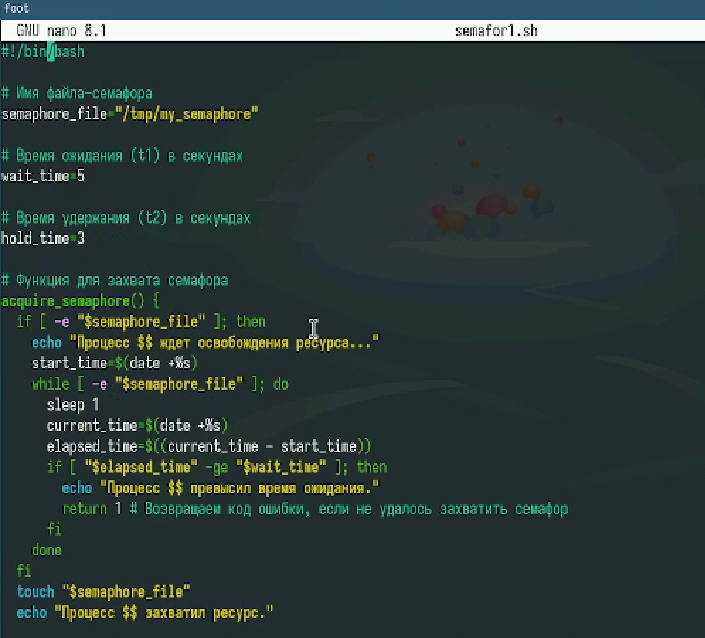
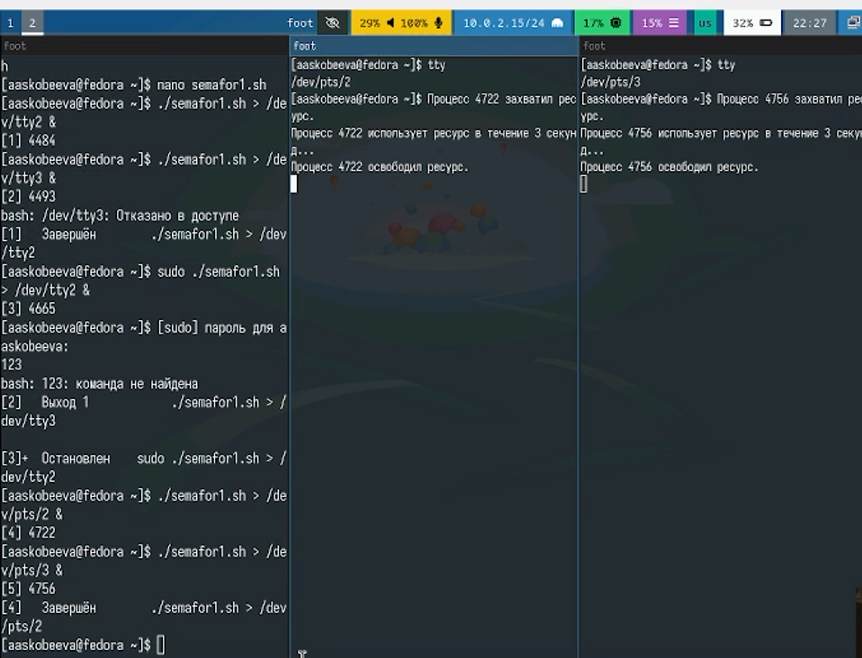
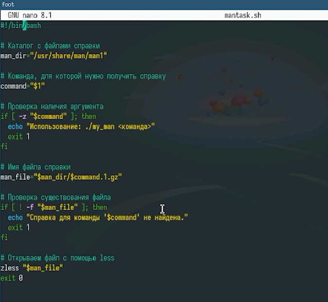
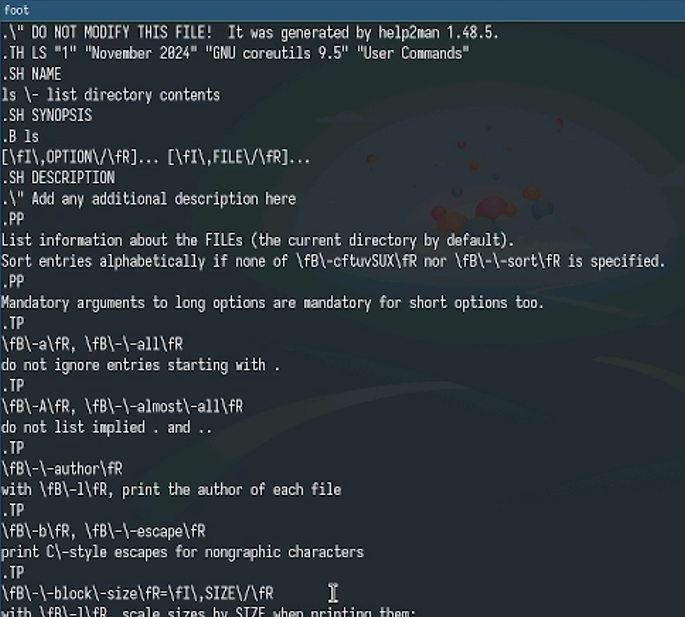
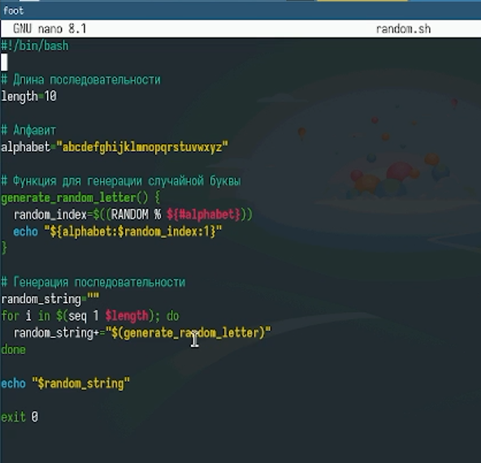
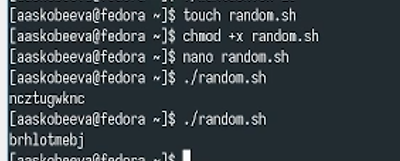

---
## Front matter
title: "Отчет по лабораторной работе № 14"
subtitle: "Программирование в командном процессоре ОС Unix. Расширенное программирование"
author: "Скобеева Алиса Алексеевна"

## Generic otions
lang: ru-RU
toc-title: "Содержание"

## Bibliography
bibliography: bib/cite.bib
csl: pandoc/csl/gost-r-7-0-5-2008-numeric.csl

## Pdf output format
toc: true # Table of contents
toc-depth: 2
lof: true # List of figures
lot: true # List of tables
fontsize: 12pt
linestretch: 1.5
papersize: a4
documentclass: scrreprt
## I18n polyglossia
polyglossia-lang:
  name: russian
  options:
	- spelling=modern
	- babelshorthands=true
polyglossia-otherlangs:
  name: english
## I18n babel
babel-lang: russian
babel-otherlangs: english
## Fonts
mainfont: IBM Plex Serif
romanfont: IBM Plex Serif
sansfont: IBM Plex Sans
monofont: IBM Plex Mono
mathfont: STIX Two Math
mainfontoptions: Ligatures=Common,Ligatures=TeX,Scale=0.94
romanfontoptions: Ligatures=Common,Ligatures=TeX,Scale=0.94
sansfontoptions: Ligatures=Common,Ligatures=TeX,Scale=MatchLowercase,Scale=0.94
monofontoptions: Scale=MatchLowercase,Scale=0.94,FakeStretch=0.9
mathfontoptions:
## Biblatex
biblatex: true
biblio-style: "gost-numeric"
biblatexoptions:
  - parentracker=true
  - backend=biber
  - hyperref=auto
  - language=auto
  - autolang=other*
  - citestyle=gost-numeric
## Pandoc-crossref LaTeX customization
figureTitle: "Рис."
tableTitle: "Таблица"
listingTitle: "Листинг"
lofTitle: "Список иллюстраций"
lotTitle: "Список таблиц"
lolTitle: "Листинги"
## Misc options
indent: true
header-includes:
  - \usepackage{indentfirst}
  - \usepackage{float} # keep figures where there are in the text
  - \floatplacement{figure}{H} # keep figures where there are in the text
---

# Цель работы

Изучить ОП в оболочке ОС Unix. Научиться писать более сложные командные файлы с использованием логических управляющих конструкций и циклов.

# Задание

Написать три командных файла с использованием логических управляющих конструкций и циклов.

# Выполнение лабораторной работы

Пишем командный файл, реализующий упрощенный механизм семафоров. Также дорабатываем программу так, чтобы имелась возможность взаимодействия трёх и более процессов.

{#fig:001 width=70%}

Запускаем файл и открываем еще два терминала, смотрим на работу файла также и в них

{#fig:002 width=70%}

Реализовываем команду man с помощью командного файла

{#fig:003 width=70%}

Запускаем файл

{#fig:004 width=70%}

Пишем командный файл, который используя встроенную переменную $RANDOM генерирует случайную последовательность букв латинского алфавита

{#fig:005 width=70%}

Запускаем файл и проверяем корректность работы программы

{#fig:006 width=70%}

# Выводы

Мы успешно написали 3 командных файла с использованием логических управляющих конструкций и циклов.

# Ответы на контрольные вопросы

1.  Синтаксическая ошибка:

Bash
    while [ "$1" != "exit" ]
    

Необходимы пробелы вокруг [ и ], а также кавычки вокруг $1, чтобы избежать ошибок, если $1 не определена.
2.  Конкатенация строк:

Bash
    result="$string1$string2$string3"
    

3.  Утилита seq: Генерирует последовательность чисел. Другие способы:
    *   Цикл for: for i in $(eval echo {1..10}); do ... done
    *   while: i=1; while [ $i -le 10 ]; do ...; i=$((i+1)); done
4.  Результат ((10/3)): 3 (целочисленное деление).
5.  zsh vs. bash:
    *   Расширенная автодополнение
    *   Темы оформления и плагины
    *   Более гибкая настройка
6.  Синтаксис for ((a=1; a <= LIMIT; a++)): Синтаксис верен.
7.  bash vs. другие ЯП:
    *   Преимущества: Прямой доступ к командам ОС, удобство управления процессами, хорошо подходит для автоматизации задач.
    *   Недостатки: Ограниченные возможности в обработке сложных данных, менее эффективен для вычислительных задач, сложнее в поддержке крупных проектов. Bash - скриптовый язык, другие языки могут быть скомпилированы.
