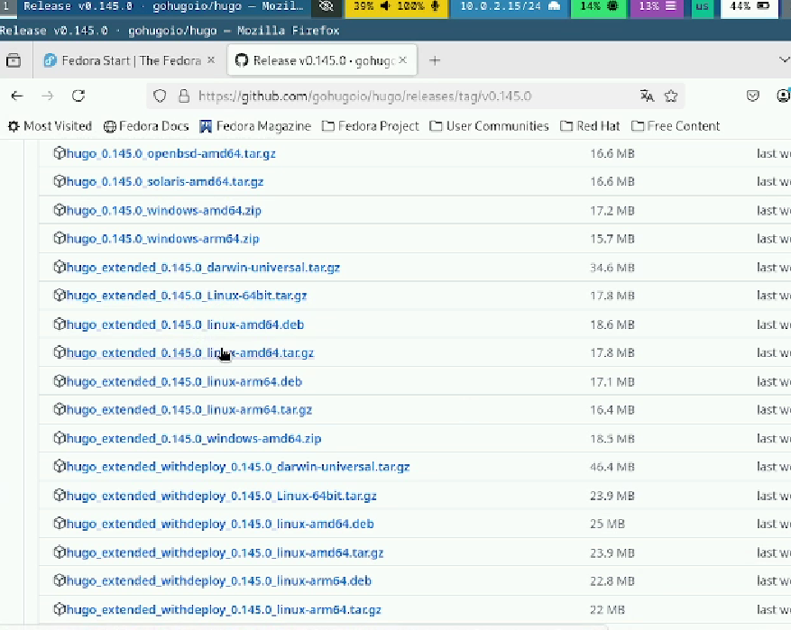
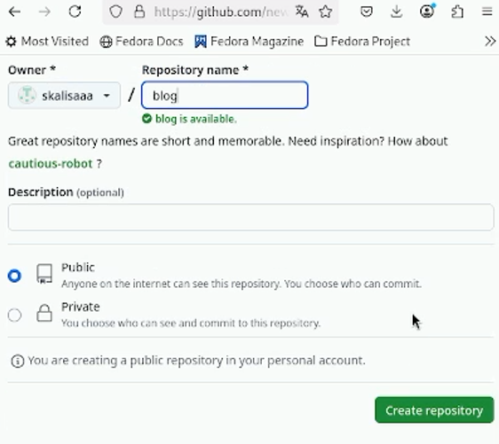
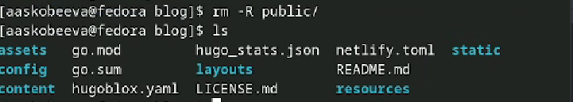
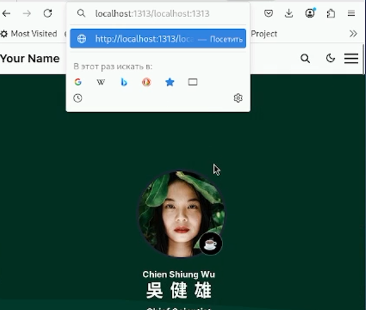

---
## Front matter
lang: ru-RU
title: Индивидуальный проект. Этап № 1
subtitle: Персональный сайт научного работника
author:
  - Скобеева А.А.
institute:
  - Российский университет дружбы народов, Москва, Россия
date: 08 марта 2025

## i18n babel
babel-lang: russian
babel-otherlangs: english

## Formatting pdf
toc: false
toc-title: Содержание
slide_level: 2
aspectratio: 169
section-titles: true
theme: metropolis
header-includes:
 - \metroset{progressbar=frametitle,sectionpage=progressbar,numbering=fraction}
---

# Информация

## Докладчик

:::::::::::::: {.columns align=center}
::: {.column width="70%"}

  * Скобеева Алиса Алексеевна
  * студентка 1-го курса направления "Прикладная информатика"
  * Российский университет дружбы народов
  * [1132246836@pfur.ru](mailto:1132246836@pfur.ru)

:::
::: {.column width="30%"}

:::
::::::::::::::

# Вводная часть

## Актуальность

- Данная презентация актуальна для людей, которых интересует создание персонального сайта.

## Объект и предмет исследования

- Hugo
- Шаблон с github

## Цели и задачи

- Создать персональный сайт научного работника, на котором будут размещены нывыки и достижения.

## Материалы и методы

- Заготовки с github
- Hugo

# Основная часть

## Выбор релиза

- Переходим по ссылке на страницу с релизами Hugo
- Выбираем последний релиз и устанавливаем его. Далее мы должны его распаковать 

## Создание нового репозиторий

- Выбираем шаблон сайта
- Создаем новый репозиторий на GitHub используя выбранный нами шаблон

## Работа с новым репозиторием

- Подключаем репозиторий 
- Выполняем ряд команд. Устанавливаем Go
- Удаляем папку public

## Переход на страницу сайта

- Выполняем команду hugo server
- Переходим по ссылке на сервер

## Создание репозитория для персонального сайта

- Создаем новый репозиторий
- Подключаем его к себе. Клонируем в него все папки из нашего шаблона
- Отправляем данные на гитхаб. Теперь, перейдя по названию нашего репозитория у нас открывается сайт.

# Результаты

## Результаты

- Установили необходимое ПО
- Скачали шаблон темы сайта. Разместили его на хостинге git
- Установили параметр для URLs сайта
- Разместили заготовку сайта на Github pages

## Итоговый слайд

- Шаблоны Hugo - удобный инструмент для создания персональных сайтов.

