---
## Front matter
title: "Отчет по выполнению индивидуального проекта. Этап № 1."
subtitle: "Создание персонального сайта научного работника"
author: "Алиса Алексеевна Скобеева"

## Generic otions
lang: ru-RU
toc-title: "Содержание"

## Bibliography
bibliography: bib/cite.bib
csl: pandoc/csl/gost-r-7-0-5-2008-numeric.csl

## Pdf output format
toc: true # Table of contents
toc-depth: 2
lof: true # List of figures
lot: true # List of tables
fontsize: 12pt
linestretch: 1.5
papersize: a4
documentclass: scrreprt
## I18n polyglossia
polyglossia-lang:
  name: russian
  options:
	- spelling=modern
	- babelshorthands=true
polyglossia-otherlangs:
  name: english
## I18n babel
babel-lang: russian
babel-otherlangs: english
## Fonts
mainfont: IBM Plex Serif
romanfont: IBM Plex Serif
sansfont: IBM Plex Sans
monofont: IBM Plex Mono
mathfont: STIX Two Math
mainfontoptions: Ligatures=Common,Ligatures=TeX,Scale=0.94
romanfontoptions: Ligatures=Common,Ligatures=TeX,Scale=0.94
sansfontoptions: Ligatures=Common,Ligatures=TeX,Scale=MatchLowercase,Scale=0.94
monofontoptions: Scale=MatchLowercase,Scale=0.94,FakeStretch=0.9
mathfontoptions:
## Biblatex
biblatex: true
biblio-style: "gost-numeric"
biblatexoptions:
  - parentracker=true
  - backend=biber
  - hyperref=auto
  - language=auto
  - autolang=other*
  - citestyle=gost-numeric
## Pandoc-crossref LaTeX customization
figureTitle: "Рис."
tableTitle: "Таблица"
listingTitle: "Листинг"
lofTitle: "Список иллюстраций"
lotTitle: "Список таблиц"
lolTitle: "Листинги"
## Misc options
indent: true
header-includes:
  - \usepackage{indentfirst}
  - \usepackage{float} # keep figures where there are in the text
  - \floatplacement{figure}{H} # keep figures where there are in the text
---

# Цель работы

Создание персонального сайта научного работника, на котором будет публиковаться информация о достижениях и навыках.

# Задание

Создать персональный сайт, используя шаблон с github.

# Выполнение 1-го этапа индивидуального проекта

Переходим на страницу с релизами Hugo. Выбираем самый последний релиз и устанавливаем нужную нам версию:

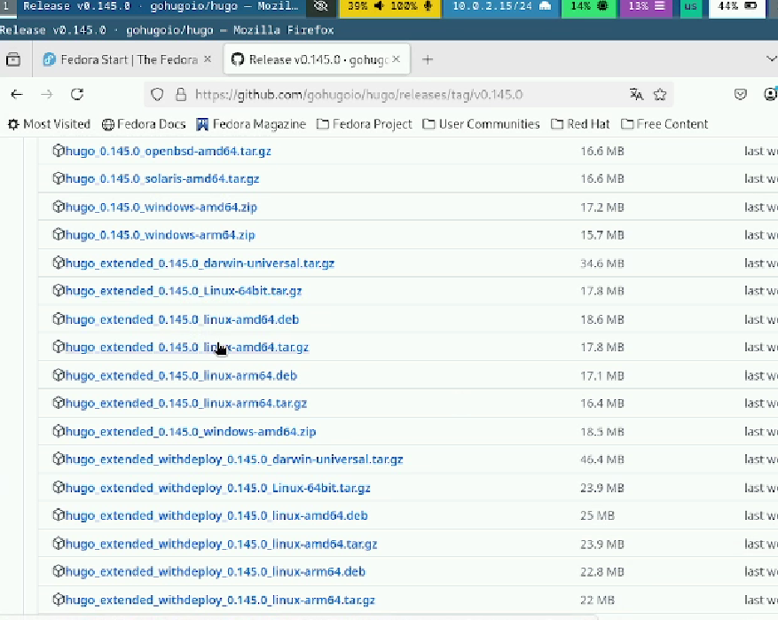{#fig:001 width=70%}

Далее, нам необходимо распаковать скаченный файл:

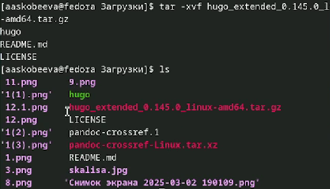{#fig:002 width=70%}

После, подключив права суперпользователя, переносим файлы в папку:

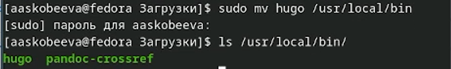{#fig:003 width=70%}

Переходим в репозиторий по ссылке, указанной в ТУИС. Нажимаем на "use this template":

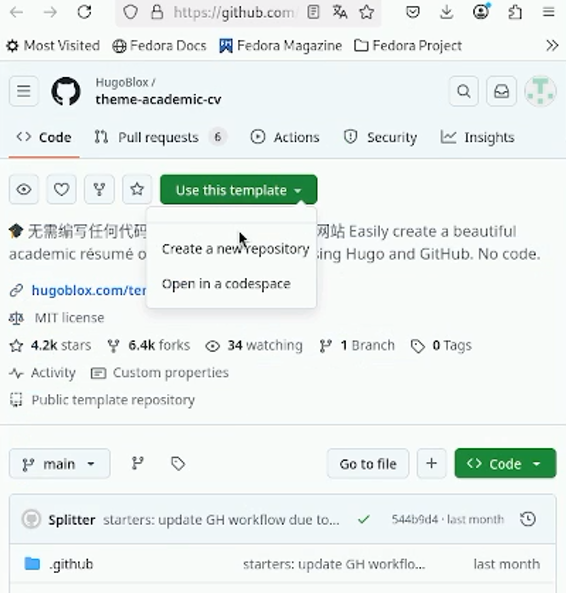{#fig:004 width=70%}

Создаем новый репозиторий с использованием выбранного нами шаблона:

{#fig:005 width=70%}

После, нам необходимо присоединить наш репозиторий к Fedora Sway:

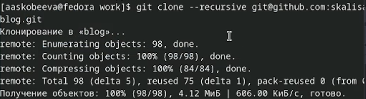{#fig:006 width=70%}

Выполняем команду hugo server:

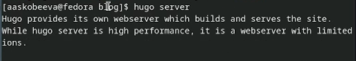{#fig:007 width=70%}

Нам выдало ошибку, связанную с тем, что у нас не установлен Go. Исправим это:

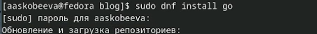{#fig:008 width=70%}

После установки Go, выполним команду hugo:

{#fig:009 width=70%}

Удаляем папку public:

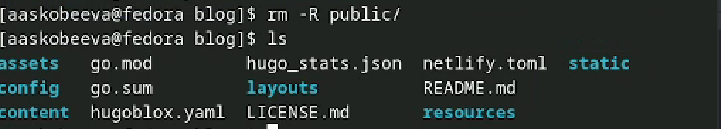{#fig:010 width=70%}

После, выполняем команду hugo server:

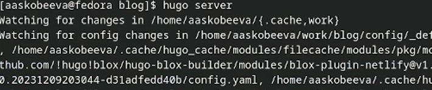{#fig:011 width=70%}

Переходим по выделенной ссылке:

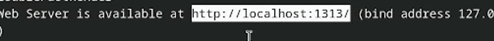{#fig:012 width=70%}

Открылся сайт:

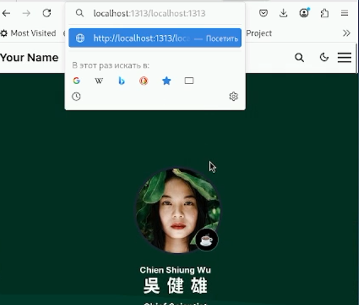{#fig:013 width=70%}

Теперь, создадим новый репозиторий:

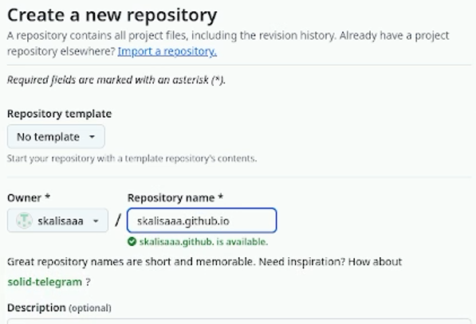{#fig:014 width=70%}

Подключаем к себе наш новый репозиторий:

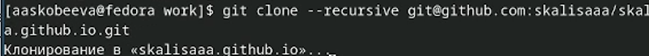{#fig:015 width=70%}

Переходим на наш репозиторий, подключаем ветку main и создаем файл README.md:

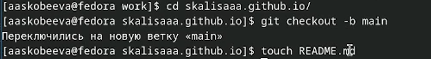{#fig:016 width=70%}

Отправляем все на github:

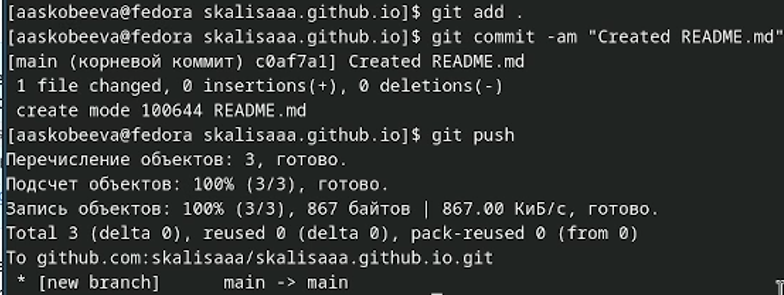{#fig:017 width=70%}

Далее, выполняем следующую команду:

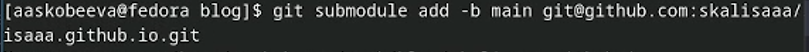{#fig:018 width=70%}

Выполняем git remote -v:

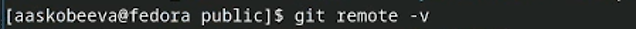{#fig:019 width=70%}

Теперь, перейдя по названию нашего репозитория открывается наш сайт:

{#fig:020 width=70%}

# Выводы

Мы выполнили 1-ый этап индивидуального проекта: установили необходимое ПО; скачали шаблон темы сайта; разместили его на хостинге git; установили параметр для URLs сайта; разместили заготовку сайта на Github pages.

