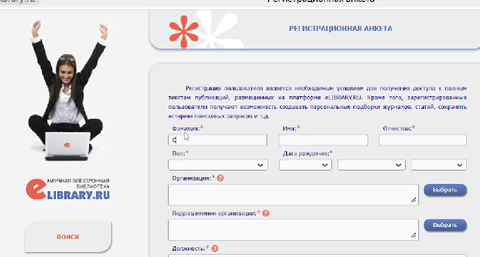
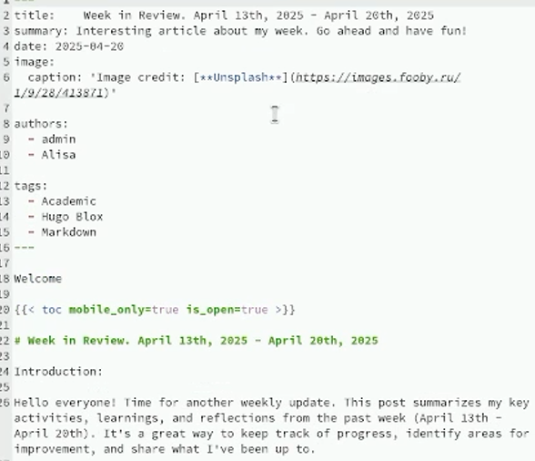
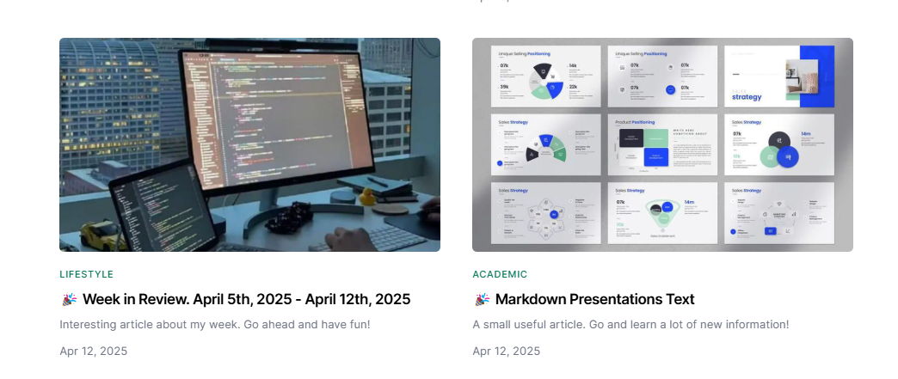

---
## Front matter
lang: ru-RU
title: Индивидуальный проект
subtitle: Часть 4
author:
  - Скобеева А.А.
institute:
  - Российский университет дружбы народов, Москва, Россия
date: 20 апреля 2025

## i18n babel
babel-lang: russian
babel-otherlangs: english

## Formatting pdf
toc: false
toc-title: Содержание
slide_level: 2
aspectratio: 169
section-titles: true
theme: metropolis
header-includes:
 - \metroset{progressbar=frametitle,sectionpage=progressbar,numbering=fraction}
---

# Информация

## Докладчик

:::::::::::::: {.columns align=center}
::: {.column width="70%"}

  * Скобеева Алиса Алексеевна
  * студентка 1-го курса направления "Прикладная информатика"
  * Российский университет дружбы народов
  * [1132246836@pfur.ru](mailto:1132246836@pfur.ru)

:::
::: {.column width="30%"}

:::
::::::::::::::

# Вводная часть

## Актуальность

- Данная презентация актуальна для тех, кто интересуется созданием персонального сайта.

## Объект и предмет исследования

- Репозиторий git
- Конструктор сайтов HUGO

## Цели и задачи

- Зарегестрироваться на соответствующих ресурсах и разместить на них ссылки на сайте
- Добавить две статьи

## Материалы и методы

- Github
- Материалы ТУИС

# Основная часть

## Регистрация на сайтах

- Регистрируемся на всех необходимых платформах
- 

## Добавляем ссылки на персональный сайт

- Редактируем файл index.md и сохраняем изменения
- 

## Написание статей

- 
- 

## Проверяем статьи на сайте

- Все отображено корректно
- 

## Результаты

- Мы добавили информацию о себе и написали две статьи на нашем персональном сайте научного работника.

