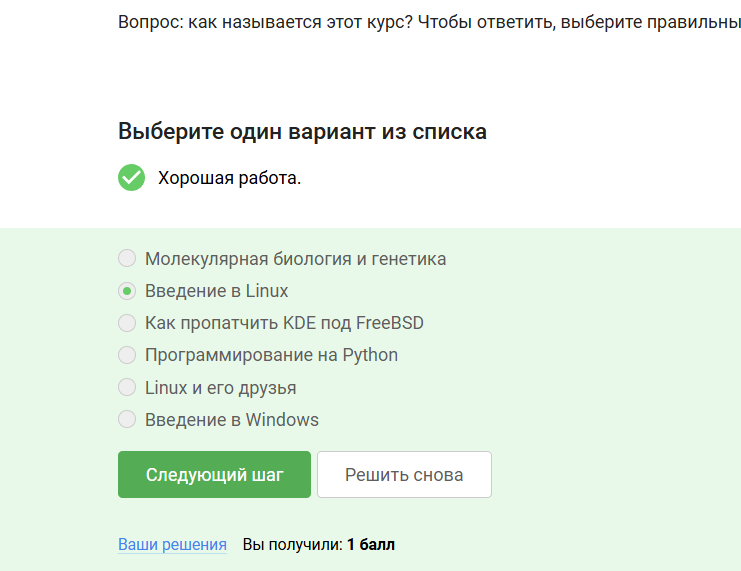
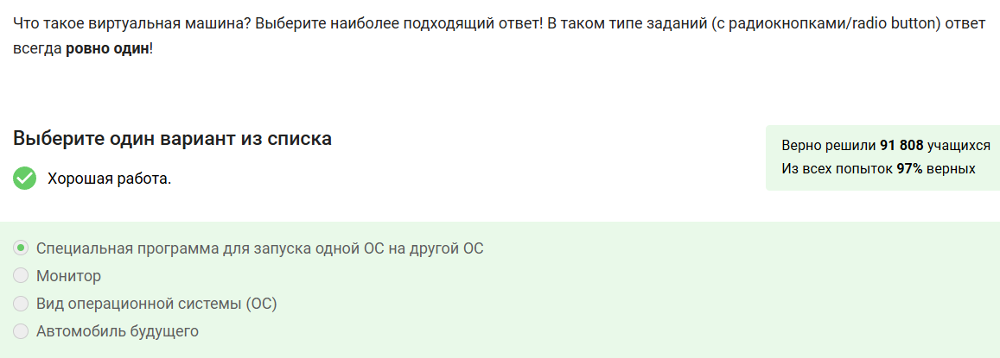
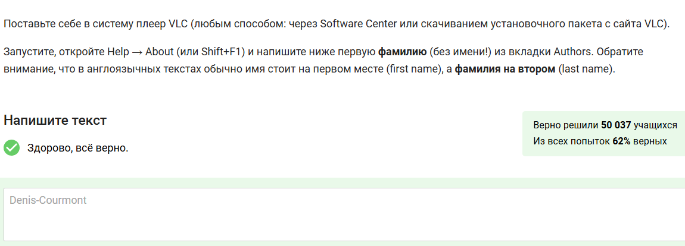
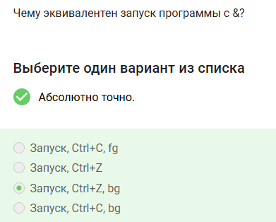
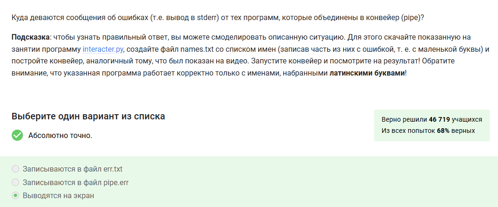
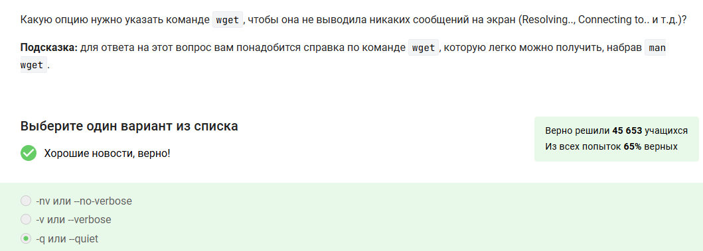
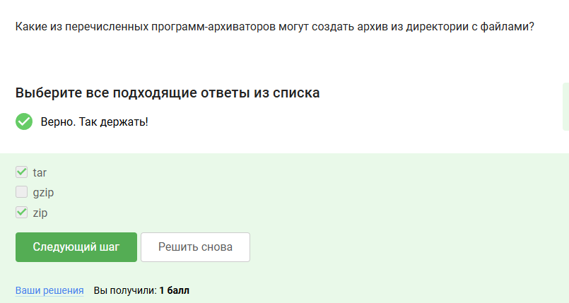
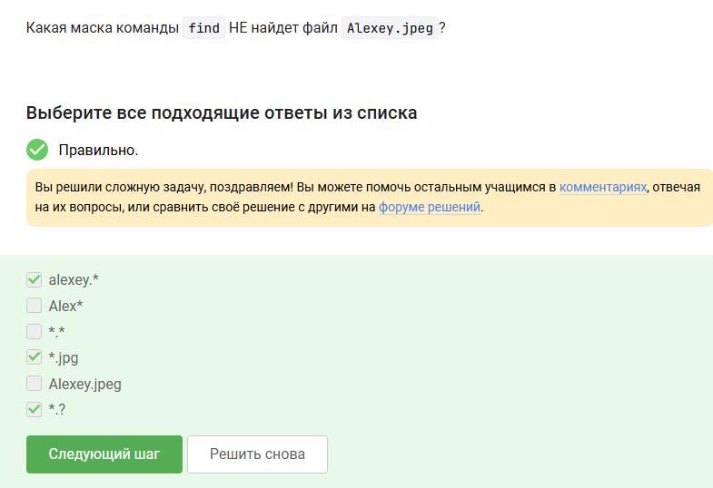

---
## Front matter
lang: ru-RU
title: Отчет по прохождению внешнего курса
subtitle: Часть 1. Введение
author:
  - Скобеева А.А.
institute:
  - Российский университет дружбы народов, Москва, Россия
date: 07 марта 2025

## i18n babel
babel-lang: russian
babel-otherlangs: english

## Formatting pdf
toc: false
toc-title: Содержание
slide_level: 2
aspectratio: 169
section-titles: true
theme: metropolis
header-includes:
 - \metroset{progressbar=frametitle,sectionpage=progressbar,numbering=fraction}
---

# Информация

## Докладчик

:::::::::::::: {.columns align=center}
::: {.column width="70%"}

  * Скобеева Алиса Алексеевна
  * студентка 1-го курса направления "Прикладная информатика"
  * Российский университет дружбы народов
  * [1132246836@pfur.ru](mailto:1132246836@pfur.ru)

:::
::: {.column width="30%"}

:::
::::::::::::::

# Вводная часть

## Актуальность

- Данная презентация актуальна для всех, кто хочет пройти внешний курс "Введение в Linux"

## Цели и задачи

- Изучить текстовые и видеоматериалы, а также выполнить все практические задания 1 раздела

# Основная часть

## Общая информация о курсе

- В данном разделе мы ознакомились с общей информацией о курсе "Введение в Linux"
- {#fig:001 width=70%}

## Как установить Linux 

- Изучив материалы данного раздела мы узнали, как установить Linux.
- {#fig:002 width=70%}

## Осваиваем Linux

- Изучив материалы данного раздела и выполнив все практические задания мы научились просматривать, создавать и удалять файлы и папки через файловый менеджер. 
- {#fig:003 width=70%}

## Terminal: основы

- Изучив материалы данного раздела и выполнив все практические задания мы научились запускать Терминал и изучили несколько базовых команд для работы в нем.
- {#fig:004 width=70%}

## Запуск исполняемых файлов

- Изучив материалы данного раздела и выполнив все задания мы научились запускать программы из командной строки.
- {#fig:005 width=70%}

## Ввод/вывод

- Изучив материалы данного раздела и выполнив все практические задания мы научились передавать приложению входные данные из файла и записывать результаты выполнения и возникшие ошибки в файл или несколько файлов.
- {#fig:006 width=70%}

## Скачивание файлов из интернета

- Изучив материалы данного раздела и выполнив все практические задания мы научились скачивать файлы из интернета с помощью команды wget.
- {#fig:007 width=70%}

## Работа с архивами

- Изучив материалы данного раздела и выполнив все практические задания мы научились работать с несколькими архиваторами в терминале: создание и распаковка архивов.
- {#fig:008 width=70%}

## Поиск файлов и слов в файлах

- Изучив материалы данного раздела и выполнив все практические задания мы научичились использовать инструменты для поиска данных. 
- {#fig:009 width=70%}

## Результаты

- Мы изучили все материалы 1-го раздела и успешно выполнили все практические задания.

