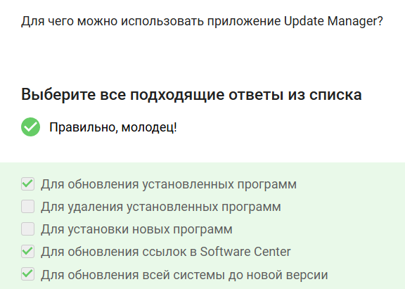

---
## Front matter
title: "Отчет по прохождению внешнего курса"
subtitle: "Часть 1. Введение"
author: "Скобеева Алиса Алексеевна"

## Generic otions
lang: ru-RU
toc-title: "Содержание"

## Bibliography
bibliography: bib/cite.bib
csl: pandoc/csl/gost-r-7-0-5-2008-numeric.csl

## Pdf output format
toc: true # Table of contents
toc-depth: 2
lof: true # List of figures
lot: true # List of tables
fontsize: 12pt
linestretch: 1.5
papersize: a4
documentclass: scrreprt
## I18n polyglossia
polyglossia-lang:
  name: russian
  options:
	- spelling=modern
	- babelshorthands=true
polyglossia-otherlangs:
  name: english
## I18n babel
babel-lang: russian
babel-otherlangs: english
## Fonts
mainfont: IBM Plex Serif
romanfont: IBM Plex Serif
sansfont: IBM Plex Sans
monofont: IBM Plex Mono
mathfont: STIX Two Math
mainfontoptions: Ligatures=Common,Ligatures=TeX,Scale=0.94
romanfontoptions: Ligatures=Common,Ligatures=TeX,Scale=0.94
sansfontoptions: Ligatures=Common,Ligatures=TeX,Scale=MatchLowercase,Scale=0.94
monofontoptions: Scale=MatchLowercase,Scale=0.94,FakeStretch=0.9
mathfontoptions:
## Biblatex
biblatex: true
biblio-style: "gost-numeric"
biblatexoptions:
  - parentracker=true
  - backend=biber
  - hyperref=auto
  - language=auto
  - autolang=other*
  - citestyle=gost-numeric
## Pandoc-crossref LaTeX customization
figureTitle: "Рис."
tableTitle: "Таблица"
listingTitle: "Листинг"
lofTitle: "Список иллюстраций"
lotTitle: "Список таблиц"
lolTitle: "Листинги"
## Misc options
indent: true
header-includes:
  - \usepackage{indentfirst}
  - \usepackage{float} # keep figures where there are in the text
  - \floatplacement{figure}{H} # keep figures where there are in the text
---

# Цель работы

Пройти внешний курс для получения и закрепления навыков работы с операционными системами Linux.

# Задание

Выполнить все задания 1-го раздела курса.

# Выполнение лабораторной работы

1. Общая информация о курсе

{#fig:001 width=70%}

{#fig:002 width=70%}

2. Как установить Linux 

{#fig:003 width=70%}

{#fig:004 width=70%}

{#fig:005 width=70%}

Изучив материалы данного раздела мы узнали, как установить Linux.

3. Осваиваем Linux

{#fig:006 width=70%}

{#fig:007 width=70%}

{#fig:008 width=70%}

{#fig:009 width=70%}

Изучив материалы данного раздела и выполнив все практические задания мы научились просматривать, создавать и удалять файлы и папки через файловый менеджер. 

4. Terminal: основы

{#fig:010 width=70%}

{#fig:011 width=70%}

{#fig:012 width=70%}

{#fig:013 width=70%}

{#fig:014 width=70%}

Изучив материалы данного раздела и выполнив все практические задания мы научились запускать Терминал и изучили несколько базовых команд для работы в нем.

5. Запуск исполняемых файлов

{#fig:015 width=70%}

{#fig:016 width=70%}

{#fig:017 width=70%}

Изучив материалы данного раздела и выполнив все задания мы научились запускать программы из командной строки.

6. Ввод/вывод

{#fig:018 width=70%}

{#fig:019 width=70%}

{#fig:020 width=70%}

Изучив материалы данного раздела и выполнив все практические задания мы научились передавать приложению входные данные из файла и записывать результаты выполнения и возникшие ошибки в файл или несколько файлов.

7. Скачивание файлов из интернета

{#fig:021 width=70%}

{#fig:022 width=70%}

{#fig:023 width=70%}

Изучив материалы данного раздела и выполнив все практические задания мы научились скачивать файлы из интернета с помощью команды wget.

8. Работа с архивами

{#fig:024 width=70%}

{#fig:025 width=70%}

{#fig:026 width=70%}

Изучив материалы данного раздела и выполнив все практические задания мы научились работать с несколькими архиваторами в терминале: создание и распаковка архивов.

9. Поиск файлов и слов в файлах

{#fig:027 width=70%}

{#fig:028 width=70%}

{#fig:029 width=70%}

Изучив материалы данного раздела и выполнив все практические задания мы научичились использовать инструменты для поиска данных. 

# Выводы

После изучения всех текстовых и видеоматериалов 1-ой части курса, а также успешного выполнения всех практических заданий, мы приобрели и закрепили базовые навыки работы с Linux.

