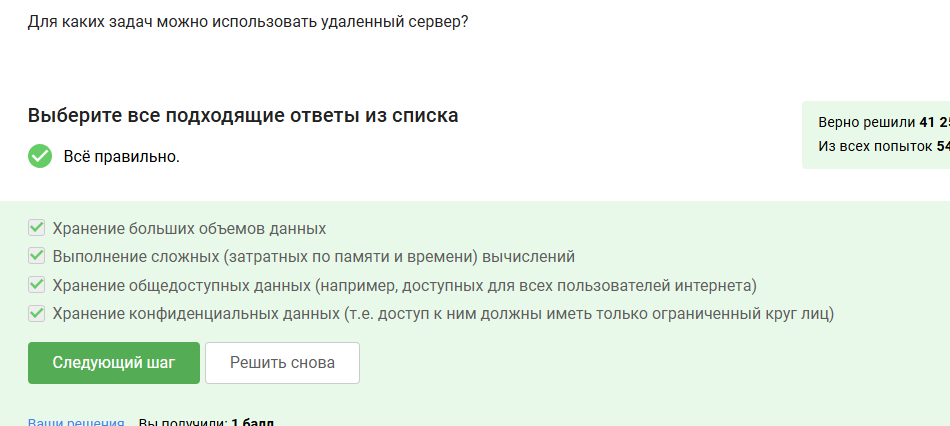
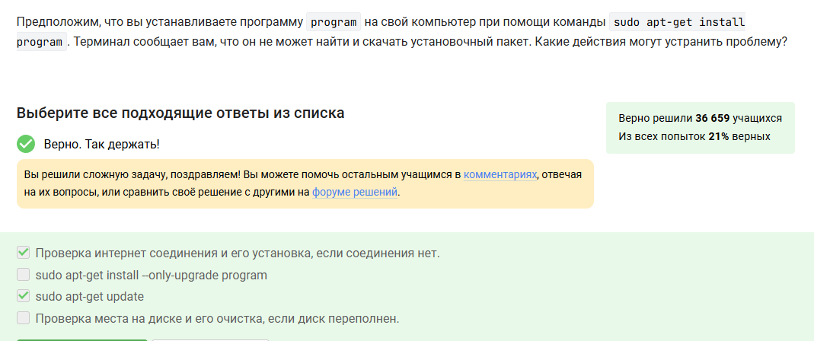
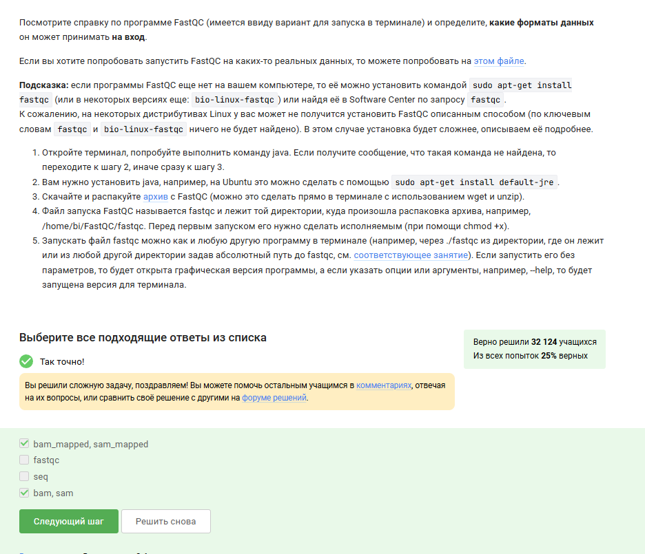
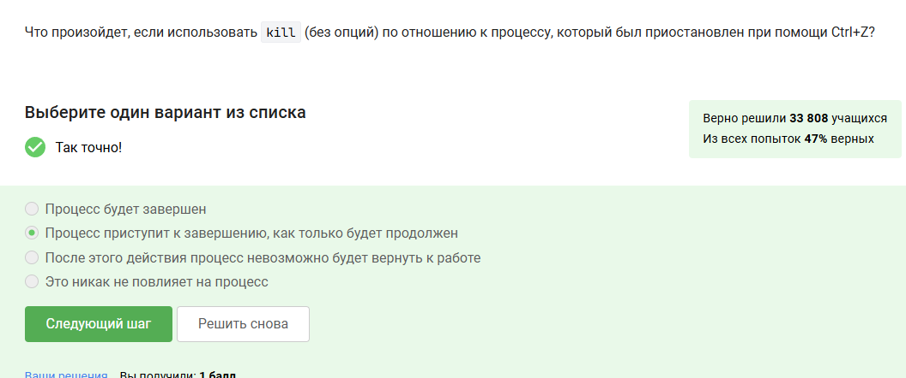
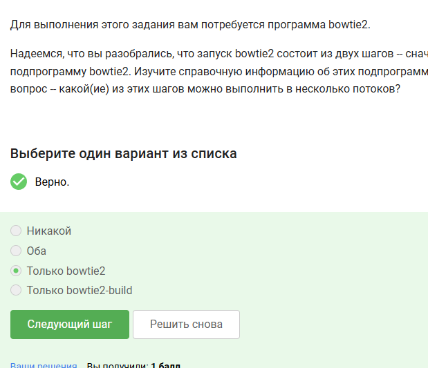
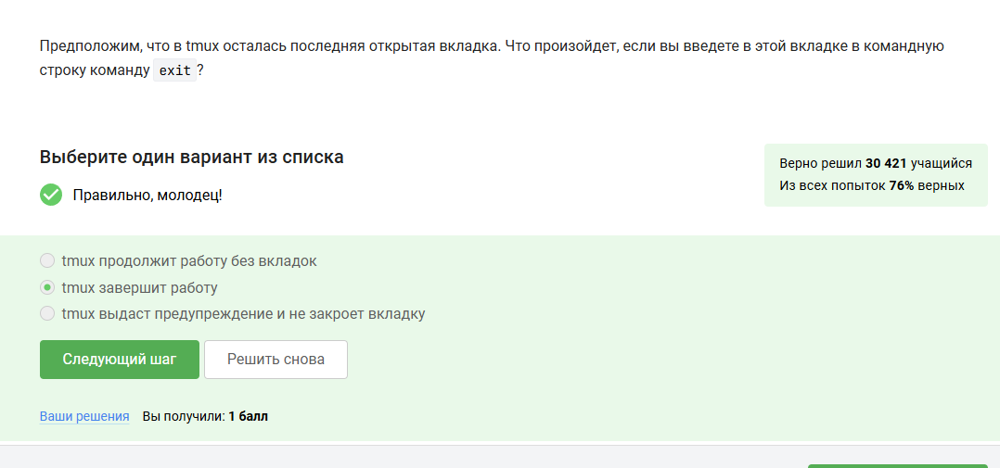

---
## Front matter
lang: ru-RU
title: Отчет по прохождению внешнего курса
subtitle: Часть 2. Работа на сервере
author:
  - Скобеева А.А.
institute:
  - Российский университет дружбы народов, Москва, Россия
date: 07 марта 2025

## i18n babel
babel-lang: russian
babel-otherlangs: english

## Formatting pdf
toc: false
toc-title: Содержание
slide_level: 2
aspectratio: 169
section-titles: true
theme: metropolis
header-includes:
 - \metroset{progressbar=frametitle,sectionpage=progressbar,numbering=fraction}
---

# Информация

## Докладчик

:::::::::::::: {.columns align=center}
::: {.column width="70%"}

  * Скобеева Алиса Алексеевна
  * студентка 1-го курса направления "Прикладная информатика"
  * Российский университет дружбы народов
  * [1132246836@pfur.ru](mailto:1132246836@pfur.ru)

:::
::: {.column width="30%"}

:::
::::::::::::::

# Вводная часть

## Актуальность

- Данная презентация актуальна для всех, кто хочет пройти внешний курс "Введение в Linux"

## Цели и задачи

- Изучить текстовые и видеоматериалы, а также выполнить все практические задания 2 раздела

# Основная часть

## Знакомство с сервером 

- В данном разделе мы ознакомились с общей информацией о работе на сервере
- {#fig:001 width=70%}

## Обмен файлами

- Изучив материалы данного раздела и выполнив все практические задания мы научились обмениваться файлами в обе стороны, а также рассмотрели два способа обмена файлами: используя терминал и Filezila.
- {#fig:002 width=70%}

## Запуск приложений

- Изучив материалы данного раздела и выполнив все практические задания мы научились запускать приложения на сервере. 
- {#fig:003 width=70%}

## Контроль запускаемых программ

- Изучив материалы данного раздела и выполнив все практические задания мы научимся следить за своими и чужими приложениями, запускать их в фоновом и основном режимах и отменять некоторые из запусков в случае необходимости.
- {#fig:004 width=70%}

## Многопоточные приложения 

- Изучив материалы данного раздела и выполнив все задания мы научились работать с потоками и процессами, без которых практически невозможно представить обработку больших объемов данных.
- {#fig:005 width=70%}

## Менеджер терминалов tmux

- Изучив материалы данного раздела и выполнив все практические задания мы научились работать с менеджером терминалов tmux. 
- {#fig:006 width=70%}

## Результаты

- Мы изучили все материалы 2-го раздела и успешно выполнили все практические задания.

