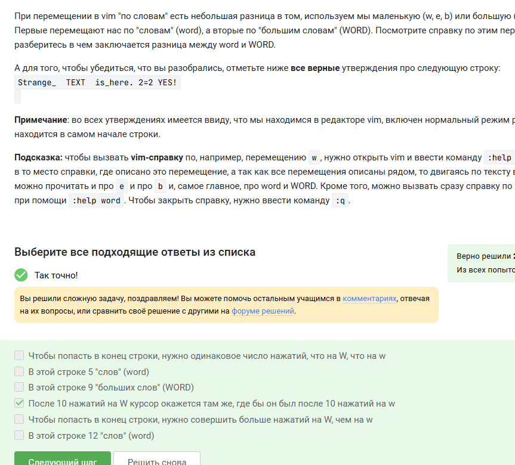
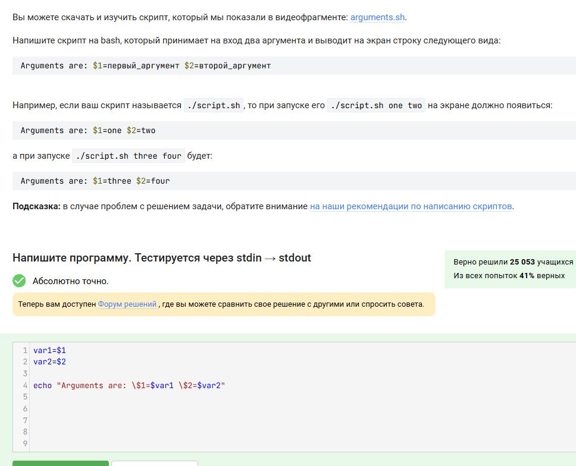
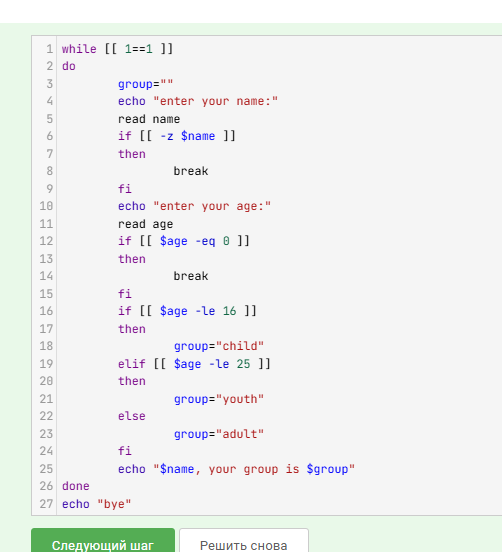
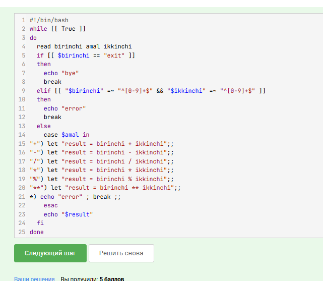
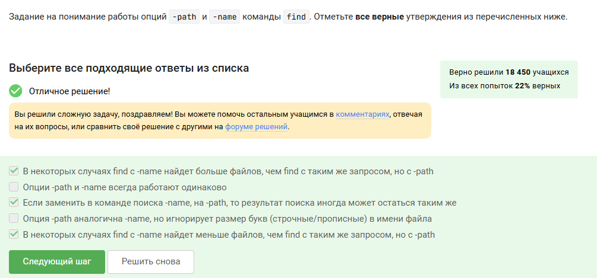
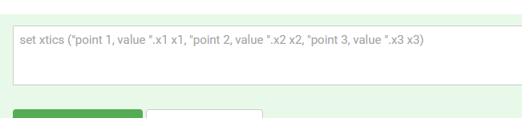

---
## Front matter
lang: ru-RU
title: Отчет по прохождению внешнего курса
subtitle: Часть 3. Продвинутые темы
author:
  - Скобеева А.А.
institute:
  - Российский университет дружбы народов, Москва, Россия
date: 07 марта 2025

## i18n babel
babel-lang: russian
babel-otherlangs: english

## Formatting pdf
toc: false
toc-title: Содержание
slide_level: 2
aspectratio: 169
section-titles: true
theme: metropolis
header-includes:
 - \metroset{progressbar=frametitle,sectionpage=progressbar,numbering=fraction}
---

# Информация

## Докладчик

:::::::::::::: {.columns align=center}
::: {.column width="70%"}

  * Скобеева Алиса Алексеевна
  * студентка 1-го курса направления "Прикладная информатика"
  * Российский университет дружбы народов
  * [1132246836@pfur.ru](mailto:1132246836@pfur.ru)

:::
::: {.column width="30%"}

:::
::::::::::::::

# Вводная часть

## Актуальность

- Данная презентация актуальна для всех, кто хочет пройти внешний курс "Введение в Linux"

## Цели и задачи

- Изучить текстовые и видеоматериалы, а также выполнить все практические задания 3 раздела

# Основная часть

## Текстовый редактор vim

- Изучив материалы данного раздела и выполнив все практические задания мы научились пользоваться текстовым редактором vim.
- {#fig:001 width=70%}

## Скрипты на bash: основы

- Изучив материалы данного раздела и выполнив все практические задания мы научились писать небольшие скрипты и запускать их. 
- {#fig:002 width=70%}

## Скрипты на bash: ветвления и циклы

- Изучив материалы данного раздела и выполнив все практические задания мы научились использовать управляющие конструкции языка bash, которые позволяют писать скрипты, где часть инструкций выполняется только при опр. условиях(ветвления), а часть инструкций выполняется по много раз подряд(циклы).
- {#fig:003 width=70%}

## Скрипты на bash: разное

- Изучив материалы данного раздела и выполнив все практические задания мы научились писать довольно сложные и полезные скрипты на bash. Также мы изучили несколько тем: арифметические операции, запуск внешних программ и обработка результатов их работы; понятие функций в языке bash и их использование.
- {#fig:004 width=70%}

## Продвинутый поиск и редактирование

- Изучив материалы данного раздела и выполнив все задания мы научились работать с потоковым текстовым редактором sed, который позволяет не только искать слова в файлах, но и сразу же эти файлы редактировать.
- {#fig:005 width=70%}

## Строим графики в gnuplot

- Изучив материалы данного раздела и выполнив все практические задания мы научились использовать базовые команды gnuplot для работы в интерактивном режиме, а также научились писать gnuplot-скрипты.
- {#fig:006 width=70%}

## Разное

- Изучив материалы данного раздела и выполнив все практические задания мы узнали много нового об еще нескольких важных темах.
- {#fig:034 width=70%}

## Результаты

- Мы изучили все материалы 3-го раздела и успешно выполнили все практические задания.

