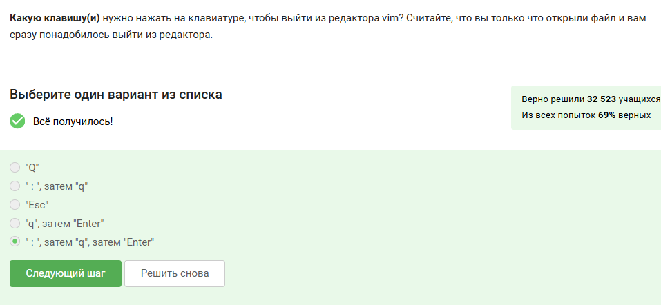

---
## Front matter
title: "Отчет по прохождению внешнего курса"
subtitle: "Часть 3. Продвинутые темы"
author: "Скобеева Алиса Алексеевна"

## Generic otions
lang: ru-RU
toc-title: "Содержание"

## Bibliography
bibliography: bib/cite.bib
csl: pandoc/csl/gost-r-7-0-5-2008-numeric.csl

## Pdf output format
toc: true # Table of contents
toc-depth: 2
lof: true # List of figures
lot: true # List of tables
fontsize: 12pt
linestretch: 1.5
papersize: a4
documentclass: scrreprt
## I18n polyglossia
polyglossia-lang:
  name: russian
  options:
	- spelling=modern
	- babelshorthands=true
polyglossia-otherlangs:
  name: english
## I18n babel
babel-lang: russian
babel-otherlangs: english
## Fonts
mainfont: IBM Plex Serif
romanfont: IBM Plex Serif
sansfont: IBM Plex Sans
monofont: IBM Plex Mono
mathfont: STIX Two Math
mainfontoptions: Ligatures=Common,Ligatures=TeX,Scale=0.94
romanfontoptions: Ligatures=Common,Ligatures=TeX,Scale=0.94
sansfontoptions: Ligatures=Common,Ligatures=TeX,Scale=MatchLowercase,Scale=0.94
monofontoptions: Scale=MatchLowercase,Scale=0.94,FakeStretch=0.9
mathfontoptions:
## Biblatex
biblatex: true
biblio-style: "gost-numeric"
biblatexoptions:
  - parentracker=true
  - backend=biber
  - hyperref=auto
  - language=auto
  - autolang=other*
  - citestyle=gost-numeric
## Pandoc-crossref LaTeX customization
figureTitle: "Рис."
tableTitle: "Таблица"
listingTitle: "Листинг"
lofTitle: "Список иллюстраций"
lotTitle: "Список таблиц"
lolTitle: "Листинги"
## Misc options
indent: true
header-includes:
  - \usepackage{indentfirst}
  - \usepackage{float} # keep figures where there are in the text
  - \floatplacement{figure}{H} # keep figures where there are in the text
---

# Цель работы

Пройти внешний курс для получения и закрепления навыков работы с операционными системами Linux.

# Задание

Выполнить все задания 3-го раздела курса.

# Прохождение внешнего курса

1. Текстовый редактор vim

{#fig:001 width=70%}

{#fig:002 width=70%}

{#fig:003 width=70%}

{#fig:004 width=70%}

{#fig:005 width=70%}

Изучив материалы данного раздела и выполнив все практические задания мы научились пользоваться текстовым редактором vim. 

2. Скрипты на bash: основы

{#fig:006 width=70%}

{#fig:007 width=70%}

{#fig:008 width=70%}

{#fig:009 width=70%}

Изучив материалы данного раздела и выполнив все практические задания мы научились писать небольшие скрипты и запускать их. 

3. Скрипты на bash: ветвления и циклы

{#fig:010 width=70%}

{#fig:011 width=70%}

{#fig:012 width=70%}

{#fig:013 width=70%}

{#fig:014 width=70%}

Изучив материалы данного раздела и выполнив все практические задания мы научились использовать управляющие конструкции языка bash, которые позволяют писать скрипты, где часть инструкций выполняется только при опр. условиях(ветвления), а часть инструкций выполняется по много раз подряд(циклы).

4. Скрипты на bash: разное

{#fig:015 width=70%}

{#fig:016 width=70%}

{#fig:017 width=70%}

{#fig:018 width=70%}

{#fig:019 width=70%}

{#fig:020 width=70%}

Изучив материалы данного раздела и выполнив все практические задания мы научились писать довольно сложные и полезные скрипты на bash. Также мы изучили несколько тем: арифметические операции, запуск внешних программ и обработка результатов их работы; понятие функций в языке bash и их использование.

5. Продвинутый поиск и редактирование

{#fig:021 width=70%}

{#fig:022 width=70%}

{#fig:023 width=70%}

{#fig:024 width=70%}

{#fig:025 width=70%}

{#fig:026 width=70%}

{#fig:027 width=70%}

Изучив материалы данного раздела и выполнив все задания мы научились работать с потоковым текстовым редактором sed, который позволяет не только искать слова в файлах, но и сразу же эти файлы редактировать.

6. Строим графики в gnuplot

{#fig:028 width=70%}

{#fig:029 width=70%}

{#fig:030 width=70%}

{#fig:031 width=70%}

Изучив материалы данного раздела и выполнив все практические задания мы научились использовать базовые команды gnuplot для работы в интерактивном режиме, а также научились писать gnuplot-скрипты.

7. Разное

{#fig:032 width=70%}

{#fig:033 width=70%}

{#fig:034 width=70%}

{#fig:035 width=70%}

{#fig:036 width=70%}

Изучив материалы данного раздела и выполнив все практические задания мы узнали много нового об еще нескольких важных темах.

# Выводы

После изучения всех текстовых и видеоматериалов 3-ой части курса, а также успешного выполнения всех практических заданий, мы приобрели и закрепили навыки работы в продвинутых темах, таких как написание программ.

